# مراجعة أطلس النظام والخريطة المعمارية — MotionPrep Studio v0.1.8

**التاريخ:** 14 أغسطس 2026
**نطاق المراجعة:** أطلس النظام المرفق، الكود المحلي، العقود، Compose، وثائق التشغيل واختبارات الحزم.
**الحكم:** الأطلس مفيد تنظيميًا، لكنه ليس دقيقًا بما يكفي ليكون مرجع نشر دون التصحيحات أدناه.

## 1. الخريطة المعمارية المصححة

```mermaid
flowchart TD
  Web["apps/web — React 19 + Vite + TypeScript"] -->|"HTTPS + HttpOnly cookie"| Nginx["Nginx — TLS/HSTS/static/proxy"]
  Nginx --> API["apps/api — Fastify + Zod + OpenAPI"]
  API --> PG[("PostgreSQL 17 — authoritative metadata, sessions, documents, reviews, jobs")]
  API --> Redis[("Redis 8 — distributed rate limiting only")]
  API --> S3[("S3/MinIO — authoritative registered source/derived/artifact bytes")]
  PG -. "leased jobs / SKIP LOCKED" .-> Media["worker-media"]
  PG -. "leased jobs / SKIP LOCKED" .-> Document["worker-document"]
  PG -. "leased jobs / SKIP LOCKED" .-> Export["worker-export"]
  PG -. "feature-gated jobs" .-> Character["worker-character"]
  Media --> S3
  Document --> S3
  Export --> S3
  Character --> S3
  Contracts["contracts"] --> API
  Contracts --> Web
  LayerDomain["layer-domain — validation/naming/commands/merge"] --> API
  LayerDomain --> Web
  LayerDomain --> Document
  LayerDomain --> Export
  Presets["presets — dormant motion/product catalog; not a domain facade"]
```



### تصحيحات الرسم الأصلي

- API يستخدم **Fastify**، وليس Express.
- Compose يثبت **Redis 8** بالـdigest، وليس Redis 7.
- الجلسات محفوظة في جدول PostgreSQL `sessions`؛ Redis ليس Session Store.
- Redis مخصص حاليًا للـdistributed rate limiting، وجاهزية التطبيق لا تعتمد عليه عمدًا.
- العمال يقرأون/يكتبون S3 أيضًا؛ العلاقة ليست API→S3 فقط.
- `packages/presets` لم يعد مالك قواعد التسمية والتحقق. المالك هو `layer-domain`، وpresets catalog غير مستهلك runtime حاليًا.
- PostgreSQL وS3 لهما سلطات مختلفة؛ لا يصح جمع PostgreSQL وRedis وS3 تحت عبارة واحدة «مصادر الحقيقة».

## 2. مسار الإنتاج المصحح


### دقة ادعاءات الرفع

- المساران في التقرير صحيحان: `POST /v1/uploads/intents` و`PUT /v1/uploads/:uploadId/content`.
- magic bytes وSHA-256 وحد 30 MiB صحيحة.
- النقل لا يجمع الملف كاملًا في Buffer؛ يستخدم staging على القرص ثم stream إلى object storage.
- هذه الضوابط **تخفف** memory amplification وDoS، لكنها لا «تمنع DoS» وحدها؛ الحماية الكاملة تعتمد كذلك على rate limits والمهلات وحدود body والتزامن ومساحة القرص والمراقبة.
- النشر والحواجز والـjob fences مصممة لتفشل بصوت عالٍ وتمنع source/job drift.

## 3. مقارنة مسارات المنتج

| المسار | نتيجة المقارنة | التصحيح أو القيد |
|---|---|---|
| Image alpha islands | صحيح: أكبر 14 مستقلة والباقي merged residual عند تجاوز 15 | لا يعني أن كل صورة تنتج 15 طبقة؛ الصور المعتمة تبدأ كمصدر صادق واحد |
| PDF segmentation | المستويات الستة والحدود صحيحة | كل صفحة لها group root وخلفية مقفلة؛ لا تعد الخلفية طبقة محتوى في العداد |
| PDF OCR ingestion | محلي ويفشل بـ`OCR_FAILED` بدل نص مختلق | يختلف عن regional OCR التفاعلي، الذي يبقى معطلًا بسبب holdout |
| Character Studio | توجد Bible/references/generation/review/compiler ومسارات worker | feature-gated وغير جاهز للإعلان العام قبل provider/staging/Adobe gates |
| Workspace mutations | baseRevision/CAS وtimeline وSOURCE_NOT_CURRENT صحيحة | ليس كل تغيير UI طلبًا منفردًا؛ autosave يُفرغ قبل الأوامر البنيوية |
| Text merge | ذري ويدعم space/newline مع اتجاه ومحاذاة وأب وصفحة موحدة | لا يدعم custom separator ولا «يوحد الخط تلقائيًا»؛ يرفض التنسيقات غير المتوافقة |
| Raster merge | خادمي ويحافظ على alpha ويحسب bounds جديدة | يبقى خاضعًا لحد 15 ولتوفر أصول وحدود صالحة |
| Export formats | الجدول الوارد صحيح | Adobe Golden دليل توافق للصيغ المختبرة، وليس دليل staging/availability/security كاملًا |

## 4. تدقيق العيوب الخمسة الواردة

### D1 — تكرار اختبارات `dist`: صحيح وأُصلح

قبل الإصلاح، وجود `dist/index.test.js` و`dist/edge-cases.test.js` جعل Vitest يشغل 4 ملفات و36 اختبارًا بدل المصدرين و18 اختبارًا.

الإصلاح:

- `tsconfig.build.json` أصبح يستبعد `src/**/*.test.ts` ويحدد `rootDir=src`، فلا تنتج builds النظيفة اختبارات runtime.
- `vitest.config.ts` يستبعد `dist` و`node_modules` صراحة، فيحمي أيضًا من مخرجات قديمة باقية على جهاز المطور.
- تحقق قبل البناء وبعده: 2 ملفات و18/18 اختبارًا في المرتين.

### D2 — 29 ملفًا في إنذار الصيانة: صحيح

- لا ملف يتجاوز 550 ولا exact clone blocks.
- الملفات الأعلى: `processing-routes` 546، `postgres-processing-repository` 534، `Workspace` 531، `ExportReview` و`LayerDock` 528، `postgres-export-repository` 527، `auth-service` 525.
- لا يُفكك الملف لمجرد العدد. الاستخراج المقبول ينشئ router/command/query/presentation boundary ويصاحبه اختبار؛ hooks شكلية قد تزيد التشتت.

### D3 — OCR holdout: صحيح

- overall ‏19.39%، validation ‏15.13%، sealed holdout ‏27.02% مقابل هدف ≤25%.
- regional OCR يبقى fail-closed.
- إعادة التفعيل تتطلب corpus seal وبصمة تنفيذ جديدة ونجاح quality/browser gates قبل فتح holdout.

### D4 — سباق autosave: وصف قديم، مغلق في الكود الحالي

- coordinator يفرغ `flushLayerReview()` افتراضيًا قبل الأمر.
- merge/split/OCR/raster وundo/redo/refinement/export والرفع والاسترجاع تمر عبر coordinator أو حارس flush.
- coordinator يمرر `AbortSignal` ويلغي العملية عند تغير هوية المشروع/المصدر.
- القاعدة المتبقية: أي أمر جديد يغير الوثيقة يجب ألا يستدعي API مباشرة خارج coordinator.

### D5 — DOM budget لشجرة PDF: صحيح جزئيًا

- الصفحة المطوية لا تركب أبناءها، ومجلد واحد مفتوح عادة.
- الصفحة المفتوحة تبدأ بـ80 عقدة ثم تضيف 160.
- fixture ‏250 صفحة/100,000 عنصر يبقى دون 3,500 عقدة DOM وفي ميزانية الاختبار.
- المتبقي: variable-height virtualization لرؤوس الصفحات والمجموعات مع حفظ focus وARIA والبحث؛ «إظهار الصفحة النشطة فقط» وحده قد يخفي نتائج البحث ويضعف الوصول.

## 5. الأمان والخصوصية — التصحيح الدقيق

| ادعاء الأطلس | الواقع |
|---|---|
| جلسات مشفرة/Redis sessions | token عشوائي في cookie آمنة، hash الجلسة وسجلها في PostgreSQL؛ Redis لا يخزن الجلسة |
| MFA وrecovery كلاهما AES-GCM | TOTP secret محمي بـAES-256-GCM؛ recovery codes مخزنة كـkeyed hashes قابلة للدوران، وهو التصميم الصحيح للاستخدام أحادي الاتجاه |
| SKIP LOCKED يمنع كل deadlocks | يقلل تنازع claims، لكنه لا يثبت غياب deadlock في كل معاملات النظام؛ يلزم lock ordering واختبارات races |
| migration 042 يحقق GDPR/CCPA | يوفر state machines وحواجز deletion/retention؛ الامتثال القانوني يحتاج سياسة وحقوق مستخدم وعقود مزودين ومراجعة قانونية، ولا يثبت بترحيل SQL |
| Redis outage | rate limiter موزع قد يتعطل، لكن readiness والجلسات/المشروعات لا تعتمد عليه؛ هذا سلوك مقصود ومختبر |
| Artifact retention 24h | صحيح للمخرجات المنتهية؛ المصادر والأصول المشتقة تتبع مرجعيتها وسياسات deletion/retention المختلفة |

## 6. أدوات الطبقات — الموجود والناقص فعلًا

النسبة الدائرية 70/30 الواردة في الأطلس ليست ناتجة عن inventory أو وزن قيمة/جهد، لذلك لا تُستخدم للتخطيط.

### موجود بالفعل

- drop feedback مرئي عبر `is-drag-over` وخط علوي بلون primary.
- F2/double-click rename مع تحقق الاسم.
- Shift/Ctrl multi-select داخل النطاق نفسه.
- bulk hide/show/lock/unlock على desktop/mobile.
- ترتيب بالسحب على desktop وبأزرار/أمر خادمي على mobile.
- space/newline text merge، وmerge raster خادمي.
- preview URLs ومعاينة Raster مركزية، وscroll إلى الطبقة النشطة في virtual list.

### فجوات حقيقية مقترحة

1. **Smart alignment/distribution — P2 مرتفع القيمة:** أوامر خادمية `align-layers` و`distribute-layers` على bounds، مع baseRevision وundo/audit. لا يحتاج rotation schema في النسخة الأولى.
2. **Custom image folders — P2:** أوامر `create-group` و`ungroup` و`reparent-layers` مع graph validation؛ لا تعديل محلي فقط.
3. **Batch opacity — P2 صغير:** توسيع `update-state` أو toolbar بمدى عتامة موحد مع count وpreview قبل التطبيق.
4. **Live row thumbnails — P2 صغير/متوسط:** استخدام preview URLs الموجودة داخل الصفوف المرئية فقط، مع fallback صادق وإدارة object URL/virtual recycling.
5. **Bi-directional canvas focus — P2:** hover/focus state مؤقت لا يكتب الوثيقة، واختيار canvas يحدد الطبقة ويمرر القائمة إليها.
6. **Canvas transform gizmo — P3 كبير:** bounds drag/resize أولًا؛ rotation/pivot يحتاجان عقد schema وتصدير PSD/AE واضح واختبارات إحداثيات RTL/zoom.
7. **Semantic color tags — P3:** حقل persisted منفصل مثل `labelColor`؛ لا يعاد استخدام اللون التلقائي المشتق من ID.
8. **Pivot/parallax preview — P3/feature:** يحتاج نموذج anchor/depth/export semantics وبوابة أداء، وليس مجرد animation محلي.
9. **Custom text separator — P3:** إن ثبتت الحاجة، يضاف بطول محدود وتحقق control characters؛ الحالي space/newline مقصود وآمن.

لا توجد أحداث drag متطابقة بين `LayerDockInteractiveRow` و`WorkspaceMobileSheet`: الهاتف لا يستخدم HTML drag/drop. لذلك اقتراح `useLayerDragAndDrop` مشترك كما هو مكتوب ليس استخراجًا صحيحًا؛ الأنسب مشاركة command/presentation model مع تفاعلات platform-specific.

## 7. خطة التنفيذ المصححة

### المرحلة 0 — إغلاق مرشح 0.1.8

- تجميد diff ومراجعة الملفات الجديدة وartifacts.
- تشغيل `npm run quality` مرتين و12/12 E2E على SHA ثابت.
- لا تضف أدوات Canvas أو schema جديدًا داخل نافذة الإصدار.
- لا تدمج Dependabot majors.

### المرحلة 1 — إصدار immutable

- PR وhosted CI ثم merge.
- tag `v0.1.8` من SHA المدمج.
- `release-images` يبني مرة واحدة، ينتج SBOM/provenance ويفحص ويوقع digests.

### المرحلة 2 — staging والإطلاق

لا تستخدم الأمر الوارد في الأطلس:

```bash
docker compose -f compose.production.yaml up -d --build
```

العقد الصحيح هو استخدام wrapper الذي يتحقق من البيئة والمراجع immutable:

```bash
node scripts/verify-release-environment.mjs .env.production
node scripts/run-production-compose.mjs .env.production pull
node scripts/run-production-compose.mjs .env.production up -d
node scripts/run-production-compose.mjs .env.production ps
```

`compose.production.yaml` لا يحتوي build directives، ويفرض `RUNTIME_IMAGE_REF` و`WEB_IMAGE_REF` بصيغة digest. خدمة `migrate` المخصصة تعمل قبل الخدمات التابعة لها، باستخدام secret file وDB role منفصلين؛ لا تشغل migration يدويًا من بيئة API العامة.

### المرحلة 3 — أدلة GO

- managed PostgreSQL TLS/Redis/S3/SMTP.
- readiness لكل API/worker instance.
- signed restore يثبت RPO ≤15m وRTO ≤4h.
- representative load/fault/rollback على digests نفسها.
- Character/regional OCR/live billing تبقى مغلقة.

### المرحلة 4 — Layer UX بعد تجميد الإصدار

ترتيب التنفيذ المقترح:

1. batch opacity + mobile E2E.
2. live thumbnails + bidirectional focus.
3. align/distribute commands.
4. custom folders/server hierarchy.
5. PDF variable-height virtualization.
6. transform gizmo bounds-only، ثم قرار rotation/pivot/depth مستقل.

كل ميزة تحتاج problem metric وقبول وتعطيل/rollback، لا تاريخ Gantt افتراضي بلا مالك أو سعة فريق.

## 8. أدلة التحقق

- قبل الإصلاح: `layer-domain` شغّل 4 ملفات و36 اختبارًا بسبب التقاط نسخ `dist`.
- بعد إضافة Vitest/build exclusions: ملفان و18/18 اختبارًا ناجحًا.
- بعد إعادة build للحزمة: بقيت النتيجة ملفين و18/18، ما يثبت عدم رجوع التكرار.
- Root ESLint: ناجح بلا warnings.
- Knip deadcode: ناجح.
- Architecture/import-cycle/documentation contracts: ناجحة، بما فيها عقد Redis غير السلطوي الجديد.
- Maintainability: ‏473 ملفًا، صفر ملفات فوق 550 وصفر exact clone blocks؛ 29 إنذارًا مبكرًا باقية.
- `git diff --check`: ناجح.

بوابات الاختبارات والبناء الأوسع للدفعة المحلية موثقة في تقرير المقارنة السابق؛ تغييرات هذه الجولة محصورة في إعداد layer-domain والوثيقة وعقد تحققها، لذلك أُعيدت البوابات المتأثرة مباشرة دون الادعاء بتشغيل staging أو provider integration.

## 9. قرار الجاهزية

- **لا يوجد P0 جديد مؤكد من هذا الأطلس.** هذه ليست شهادة غياب ثغرات.
- **العيب المؤكد:** تكرار اختبارات layer-domain؛ أُصلح وتحقق قبل/بعد build.
- **التناقض الوثائقي المؤكد:** Redis وُصف مصدر حقيقة؛ صُحح `BUILD_MAP` وأضيف عقد تحقق يمنع رجوع العبارة.
- **No-Go للإنتاج العام:** ما زال قائمًا بسبب غياب tag/images/staging/restore/load/rollback المربوطة بنفس SHA.
- تحسينات الطبقات تزيد جودة المنتج، لكنها لا تستبدل بوابات التشغيل الخارجية ولا تجعل الإطلاق «جاهزًا تمامًا» بمفردها.
