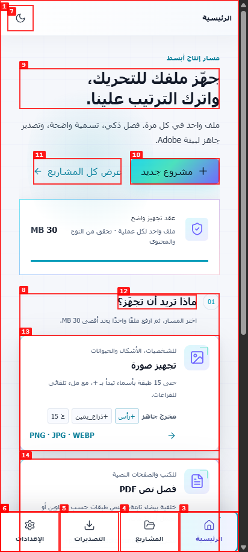
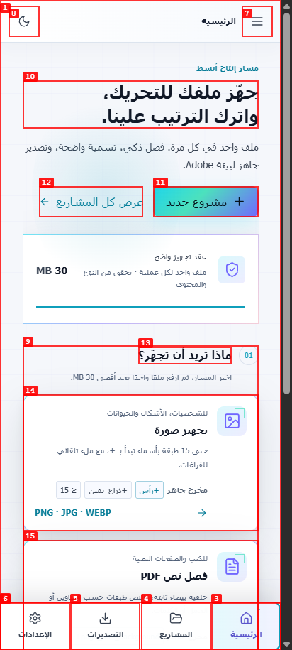
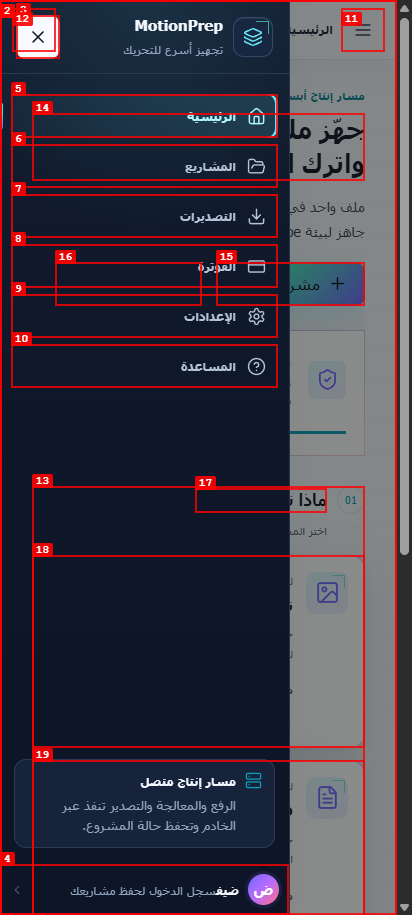
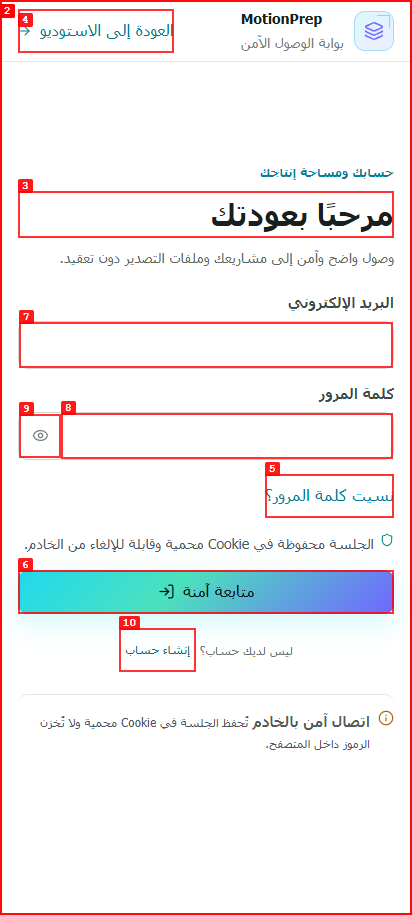
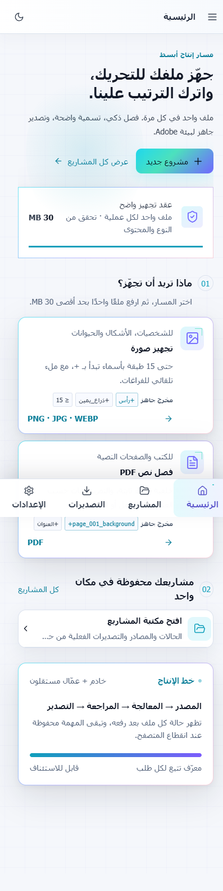
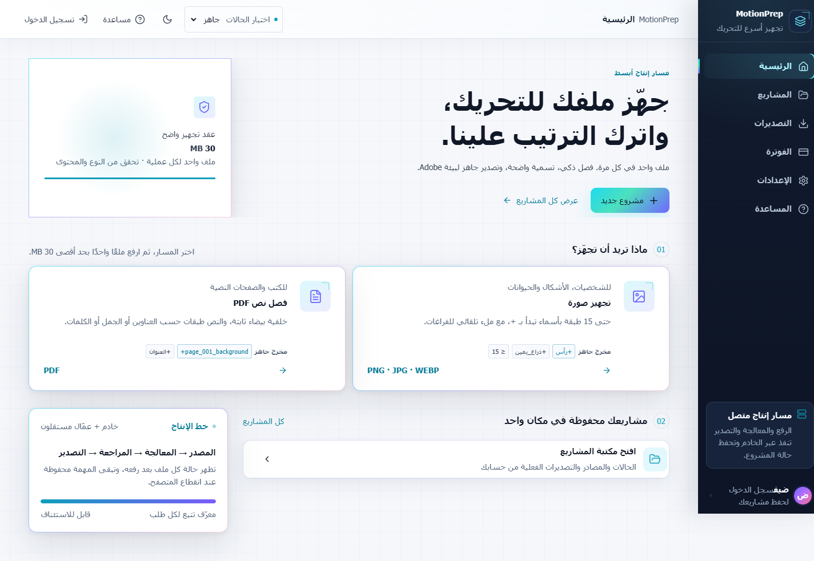

# Mobile browser QA report

| Field | Value |
|---|---|
| Date | 2026-07-29 |
| App URL | `http://127.0.0.1:5173` |
| Session | `readiness-mobile` |
| Scope | Guest-to-registration path at a 412 × 915 mobile viewport |

## Summary

| Severity | Found | Resolved |
|---|---:|---:|
| Critical | 0 | 0 |
| High | 1 | 1 |
| Medium | 0 | 0 |
| Low | 0 | 0 |
| **Total** | **1** | **1** |

## ISSUE-001: Mobile guests could not reach authentication

| Field | Value |
|---|---|
| Severity | High |
| Category | Functional / responsive navigation |
| URL | `/?view=dashboard` |
| Status | Resolved and reverified |
| Repro video | Unavailable because `ffmpeg` is not installed; annotated screenshots are retained |

**Description**

After opening the studio as a guest on mobile, the menu trigger was present
in the DOM but hidden. The base shell and responsive feature layer both used
`!important`; important declarations reverse cascade-layer precedence, so the
older `display: none` declaration won. With no visible login control elsewhere,
the registration workflow was blocked.

**Evidence and verification**

1. Open the landing page at the mobile viewport.
   

2. Choose “فتح الاستوديو كضيف”. The guest dashboard has no menu or login
   trigger.
   

3. Remove the conflicting important declarations and reload. The menu trigger
   is visible.
   

4. Open the menu. It exposes the login action and a working close control.
   

5. Choose “تسجيل الدخول”. The authentication gateway opens and exposes
   “إنشاء حساب”.
   

No JavaScript errors or failed application requests were observed during the
verified path.

## Final responsive regression pass

- The mobile dashboard exposes the menu trigger and retains the four-item
  bottom navigation:
  
- The 1440 × 900 dashboard keeps the persistent desktop sidebar and does not
  expose mobile-only open/close controls:
  
- DOM measurement found zero visible buttons below 44 × 44 CSS pixels at both
  viewports.
- DOM measurement found no visible application text below 12px; the only
  visible text below 14px was the intentional 12px technical eyebrow.
- The browser reported no application errors during the final pass.
