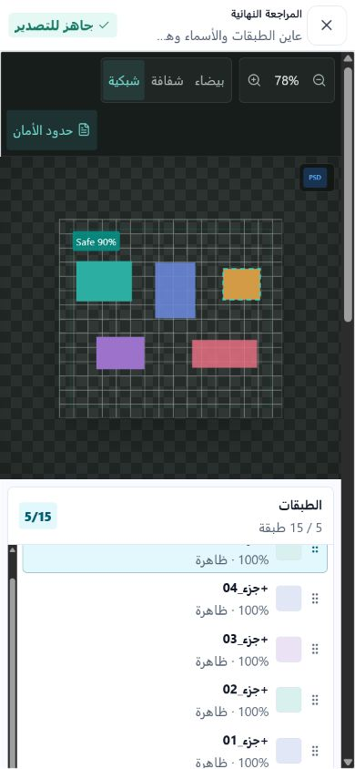
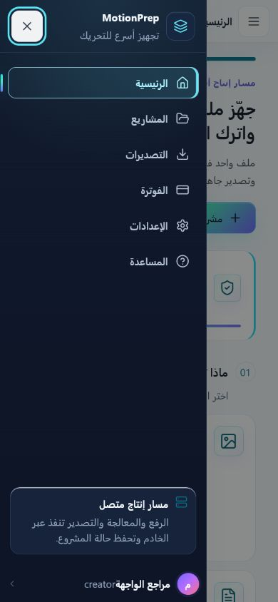

# تقرير التدقيق الشامل للكود والسلوك والواجهات — MotionPrep Studio

**تاريخ التدقيق:** 2026-08-03

**الفرع المفحوص:** `main` عند `aa7af282c37d0157b86767411690a80fda03dce1` مع تغييرات محلية غير ملتزمة
**نوع التقرير:** تدقيق ساكن + تشغيل اختبارات + تدقيق متصفح فعلي على سطح المكتب والهاتف

## 1. الحكم التنفيذي

الحالة الحالية **غير صالحة للبناء أو النشر**، رغم أن قلب النظام الوظيفي قوي وأن الاختبارات الآلية الأساسية نجحت. سبب المنع ليس انهيار الخادم أو المسارات الأساسية، بل وجود عمل غير مكتمل داخل شجرة العمل الحالية:

- `typecheck` و`build` يفشلان بسبب ملف تجريبي غير متوافق مع عقود الطبقات، واستيراد React غير مستخدم.
- `lint` و`deadcode` و`verify:maintainability` تفشل.
- هناك 82 مسارًا محليًا متغيرًا: 33 ملفًا معدلًا و49 ملفًا غير متتبع. جزء كبير من الاستخراج المعماري موجود في ملفات غير متتبعة، لذلك أي commit جزئي قد يحذف المنطق من ملفاته القديمة من دون إضافة بدائله.
- تقرير التنفيذ المؤرخ 2026-08-02 يصرح بأن جميع بوابات الجودة نجحت وأن الدين بلغ صفرًا، لكن هذا الادعاء لا يصف شجرة العمل الحالية.
- التدقيق البصري أثبت عيوبًا فعلية في مساحة المشروع ولوحة الإدارة والقوائم المتنقلة، لا تكتشفها اختبارات Axe الحالية.

التصنيف النهائي: **RED / Release blocked** حتى إغلاق المرحلة الأولى من الخطة أدناه.

## 2. نطاق الفحص والأدلة

شمل الحصر 536 ملفًا داخل `apps/` و`packages/` و`scripts/` و`config/` و`docs/` و`e2e/` بعد استبعاد `node_modules` و`dist` و`coverage`. من بينها:

| النوع | العدد |
|---|---:|
| TypeScript `.ts` | 289 |
| React `.tsx` | 56 |
| JavaScript `.mjs` | 60 |
| CSS | 16 |
| SQL migrations | 30 |
| JSON/config | 34 |
| Markdown/docs | 33 |

جرى فحص كل ملفات الكود آليًا، ثم فحص الملفات عالية المخاطر يدويًا: التطبيق، المصادقة، المشروعات، مساحة العمل، التصدير، لوحة الإدارة، CSS المتجاوب، العقود، المعالجة، العمال، وسكربتات البناء والنشر.

التدقيق البصري نُفذ من تشغيل حالي للتطبيق، وليس من لقطات قديمة، على عروض 1440 و390 و320 بكسل. تم اختبار: الصفحة العامة، حدود الضيف/الدخول، التسجيل، لوحة المستخدم، المشاريع، مساحة المشروع بعد المعالجة، مراجعة التصدير، الفوترة، الإعدادات، المساعدة، لوحة الإدارة، قائمة المستخدمين، والقوائم المتنقلة.

## 3. نتيجة بوابات الجودة الحالية

| البوابة | النتيجة | الدليل |
|---|---|---|
| `npm test` | ناجح | 416 اختبارًا عبر العقود والمعالجة والتصدير وAPI والويب والعمال |
| `npm run test:e2e` | ناجح | 8/8 رحلات Chromium لسطح المكتب والهاتف |
| `npm run verify:architecture` | ناجح | لا دورات import ولا خرق مثبت للحدود |
| `npm run lint:css` | ناجح | Stylelint يمر |
| `npm run verify:css` | ناجح | عقد طبقات CSS يمر، لكنه لا يلتقط تعارض السلوك المرئي أدناه |
| `npm run verify:visuals` | ناجح | 14 أصلًا بصريًا مطلوبًا موجودة |
| `npm run verify:deployment` | ناجح | الحصر الساكن لمتطلبات النشر يمر |
| `npm audit --omit=dev --audit-level=high` | ناجح | صفر ثغرات إنتاجية معروفة |
| `npm run lint` | **فاشل** | `ToastContainer.tsx:1` يستورد `useState` ولا يستخدمه |
| `npm run deadcode` | **فاشل** | 3 ملفات غير مستخدمة |
| `npm run typecheck` | **فاشل** | 9 أخطاء في الويب |
| `npm run build` | **فاشل** | نفس أخطاء TypeScript تمنع الحزمة |
| `npm run verify:maintainability` | **فاشل** | `Workspace.tsx` = 522 سطر مصدر مقابل حد 500 |
| `git diff --check` | **فاشل** | سطر فارغ زائد في نهاية `visual-polish.css` |
| topology/chaos الحالي | غير منفذ | Docker daemon لم يكن متاحًا في جلسة التدقيق؛ لا يجوز تحويل دليل تاريخي إلى إقرار للحالة الحالية |

## 4. الأخطاء المانعة للنشر

### R-01 — ملفات تجريبية غير مكتملة تكسر النوع والبناء — P0

`apps/web/src/features/workspace/sampleAssets.ts` غير مستخدم، لكنه يدخل في TypeScript project ويحتوي نموذجًا قديمًا لعقد `LayerDocument`:

- `segmentedAt` لم يعد ضمن `imagePreparation` (`:22`).
- طبقات Raster تفتقد `parentId` و`fixed` و`zIndex` (`:26-61`).
- طبقات PDF تفتقد حقولًا إلزامية (`:76-107`).
- الخاصية `text` ليست جزءًا من `LayerNode` الحالي (`:96`, `:107`).
- يستعمل `new Date()` أثناء تحميل الوحدة، ما يجعل العينة غير حتمية لو تم ربطها لاحقًا.

هذا ليس خطأ تجميليًا؛ يمنع `typecheck` و`build` بالكامل.

**الإصلاح:** إما حذف الملف إن لم يكن جزءًا من المنتج، أو تحويل العينات إلى factory مبني على constructors/fixtures المعتمدة واختباره بعقد schema. لا يُنصح بإسكات الأخطاء بـcasts.

### R-02 — استيراد ميت يمنع lint/typecheck — P0

`apps/web/src/shared/ToastContainer.tsx:1` يستورد `useState` ولا يستخدمه. هذا يمنع `lint` ويساهم في فشل `typecheck`.

**الإصلاح:** حذف الاستيراد، ثم إضافة اختبار مؤقتات للتأكد من أن إعادة render لا تعيد تشغيل عمر Toast بصورة غير مقصودة.

### R-03 — انحراف توثيق الإصدار عن الواقع — P0

`docs/archive/IMPLEMENTATION_REPORT_2026-08-02.md:9` يقول إنه لا توجد بوابة جودة فاشلة، و`:138` يقول إن `npm run quality` نجح. التقرير نفسه يقول إن `Workspace.tsx` وصل إلى سقف 500 وإن الدين صفر. الحالة الحالية تقول العكس:

- `Workspace.tsx` يحتوي 536 سطرًا فعليًا و522 سطر مصدر محسوبًا.
- `quality` لا يمكنه النجاح لأن lint/deadcode/typecheck/build/maintainability تفشل.
- `config/maintainability-baseline.json` تم تصفيره، ولذلك عاد الملف الكبير كدين جديد صحيح الالتقاط.

**الإصلاح:** لا تعدّل التقرير التاريخي لتجميل النتيجة. أضف ملحقًا مؤرخًا يحدد SHA وشجرة العمل التي تم التحقق منها، وأنشئ evidence manifest آليًا من CI فقط.

### R-04 — خطر commit ناقص أثناء refactor كبير — P0

الإحصاء المرئي لـ`git diff` هو 1,092 إضافة و6,352 حذفًا في 33 ملفًا، بينما البدائل المستخرجة موجودة ضمن 49 ملفًا غير متتبع. أمثلة: coordinators للمعالجة، builders للتصدير، hooks لمساحة العمل، تقسيم العقود، وأجزاء لوحة التصدير.

**الخطر:** الالتزام بالملفات المعدلة دون غير المتتبعة ينتج حذفًا وظيفيًا أو imports مكسورة على CI رغم أن التشغيل المحلي يرى الملفات كلها.

**الإصلاح:** تجميد الميزة، تقسيم refactor إلى commits ذرية قابلة للبناء، ثم مراجعة `git status --short` ضمن release gate ومنع الملفات المصدرية غير المتتبعة في حزمة الدليل.

## 5. الكود القديم والميت وغير المستخدم

### D-01 — ثلاثة ملفات ميتة مؤكدة بواسطة Knip — P1

1. `apps/web/src/features/workspace/sampleAssets.ts` — ميزة عينات/عرض غير موصولة ومخالفة للعقد.
2. `scripts/rebuild-web.mjs` — يكرر `npm run build --workspace @motionprep/web` بطريقة `npx vite build apps/web` غير موثقة وقد تحاول جلب أداة عند غيابها.
3. `scripts/serve-web.mjs` — خادم ثابت غير مربوط بأي script أو CI أو runbook.

`serve-web.mjs` لا يتحقق من بقاء المسار المطلوب داخل `apps/web/dist` قبل `createReadStream`. إذا تم تشغيله مستقبلًا، يمكن لمسار يحوي `..` أن يخرج من مجلد التوزيع. كونه مربوطًا بـ`127.0.0.1` يقلل التعرض، لكنه لا يجعل الكود صالحًا للاعتماد.

**الإصلاح:** حذف السكربتين أو استبدالهما بأوامر Vite الرسمية. إذا كانت خدمة preview مطلوبة، استخدم `vite preview` أو Nginx الإنتاجي، مع اختبار containment صريح.

### D-02 — لا توجد مكتبات إنتاجية غير مستخدمة مؤكدة — معلومة إيجابية

Knip لم يبلغ عن dependency غير مستخدمة؛ البلاغ اقتصر على الملفات الثلاثة. كذلك `npm audit` لم يجد ثغرات إنتاجية معروفة. لا يوجد مبرر الآن لحملة حذف dependencies عشوائية.

### D-03 — لا توجد كتل clone دقيقة متبقية وفق العتبة الحالية — معلومة إيجابية

بوابة الصيانة لم تبلغ عن clone blocks بطول 16 سطرًا أو أكثر. الفشل الحالي خاص بحجم `Workspace.tsx`. لذلك الادعاء بوجود دوال منسوخة واسعة غير مدعوم بالدليل الحالي.

المشكلة الفعلية هي **تكرار التخصيص عبر CSS** لا نسخ منطق TypeScript: `.app-shell` معرف في أربعة ملفات و`.sidebar` في أربعة ملفات، مع طبقتي override داخل `atelier.css` تم تعطيل `no-duplicate-selectors` لهما عمدًا عند `:854` و`:1311`.

## 6. انحرافات سلوك الكود

### B-01 — وضع الضيف يعد بتجربة لا يتيحها — P1

الصفحة العامة تقول في `LandingPage.tsx:438` إن المستخدم يستطيع تجربة الاستوديو كضيف ثم تسجيل الدخول عند الرغبة في حفظ المشاريع. الواقع:

- `App.tsx:351-358` يفتح لوحة المستخدم كضيف.
- الضيف يستطيع فتح مساحة عمل فارغة.
- عند اختيار أول ملف، `useWorkspaceUpload.ts:105-109` يوقف العملية ويفتح المصادقة فورًا.
- اختبار E2E في `e2e/motionprep.spec.ts:38-62` يثبت أن هذا الحاجز مقصود، لكنه لا يختبر اتساق الوعد التسويقي.

العينة غير المستخدمة في `sampleAssets.ts` تبدو محاولة غير مكتملة لتوفير تجربة ضيف حقيقية. النتيجة الحالية هي مسار يبدو عاملاً ثم يتوقف عند أول فعل منتج.

**الإصلاح المنتجّي المقترح:** اختر عقدًا واحدًا:

- إما “معاينة الواجهة كضيف” مع نص صريح ومنع file picker قبل الدخول.
- أو تجربة demo حقيقية تستخدم fixture صالحًا داخل المتصفح من دون رفع، مع تعطيل الحفظ/التصدير فقط حتى الدخول.

### B-02 — شريط التنقل المحمول انحرف من ثابت إلى نهاية الصفحة — P1

العقد الأصلي في `styles/features/workspace-foundation.css:152` يحدد `.mobile-bottom-nav { position: fixed; bottom: 0; }`. لكن الملف المتأخر `styles/luminous-primitives.css:524-527` يعيد تعريفه إلى `position: relative; inset: auto`.

القياس الفعلي عند 390px في لوحة المستخدم:

- أعلى الشريط `y = 1614.95px` بينما ارتفاع viewport هو 844px.
- الشريط لا يظهر عند بداية الصفحة؛ لا يصل إليه المستخدم إلا قرب نهايتها.

هذا مثال مباشر على انحراف سببه ترتيب cascade، رغم نجاح Stylelint وعقد طبقات CSS.

**الإصلاح:** اجعل ملكية موضع التنقل في ملف shell واحد، واحذف override الموضعي من primitives. أضف geometry assertion يثبت أن rect الشريط داخل viewport عند `scrollY=0`.

### B-03 — قائمة الإدارة لا تتبع عقد قائمة التطبيق — P1

`AppShell.tsx:92-145` يطبق عقدًا صحيحًا نسبيًا للقائمة المتنقلة: نقل التركيز، حصر Tab، `inert` و`aria-hidden` للمحتوى، إرجاع التركيز، و`role=dialog/aria-modal` (`:153-161`).

`AdminPanel.tsx:122-134` يوقف تمرير body ويغلق بـEscape فقط، ثم يعرض aside عاديًا عند `:253-254`. لا يوجد focus trap أو inert أو إرجاع تركيز أو `aria-modal`. أثناء فتح القائمة بقي محتوى المستخدمين كاملًا داخل شجرة الوصول في الفحص.

**الإصلاح:** استخراج `useModalDrawer` مشترك أو استعمال مكون Drawer واحد للتطبيق والإدارة، مع اختبار Tab/Shift+Tab/Escape/return-focus.

## 7. عيوب الصفحات ولوحة المشروع والقوائم

### UX-01 — مساحة المشروع تقص أدوات المعاينة والإرشاد — P1

عند 1425×900 بعد معالجة صورة حقيقية:

| العنصر | client | scroll | الجزء المخفي |
|---|---:|---:|---:|
| `.pro-preview-column` | 703px | 762px | 59px |
| `.pro-preview-toolbar` | 703px | 762px | 59px |
| `.pro-zoom-control` | 196px | 289px | 93px |
| أول `.pro-toolbar-group` | 288px | 359px | 71px |
| `.guidance-context` | 703px | 936px | 233px |

المسبب في `workspace.css:279-334`: toolbar مرن ظاهريًا لكنه لا يملك عقد overflow/priority حقيقيًا. والمسبب الأكبر في `guided-editors.css:109-120`: ثلاثة أعمدة بحدود دنيا 260+360+270 ثم `overflow: hidden`.

**الإصلاح:** استخدم container queries أو breakpoints مرتبطة بعرض عمود المعاينة، لا بعرض النافذة فقط؛ انقل الأدوات الثانوية إلى overflow menu، واجعل `guidance-context` عمودين ثم عمودًا واحدًا حسب مساحة الحاوية.

### UX-02 — رسالة الإرشاد تغطي اللوحة بدل مساعدة المستخدم — P1

`ImageGuidanceEditor.tsx:300-309` يعرض تعليمات دائمة، و`guided-editors.css:6-26` يجعلها absolute فوق اللوحة. في سطح المكتب تغطي مركز المحتوى، وعلى الهاتف تغطي مساحة كبيرة من الرسم وتخفي أجزاء فعلية من الطبقات.

**الإصلاح:** اجعلها hint قابلًا للإغلاق يظهر مرة واحدة، أو انقلها إلى شريط فوق اللوحة لا يحجب المصدر. احتفظ بالنص الكامل في Help/tooltip وليس كطبقة دائمة فوق العمل.

### UX-03 — إجراء حفظ القناع يقع خلف dock الهاتف — P1

عند 390×844:

- الصفحة مقفلة على ارتفاع viewport ولا تقبل scroll عام.
- `.guidance-context` ارتفاعه 135px بينما محتواه 160px.
- زر “تطبيق وحفظ القناع” يظهر مقصوصًا خلف dock الأدوات السفلي.
- `guided-editors.css:598-603` يفرض `max-height:136px`، و`accessibility-responsive.css:269-275` يضع padding/dock ثابتين لا يكفيان للمحتوى.

**الإصلاح:** لا تفرض max-height على محتوى إجراء أساسي. اجعل لوحة الإرشاد bottom sheet ذات scroll داخلي وfooter مثبت داخلها، أو احسب padding أسفلها من ارتفاع dock وsafe-area. معيار القبول: rect الزر داخل viewport بالكامل وقابل للنقر عند 320/390px.

### UX-04 — صفوف الطبقات أضيق من محتواها — P1

صف الطبقة المقاس 52px يحمل محتوى بارتفاع 70px، و`.pro-layer-order` ارتفاعه 28px ومحتواه 58px. `workspace.css:490-527` يحشر سبعة أعمدة تحكم داخل صف قصير، مع أزرار ترتيب 14px فقط.

**الأثر:** قص رأسي، أهداف لمس صغيرة، كثافة غير مقروءة، وحركة غير مستقرة عند hover/focus.

**الإصلاح:** افصل إجراءات الطبقة إلى menu واحد على الشاشات الضيقة، ارفع hit target إلى 32/44px حسب السياق، واستخدم صفين واضحين بدل سبعة أعمدة متجاورة.

### UX-05 — مراجعة التصدير قابلة للوصول لكنها طويلة ومزدحمة — P2

على الهاتف، `.export-review__body` ارتفاعه 788px ومحتواه 2123px. زر إنشاء الملف موجود وقابل للوصول عند نهاية التمرير، لكن المستخدم يمر على معاينة وقائمة طبقات وإعدادات طويلة قبل CTA. `export-review.css:812-832` يحول footer إلى `position: static` تحديدًا تحت 960px.

على سطح المكتب، الحوار بعرض جيد، لكن اللوحات الثلاث تستهلك كامل الارتفاع ويلاصق زر التصدير الحافة السفلى.

**الإصلاح:** اجعل CTA footer ثابتًا داخل dialog مع safe-area، واعرض ملخصًا متدرجًا progressive disclosure. لا تجعل قائمة الطبقات الداخلية وقائمة الحوار الخارجي تتنافسان على التمرير من دون مؤشرات واضحة.

### UX-06 — لوحة الإدارة على الهاتف مشوهة نصيًا — P1

في قائمة المستخدمين عند 390px:

- البريد والاسم والحالة مضغوطة داخل بطاقة بعمودين.
- تسميات “الدور/الخطة/الاستخدام” بحجم 6px وفق `account-admin.css:581-593`.
- بعض النصوص تبدو متداخلة أو مبتورة، ولا توجد أولوية واضحة للمعلومة الأساسية.
- CSS الأساسي نفسه يستخدم 8px للبحث وعدة حقول إدارية (`:455-468`)، وهو صغير جدًا حتى على سطح المكتب.

**الإصلاح:** أعد تصميم mobile row كمكون definition list: هوية كاملة، ثم role/status/date في صفوف؛ حد أدنى 12px للملاحظات و14px للمحتوى، مع ellipsis وعنوان كامل قابل للوصول للبريد. أضف لقطة visual regression للإدارة، لأنها غير مشمولة في E2E الحالي.

### UX-07 — لوحة الإدارة والمشاريع تهدران المساحة على سطح المكتب — P2

- نظرة الإدارة تعرض أربعة KPI ثم مساحة داكنة فارغة كبيرة جدًا؛ لا يوجد توزيع يتكيف مع قلة البيانات.
- صفحة المشاريع بحساب واحد تعرض صفًا واحدًا ثم فراغًا واسعًا، وزر “مشروع جديد” منفصل بعيدًا عن عنوان RTL.
- حالات الفراغ جميلة بصريًا لكنها لا تقترح خطوة ثانية أو بيانات مفيدة بعد CTA.

**الإصلاح:** استخدم max-width وdensity متكيفة، وضع النشاط الأخير/حالة العمال/التصديرات الحديثة في المساحة المتاحة. في المشاريع اجمع العنوان والزر ضمن action row واحد.

### UX-08 — الحد 320px لا يسبب overflow عالميًا، لكن Hero داخليًا يتجاوز حاويته — P2

عند 320×800 كان `document.clientWidth = scrollWidth = 305px`، لذلك لا يوجد شريط أفقي عالمي. مع ذلك، حاوية hero كانت 285px ومحتواها 304px؛ أي 19px تجاوز داخليًا. لا يظهر ككسر حاد في اللقطة، لكنه مؤشر هشاشة عند تكبير الخط أو الترجمة.

**الإصلاح:** أضف `min-width:0` للعناصر المرنة المسببة، واختبر 320px مع تكبير نص 200%.

## 8. صور الدليل البصري

### مساحة المشروع — سطح المكتب

### مساحة المشروع — الهاتف وقص زر الحفظ

### مراجعة التصدير — بداية ونهاية التمرير على الهاتف

### القائمة الرئيسية المتنقلة

### لوحة الإدارة وقائمة المستخدمين

## 9. لماذا نجحت الاختبارات رغم وجود هذه العيوب؟

الاختبارات الحالية جيدة في صحة العمليات، لكنها لا تختبر هندسة العرض:

- E2E يزور dashboard/projects/exports/billing/settings/help ويفحص أن الجذر غير فارغ وأن Axe لا يعثر على مخالفات **serious/critical**.
- Axe لا يعتبر font-size 6px وحده مخالفة تلقائية، ولا يقيس أن زرًا مرئيًا يقع خلف dock.
- لا توجد assertions على `scrollWidth <= clientWidth` للمكونات الداخلية.
- لا توجد رحلة إدارية في E2E.
- لا توجد لقطات مرجعية للـworkspace بعد ظهور كل الأدوات والطبقات.

لذلك نتيجة 8/8 صحيحة، لكنها لا تعني أن الواجهة خالية من التشوهات.

**حدود دليل الوصول:** تم التحقق آليًا من WCAG 2A/AA للمخالفات الجسيمة في الصفحات الأساسية، مع فحص DOM والتفاعل بالكيبورد للقائمة العامة. لم يُنفذ تدقيق قارئ شاشة يدوي، ولم تكن لوحة الإدارة ضمن مجموعة Axe الحالية. لا ينبغي وصف الوصول بأنه مكتمل قبل سد هذا النقص.

## 10. خطة الإصلاح المتتابعة

### المرحلة 0 — حماية الحالة الحالية (نصف يوم)

1. إنشاء فرع إصلاح واحد من SHA معلوم.
2. حفظ قائمة 82 مسارًا وتحديد المالك لكل ملف غير متتبع.
3. منع أي merge أو نشر حتى نجاح build.
4. فصل الإصلاحات عن refactor البنيوي في commits ذرية.

**القبول:** لا يوجد ملف مصدر غير متتبع في release candidate، وكل commit وسيط قابل للـtypecheck.

### المرحلة 1 — فتح البناء (يوم)

1. حذف أو إصلاح `sampleAssets.ts` عبر fixture factory مطابق للعقود.
2. حذف `useState` الميت.
3. حذف/استبدال `rebuild-web.mjs` و`serve-web.mjs`.
4. إزالة السطر الفارغ الزائد.
5. خفض `Workspace.tsx` تحت 500 باستخراج orchestration متماسك، لا بمجرد نقل forwarding code.
6. تشغيل: lint، deadcode، typecheck، build، maintainability، diff-check.

**القبول:** جميع البوابات السابقة خضراء من checkout نظيف.

### المرحلة 2 — إصلاح مساحة المشروع (2–3 أيام)

1. container queries لشريط المعاينة والإرشاد.
2. overflow menu للأدوات الثانوية.
3. نقل رسالة الإرشاد خارج اللوحة أو جعلها قابلة للإغلاق.
4. إعادة بناء guidance على الهاتف كلوحة قابلة للتمرير مع CTA ثابت داخلها.
5. تبسيط صف الطبقة وأهداف اللمس.

**القبول الآلي:** عند 320/390/768/1024/1440:

- لا عنصر إنتاجي يملك `scrollWidth > clientWidth + 2` مع `overflow:hidden`.
- زر حفظ القناع داخل viewport بالكامل وفوق dock.
- كل hit target أساسي 44×44px على الهاتف.

### المرحلة 3 — إصلاح القوائم والإدارة (1–2 يوم)

1. إعادة `mobile-bottom-nav` إلى fixed وحذف التعريف المتعارض.
2. توحيد Drawer الإدارة والتطبيق بعقد focus/inert واحد.
3. إعادة تصميم صفوف الإدارة للهاتف ورفع typography.
4. إضافة admin desktop/mobile E2E وAxe.

**القبول:** الشريط ظاهر عند scrollY=0، Tab لا يخرج من drawer، Escape يغلق، والتركيز يعود للزر.

### المرحلة 4 — حسم تجربة الضيف (1 يوم)

1. اتخاذ قرار preview-only أو demo حقيقي.
2. توحيد نصوص Landing/Dashboard/Workspace مع القرار.
3. إذا اختير demo: بناء sample document من fixtures معتمدة، بلا API mutation وبلا مشاريع وهمية.
4. اختبار رحلة الضيف من CTA حتى نهاية القيمة المعلنة.

### المرحلة 5 — تقليل دين CSS (2–3 أيام)

1. تحديد ملف مالك لكل shell/surface.
2. نقل primitives إلى قيم غير سلوكية؛ لا تغير `position/display/overflow` لمكونات features.
3. تقليل طبقات overrides وإلغاء تعطيل duplicate selectors تدريجيًا.
4. توثيق contract للـmobile navigation والworkspace panels.

### المرحلة 6 — توسيع دليل الجودة (2 أيام)

1. Visual regression للصفحات المهمة والحالات الممتلئة/الفارغة.
2. geometry assertions للقص والـoverflow.
3. component tests للـworkspace hooks وToast timers وAdmin drawer.
4. تشغيل bundle budget بعد نجاح build.
5. إعادة topology/chaos على Docker من commit نظيف، ثم ربط الدليل بـSHA وصور container digests.

### المرحلة 7 — تجهيز الإصدار

1. `npm run quality` كامل.
2. `npm run test:e2e` على desktop/mobile وadmin.
3. staging smoke مع الخدمات المُدارة.
4. rollback/restore drill.
5. إصدار evidence bundle آلي، ثم فقط تحديث تقرير الجاهزية.

## 11. الأولويات المختصرة

| الأولوية | العمل | السبب |
|---|---|---|
| P0 | فتح typecheck/build وتثبيت جميع الملفات المستخرجة | لا يوجد إصدار صالح بدونها |
| P0 | تصحيح تقرير الجودة وربطه بـSHA | منع قرار نشر مبني على دليل قديم |
| P1 | إصلاح workspace والزر المقصوص | يؤثر مباشرة على المهمة الأساسية |
| P1 | إعادة شريط الهاتف وDrawer الإدارة | تنقل ووصول أساسيان |
| P1 | حسم وضع الضيف | وعد المنتج لا يطابق السلوك |
| P2 | توحيد CSS وتقليل الفراغات | يمنع رجوع الانحراف ويزيد قابلية الصيانة |
| P2 | توسيع visual/admin tests | يجعل الإصلاح قابلًا للإثبات والاستمرار |

## 12. الخلاصة المهنية

المشروع ليس “سيئ البنية”: العقود، الفصل بين API/عمال/تخزين، الأمن الأساسي، والاختبارات الوظيفية أقوى من المتوسط. المشكلة الحالية هي أن refactor كبيرًا وطبقة polish بصرية وصلا إلى الشجرة نفسها قبل إغلاق بوابات التكامل. لذلك ترى اختبارات منطقية ناجحة بالتوازي مع build مكسور وواجهات مقصوصة.

المسار الصحيح ليس إعادة بناء المشروع ولا إضافة microservices. المطلوب هو إنهاء التكامل الحالي، تثبيت ملكية CSS، وتوسيع الاختبارات من “العنصر موجود” إلى “العنصر ظاهر وقابل للاستخدام داخل المساحة الفعلية”.
