# لوحة الإصلاح البصري — MotionPrep Studio

**التاريخ:** 2026-08-03

**النطاق:** مساحة المشروع، مراجعة التصدير، لوحة الإدارة، التنقل المتنقل، وتجربة الضيف.
**المرجع:** لقطات من التطبيق الفعلي بالحالات الممتلئة، وليست نماذج ثابتة أو بيانات وهمية.

## مبادئ القرار

1. لا يغطي أي شرح أو تنبيه أصل العمل نفسه.
2. يبقى الإجراء الأساسي ظاهرًا وقابلًا للنقر داخل مساحة العرض الفعلية.
3. أهداف اللمس الأساسية لا تقل عن 44×44 بكسل على الهاتف.
4. القائمة المشروطة تعزل الخلفية، تحصر التركيز، تغلق بـ Escape، ثم تعيد التركيز إلى زر الفتح.
5. المعلومات الإدارية تُرتب حسب الأولوية: الهوية، الدور، المصادقة، آخر دخول، ثم الحالة.
6. النص التسويقي يصف ما يفعله المنتج فعليًا؛ وضع الضيف للاستكشاف، والرفع يبدأ بعد الدخول.

## المقارنة المرئية

### 1. مساحة المشروع — سطح المكتب

| قبل | بعد |
|---|---|
| 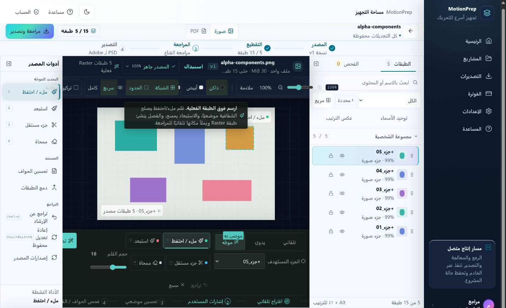 | 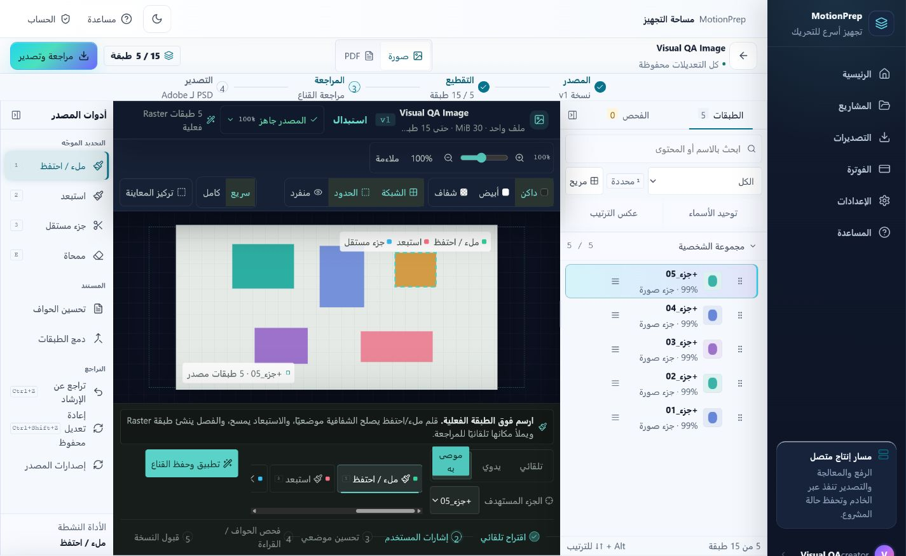 |

**التغيير:** التفاف شريط المعاينة وفق عرض حاويته، نقل الإرشاد خارج اللوحة، إزالة القص الأفقي، وتبسيط إجراءات الطبقة في قائمة واحدة.

### 2. مساحة المشروع — الهاتف

| قبل | بعد |
|---|---|
| 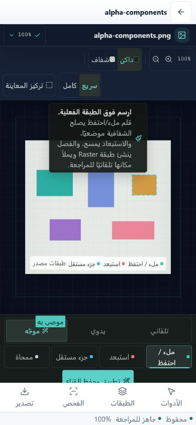 | 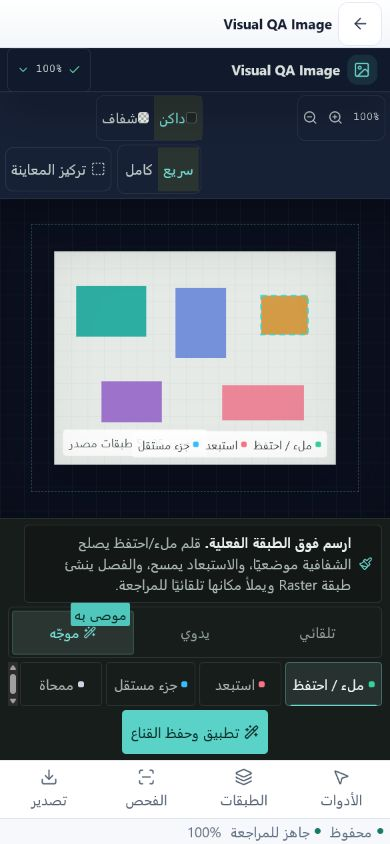 |

**التغيير:** الإرشاد قابل للقراءة والتمرير، وزر حفظ القناع كامل فوق dock الهاتف، من دون قص أو تمرير أفقي عالمي.

### 3. مراجعة التصدير — الهاتف

| قبل | بعد |
|---|---|
| 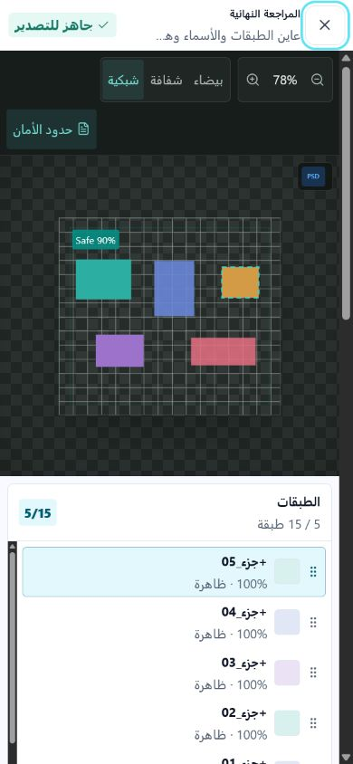 | 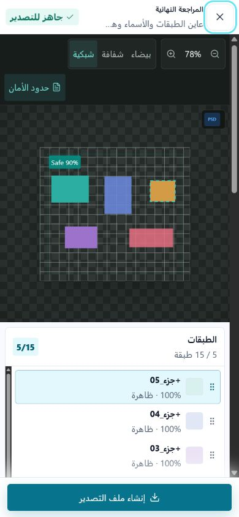 |

**التغيير:** أصبح إجراء «إنشاء ملف التصدير» صفًا ثابتًا في حوار المراجعة، بينما تتمرر المعاينة والطبقات والإعدادات داخل الجسم وحده.

### 4. المستخدمون في لوحة الإدارة — الهاتف

| قبل | بعد |
|---|---|
| 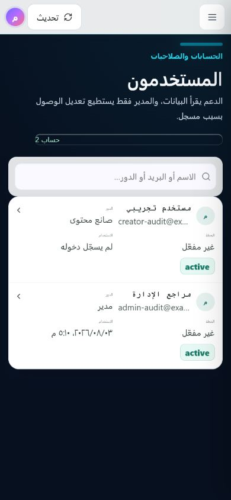 | 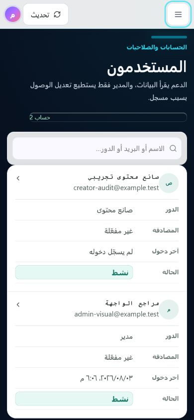 |

**التغيير:** بطاقة بعمود واحد، بريد كامل مع عنوان وصول، وصفوف تعريف واضحة للدور والمصادقة وآخر دخول والحالة، ونص فعلي 14px بدل التسميات المجهرية.

### 5. القائمة الإدارية — الهاتف

| قبل | بعد |
|---|---|
| 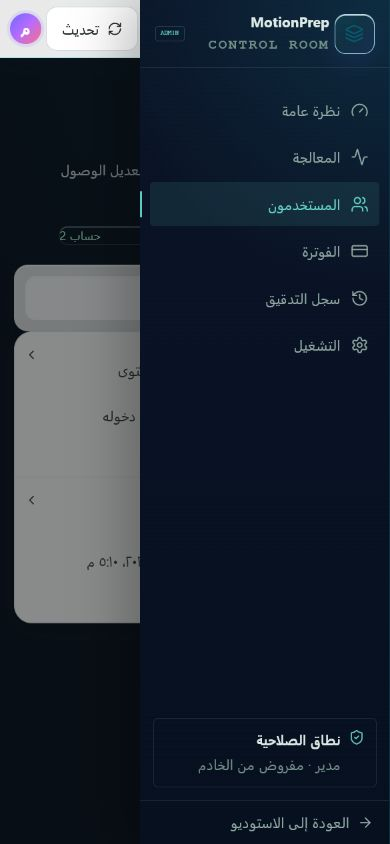 | 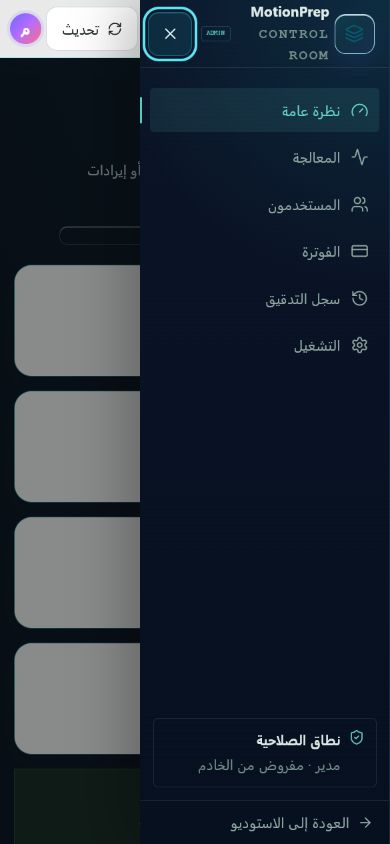 |

**التغيير:** زر إغلاق عالي التباين، `role=dialog` و`aria-modal`، عزل المحتوى بـ `inert`، حصر Tab، إغلاق Escape، واستعادة التركيز.

### 6. لوحة الإدارة — سطح المكتب

| قبل | بعد |
|---|---|
| 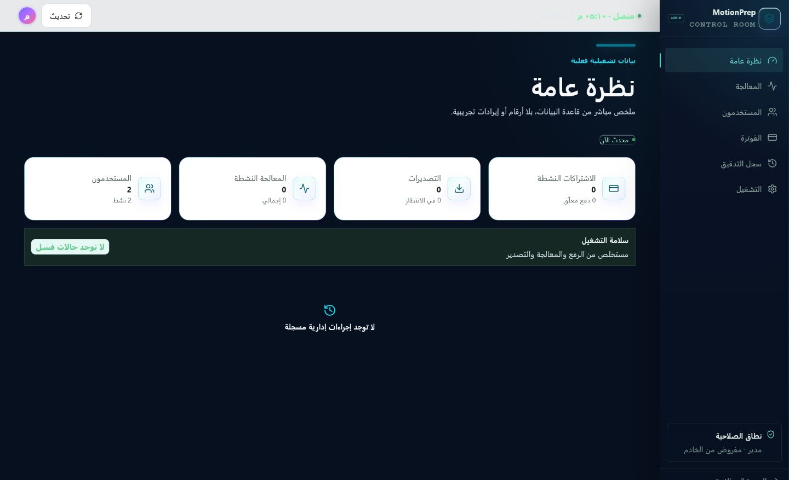 | 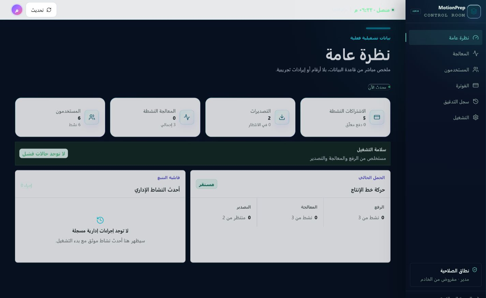 |

**التغيير:** استُثمرت المساحة الفارغة في قياسات الرفع والمعالجة والتصدير وأحدث النشاط الإداري، وكلها من بيانات الخادم الموجودة فعلًا.

## قياسات القبول المثبتة

| المسار | القياس بعد الإصلاح |
|---|---|
| شريط التنقل 390×844 | `position: fixed`، أعلى الشريط 766، أسفله 834 داخل viewport |
| مساحة الصورة 390×844 | زر حفظ القناع من 710 إلى 754، وdock يبدأ عند 760 |
| مساحة الصورة 1425×900 | عرض/تمرير عمود المعاينة 688/688، والإرشاد 688/688 |
| قائمة المستخدمين 390px | عرض/تمرير البطاقة 345/345، والنص الوظيفي 14px |
| قائمة الإدارة | الخلفية `inert=true` و`aria-hidden=true`، والتركيز يبدأ بزر الإغلاق ويعود لزر الفتح |
| مراجعة التصدير 390×844 | زر التصدير من 790 إلى 834، داخل الحوار وفوق الحافة السفلية |

## قرار الأداة

تعذر تفعيل تكامل Figma في الجلسة الحالية، لذلك استُخدمت لوحة تصميم حرة داخل المستودع مرتبطة مباشرة بلقطات التطبيق وقياسات DOM. هذا البديل قابل للمراجعة مع Git، ولا يفصل التصميم عن الكود أو دليل الاختبار.
