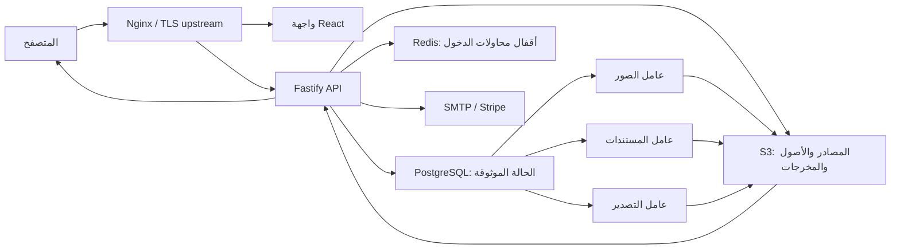

# تقرير التدقيق الشامل لمسارات الإنتاج وخطة الإصلاح النهائية — MotionPrep Studio

**تاريخ التدقيق:** 2026-08-01
**المستودع:** `ahmed1122-rpg/riig-`
**الفرع/الالتزام المنشور وقت الفحص:** `main` / `45f8e64be808f857de90b6be826fdf960a90d234`
**نطاق الفحص:** الشفرة المحلية الحالية، الصفحات، عقود HTTP، قواعد البيانات والترحيلات، الرفع والمعالجة والتصدير، العمال، التخزين، المزامنة والكاش، الأمان، الاختبارات، الحاويات، CI/CD، حالة GitHub العامة، والأصول التجريبية.

## 1. الحكم التنفيذي

الحالة الحالية هي **جاهز هندسيًا لبيئة تطوير/تكامل قوية، لكنه غير جاهز بعد لنشر عام نهائي**. سبب الحكم ليس انهيار البناء؛ بل وجود خمس بوابات إنتاج لم تُغلق بعد:

1. إتمام الرفع موزع على عدة كتابات مستقلة ويمكن أن يترك جلسة الرفع وإصدار المصدر والمشروع في حالات متناقضة بعد انقطاع العملية.
2. أصل Raster يُخدم بعنوان قابل لتغيير المحتوى مع ترويسة `immutable` لمدة 24 ساعة، ما قد يعرض صورة قديمة بعد تحسين الحواف.
3. أداة OCR الإقليمي تظهر كأداة `ready` في الواجهة، بينما الإنتاج يعطلها، ولا يمنع مدقق بيئة الإصدار إعادة تفعيلها مع دليل holdout قديم.
4. التغييرات المحلية الحالية غير ملتزمة وغير مختبرة في GitHub؛ يوجد 30 ملفًا متعقبًا معدلًا و11 ملفًا جديدًا، بينما آخر صور إصدار ناجحة بُنيت من التزام أقدم `48bdfd9` تحت الوسم `v0.1.0`.
5. مسارا `staging-readiness` و`provider-readiness` لم يُشغلا مطلقًا على GitHub، ولا توجد في المستودع بنية تحتية ككود أو دليل نشر/استعادة/تنبيه حقيقي قابل لإعادة الإنتاج.

بعد إغلاق هذه البوابات، يمكن الانتقال إلى **إطلاق محدود مراقب**؛ ثم تغطية الفجوات من مستوى P1 قبل الإتاحة العامة.

## 2. ما الذي تم التحقق منه فعليًا؟

| الدليل | النتيجة |
|---|---|
| بوابة `npm run quality` على الشجرة المحلية الحالية بعد إضافة هذا التقرير | ناجحة: بنية، lint، Knip، TypeScript، coverage، build، fixtures، visual assets، bundle budget |
| اختبارات API | 162 اختبارًا ناجحًا؛ التغطية الفعلية الأخيرة نحو 80.39% statements و69.63% branches و86.26% functions و82.25% lines |
| اختبارات الويب | 71 اختبارًا ناجحًا؛ التغطية المقاسة نحو 48.5%/47.7%/38.11%/50.08%، لكنها تشمل قائمة ملفات مختارة فقط |
| تكامل PostgreSQL/S3 | 12/12 ناجحة بعد 26 ترحيلًا |
| Playwright | 3 رحلات × سطح مكتب/هاتف = 6/6 ناجحة |
| طوبولوجيا Docker الشبيهة بالإنتاج | ناجحة محليًا، وتشمل API والويب والعمال والهجرة والصيانة والتبعيات |
| `npm audit --omit=dev` | صفر ثغرات معروفة في نتيجة الفحص الحالية |
| Knip | لا تبعيات أو exports ميتة معلنة |
| فحص التكرار `jscpd` على المصدر فقط | 551 سطرًا مكررًا من 25,738 = 2.14%؛ منخفض إجمالًا |
| روابط Markdown النسبية | لا روابط مكسورة بين 53 ملف Markdown محليًا |
| OpenAPI المولد | 52 مسارًا، 55 عملية، لكن 0 request bodies و0 summaries و0 tags و0 security assignments وكل الاستجابات الموثقة 200 فقط |
| GitHub Actions للالتزام `45f8e64` | `quality` و`codeql` ناجحان |
| GitHub provider/staging readiness | صفر تشغيل لكل منهما |
| GitHub release-images | تشغيل واحد ناجح فقط من `48bdfd9`/`v0.1.0`، ولا يوجد GitHub Release منشور |

> ملاحظة مهمة: نجاح CI الحالي يثبت الالتزام المنشور `45f8e64`، ولا يثبت التغييرات المحلية غير الملتزمة. نجاح البوابة المحلية يثبت الشجرة الحالية على Node `26.2.0`، بينما CI يستخدم Node `22.12.0`.

## 3. جرد المستودع والبنية

- 736 ملفًا متعقبًا، إضافة إلى 11 ملف تنفيذ جديد غير متعقب وقت التدقيق.
- 11 مساحة عمل: تطبيق API، تطبيق Web، ثلاثة عمال، وست حزم مجال/معالجة/تصدير.
- 191 ملف TypeScript و41 ملف TSX متعقبًا.
- 26 ملف SQL للترحيلات.
- 108 PNG و91 JPG و8 WebP.
- أصلان PDF تجريبيان بإجمالي 48,178 بايت، وأصلان PSD ذهبيان بإجمالي 150,592 بايت.
- لا توجد إشارات تنفيذ متروكة من نوع `TODO/FIXME/HACK/NotImplemented` في المصدر التنفيذي.
- لا توجد ملفات Terraform/Pulumi/CloudFormation/Helm/Kubernetes أو تعريف كامل للشبكة وTLS وDNS وقواعد البيانات المدارة.
- لا يوجد `LICENSE` أو `NOTICE` أو بيان تراخيص تبعيات في جذر المنتج.

### فائدة أصول PDF/PSD الحالية

- `motionprep-e2e.pdf`: عينة صغيرة حتمية لرحلات الواجهة والتكامل.
- `motionprep-scanned-arabic.pdf`: عينة OCR عربية ممسوحة للتحقق من مسار PDF.
- `book-pages.psd` و`image-layers.psd`: مخرجات Golden للتحقق من بنية ملفات Adobe وعدم تراجع التصدير.

هذه الأصول **أدلة اختبار وليست محتوى إنتاج للمستخدمين**. فائدتها منع تراجع التحليل والتصدير، ويجب إبقاؤها حتمية، موثقة المصدر والترخيص، ومولدة أو قابلة لإعادة التوليد.

## 4. خريطة مسار الإنتاج

القرار المعماري الأساسي صحيح: modular monolith مع PostgreSQL كمصدر حقيقة وعمال منفصلين عند الحدود الثقيلة. لا توجد حاجة مثبتة حاليًا إلى microservices أو كاش Redis عام.

## 5. النتائج الحرجة — P0

### P0-01 — التغييرات المرشحة للإصدار ليست في التزام قابل للتتبع

**الدليل:** الشجرة تحتوي 30 ملفًا متعقبًا معدلًا و11 ملفًا جديدًا. GitHub نجح للالتزام `45f8e64`، لكن إصدار الصور الوحيد نُشر من `48bdfd9`.
**الأثر:** لا يمكن ربط الشفرة المراد نشرها بصورة موقعة أو SBOM أو نتيجة CI مستضافة.
**الإصلاح:** فرع `codex/...`، مراجعة diff، التزام واحد أو سلسلة صغيرة، push، نجاح كل الوظائف، ثم وسم إصدار جديد وتشغيل `release-images`.
**معيار القبول:** SHA واحد يطابق المصدر، الاختبارات، SBOM، provenance، توقيع Cosign، وdigest المستخدم في بيئة النشر.

### P0-02 — إتمام الرفع غير ذري ويمكن أن يعلق المشروع

**الدليل:** `UploadService.completeVerified` يكتب بالتتابع: جلسة `verifying`، إصدار مصدر `verifying`، جلسة `ready`، إصدار مصدر `ready`. وبعدها يحدّث route المصدر الحالي وحالة المشروع في عمليتين إضافيتين. `receive()` يعيد مباشرة إذا كانت الجلسة `ready`.
**سيناريو الفشل:** انقطاع العملية بعد جعل الجلسة `ready` وقبل جعل إصدار المصدر `ready`؛ إعادة الطلب تعيد الجلسة ثم يفشل `markSourceReady` برسالة “Ready upload is missing its source version”، ولا يوجد reconciler يصلح الحالة.
**الإصلاح:**

1. افصل تحقق S3 عن نشر metadata.
2. نفذ transition واحدًا داخل transaction PostgreSQL يحدّث upload + source version + current source + project status.
3. اجعل العملية قابلة للإعادة بواسطة شرط الحالة وidempotency key.
4. أضف reconciler دوريًا للحالات `verifying/ready` المتناقضة.
5. أضف fault-injection tests بعد كل نقطة كتابة.

**معيار القبول:** إسقاط العملية بعد كل خطوة ثم إعادة الطلب ينتج حالة واحدة صحيحة دون رفع جديد أو تدخل يدوي.

### P0-03 — كاش Raster غير صحيح

**الدليل:** `/v1/projects/:projectId/layers/:layerId/asset?sourceVersionId=...` يرسل `private, max-age=86400, immutable`. تحسين الحواف يغير مرجع `rasterAsset` للـ`layerId` نفسه، بينما URL لا يحتوي revision أو digest، والواجهة تستخدم `fetch` بالعنوان نفسه.
**الأثر:** عرض أصل قديم حتى 24 ساعة، وقد يراجع المستخدم صورة تختلف عن الأصل الخادمي المعتمد.
**الإصلاح المفضل:** عنوان content-addressed يتضمن `documentRevision` أو SHA-256. بديل مقبول: `ETag` من SHA-256 مع `private, no-cache` وإعادة التحقق. لا تستخدم `immutable` مع هوية قابلة لتغيير المحتوى.
**معيار القبول:** اختبار متصفح يحمّل الأصل، ينفذ edge refine، ثم يثبت تغير البايتات/ETag دون مسح كاش يدوي.

### P0-04 — بوابة OCR لا تمنع تفعيل تنفيذ غير معتمد

**الدليل:** الإنتاج النموذجي يضبط `PDF_REGION_OCR_ENABLED=false`، و`verify:fixtures` يسمح بدليل implementation قديم طالما المثال معطل. لكن مدقق بيئة الإنتاج لا يرفض `true`، والواجهة تسجل `pdf.region-ocr` كـ`ready` ولا تقرأ capability من الخادم.
**الأثر:** يمكن لمشغل أن يفعّل الأداة مع holdout قديم، بينما المستخدم يراها جاهزة حتى عندما يعيد الخادم 503.
**الإصلاح:**

- أضف capability endpoint أو حقلًا في session/bootstrap يحمل `pdfRegionOcrEnabled` ونسخة engine/corpus.
- اجعل registry يعتمد capability ويعرض سبب التعطيل.
- اجعل مدقق release environment يرفض `PDF_REGION_OCR_ENABLED=true` ما لم تتطابق بصمة implementation مع holdout مختوم ناجح.
- أنشئ بوابة `verify:ocr-release` صارمة تعمل فقط عند التفعيل.

**معيار القبول:** لا يمكن بناء/نشر بيئة OCR مفعلة مع evidence قديم، والواجهة لا تعرض الأداة متاحة عند تعطيلها.

### P0-05 — مسار المزوّد والنشر والاستعادة غير مثبت

**الدليل:** GitHub يعرض صفر تشغيل لـ`staging-readiness` وصفر تشغيل لـ`provider-readiness`. `deploy/prometheus-alerts.yml` موجود، لكن لا يوجد نشر Prometheus/Alertmanager أو مالك تنبيه مثبت. لا توجد IaC، ولا تشغيل استعادة معزولة حقيقي منشور.
**الأثر:** نجاح Docker المحلي لا يثبت TLS أو الصلاحيات أو versioning أو النسخ الاحتياطي أو التنبيه أو rollback في المزوّد الفعلي.
**الإصلاح:** تعريف بيئة staging حقيقية، تشغيل المسارين، إضافة IaC للحد الأدنى (شبكة، TLS، قواعد managed، S3، IAM/OIDC، المراقبة)، وإجراء restore drill وrollback drill.
**معيار القبول:** أدلة مؤرخة وموقعة لاختبار dependencies، استعادة منفصلة، تنبيه يصل إلى مالك محدد، ونشر/رجوع بإصدارين digest-pinned.

## 6. النتائج العالية — P1

### P1-01 — OpenAPI فهرس مسارات وليس عقد تكامل

المواصفة تحتوي 55 عملية، لكن بلا bodies/tags/summaries/security وباستجابة 200 فقط، وتشمل `/internal/metrics` ومسارات الإدارة العامة في الوثيقة. هذا لا يصف 201/202/400/401/403/404/409/413/429/5xx ولا idempotency headers.
**الإصلاح:** schemas مشتركة قابلة للتحويل إلى JSON Schema، توثيق security وheaders والأخطاء، إخفاء internal أو نشر spec منفصل، ثم contract test يمنع route بلا schema.
**القبول:** مولد client ينجح، وكل عملية لها operationId وsecurity وresponses صحيحة، وتُقارن المواصفة بـsnapshot في CI.

### P1-02 — حدود المعدّل تتضاعف مع عدد نسخ API

`@fastify/rate-limit` مسجل دون Redis store، لذلك العداد الافتراضي داخل العملية. قفل محاولات login موزع في Redis، لكن register/reset/MFA والحد العام ليست موزعة.
**الإصلاح:** Redis store رسمي للـrate-limit أو rate limit مركزي عند edge مع مفتاح موحد وسياسة trusted proxy.
**القبول:** اختبار بعمليتي API يثبت أن الحد الكلي لا يتضاعف.

### P1-03 — استجابات API الحساسة بلا سياسة `no-store`

لا توجد ترويسات كاش ديناميكية سوى أصل Raster. جلسة المستخدم، المشاريع، الإدارة والفوترة يجب ألا تعتمد على heuristics للمتصفح أو proxy.
**الإصلاح:** hook افتراضي `Cache-Control: no-store` لمسارات `/v1` و`/internal`، مع استثناءات صريحة للأصول version-addressed.
**القبول:** اختبارات headers للجلسة والفوترة والإدارة والمشاريع.

### P1-04 — لا يوجد Error Boundary في React

لا يوجد `ErrorBoundary/componentDidCatch` أو fallback لتسجيل خطأ render/chunk. فشل lazy chunk أو render قد يترك صفحة بيضاء.
**الإصلاح:** boundary على مستوى التطبيق وboundary للمساحة الثقيلة، شاشة استرداد عربية، reload آمن، correlation/request ID، وربط Sentry أو بديل.
**القبول:** اختبار يرمي خطأ داخل route ويثبت ظهور fallback دون فقد الجلسة.

### P1-05 — تعارض المراجعات لا يملك مسار استرداد للمستخدم

الخادم يطبق CAS revision بصورة صحيحة، والواجهة تسلسل الحفظ محليًا، لكن 409 يتحول إلى رسالة “حدّث البيانات ثم أعد المحاولة” دون reload/merge/rebase أو حفظ مسودة محلية.
**الإصلاح:** عند conflict، جلب revision الأحدث، عرض الفروق، وتمكين “إعادة تطبيق تعديلاتي” أو “استخدام نسخة الخادم”، مع حفظ مسودة مؤقتة.
**القبول:** اختبار نافذتين تعدلان الوثيقة ويثبت عدم فقد التغييرات بصمت.

### P1-06 — تسليم استعادة كلمة المرور غير متين ولا قابل للرصد

يُحفظ token ثم يرسل SMTP مباشرة، وأي فشل يُبتلع لإخفاء وجود البريد. لا outbox/retry/dead-letter ولا metric لفشل الإرسال، رغم فحص جاهزية SMTP.
**الإصلاح:** transactional outbox دون تسريب هوية الحساب، عامل إرسال مع retries محدودة، metric وalert، وإبطال الرسائل المنتهية.
**القبول:** تعطل SMTP ثم عودته يؤدي إلى إرسال واحد، مع بقاء استجابة HTTP غير كاشفة لوجود الحساب.

### P1-07 — فجوات E2E وتغطية الويب

Playwright يغطي دخولًا عامًا، keyboard/mobile drawer، ورحلة صورة→PSD فقط. لا يغطي PDF، OCR المعطل، split/merge، source restore، MFA، reset، Stripe portal/webhook، admin RBAC، undo/redo، conflict، انقطاع الشبكة أو export cancellation. كما أن web coverage يقيس 12 ملفًا مختارًا فقط من نحو 60 وحدة مصدر وبعتبات منخفضة.
**الإصلاح:** مصفوفة رحلة/خطر، إضافة رحلات P0/P1، ثم توسيع coverage تدريجيًا إلى كل `src` مع استثناءات موثقة.
**القبول:** الرحلات الحرجة تعمل في Chromium desktop/mobile، واختبارات accessibility تشمل workspace/admin/billing/PDF.

### P1-08 — رفع الملفات يُحمّل الجسم كاملًا في ذاكرة API

Fastify يستخدم `parseAs: buffer` حتى 30 MiB؛ إيقاف buffering في Nginx لا يمنع ذاكرة Node.
**الإصلاح:** للإطلاق المحدود يمكن إبقاء الحد مع concurrency limit واختبار حمل. للتوسع أضف streaming multipart أو direct-to-S3 multipart session مع finalize موثوق وفحص server-side.
**القبول:** اختبار 30 MiB متزامن يثبت RSS/latency تحت حدود الحاوية، وإلغاء العميل لا يترك جلسة/كائنًا يتيمًا.

### P1-09 — الموافقة القانونية شكلية فقط

الواجهة تشترط checkbox للشروط والخصوصية، لكن client يرسل `{name,email,password}` فقط، والخادم لا يستقبل/يخزن consent version/time، ولا توجد صفحات شروط وخصوصية فعلية. كذلك لا يوجد user-facing account deletion أو data export.
**الإصلاح:** قرار قانوني قبل الجمع: صفحات versioned، روابط حقيقية، سجل consent، وسياسة retention. إذا تنطبق متطلبات محو/تصدير، أضف workflows مؤمنة ومدققة.
**القبول:** لا يمكن التسجيل دون نسخة موافقة معروفة، ويمكن إثبات النسخة والوقت دون تخزين زائد.

### P1-10 — حوكمة الإصدار اليدوي تسمح بأي ref

`release-images` يعمل للوسوم ولـ`workflow_dispatch`. حماية environment مفيدة، لكن الملف نفسه لا يقيد التشغيل اليدوي إلى tag محمي.
**الإصلاح:** رفض publish ما لم يكن `refs/tags/v*` أو إدخال digest/SHA معتمد مرتبط بقرار release، وفصل staging/production environments.
**القبول:** محاولة publish من فرع عادي تفشل قبل تسجيل الدخول إلى registry.

### P1-11 — تراخيص المنتج والتبعيات غير مجمعة

لا يوجد ترخيص منتج أو NOTICE، وSharp يجلب حزم libvips ذات `LGPL-3.0-or-later`. هذا ليس دليل مخالفة، لكنه نقص في release artifact.
**الإصلاح:** تحديد ترخيص المنتج، توليد third-party notices/SBOM license report، ومراجعة التزامات التوزيع مع المسؤول القانوني.
**القبول:** artifact تراخيص مرفق بكل إصدار وصورة.

## 7. نتائج متوسطة — P2

1. **CSRF defense-in-depth:** `SameSite=Lax` وCORS جيدان، لكن لا يوجد فحص Origin/CSRF token؛ أضف فحص Origin للطلبات المغيرة للحالة، خصوصًا إن وجدت subdomains غير موثوقة.
2. **CSP:** `style-src 'unsafe-inline'` يقلل صرامة CSP. انتقل تدريجيًا إلى nonce/hash أو CSS classes.
3. **ملفات ضخمة:** `processing-service.ts` نحو 1405 سطرًا، `Workspace.tsx` 1346، `document-processing/index.ts` 1115، `export-service.ts` 936، و`processing-worker-runtime.ts` 802. التقسيم مطلوب حسب use case، لا حسب طبقات شكلية.
4. **تكرار منخفض لكن متمركز:** 2.14% فقط. hotspots في validation/authorization/error mapping داخل `processing-routes.ts`، polling في `projects-client.ts`، SQL reserve/finalize، وحفظ revision. استخرج helpers محددة ولا تنشئ abstraction عامة مبكرة.
5. **اقتران العمال بالـAPI:** حزم العمال تستورد runtime subpaths من `@motionprep/api`. استخرج worker runtime contracts/config إلى حزمة داخلية عند أول حاجة مستقلة للنشر.
6. **تكرار tsconfig:** توجد خيارات متشابهة بين workspaces. أنشئ base configs (`node`, `react`, `library`).
7. **إصدارات الأدوات غير مثبتة بالكامل:** CI يثبت Node 22.12، لكن root يسمح `>=22.12` ولا يحتوي `packageManager`. أضف `.node-version` و`packageManager: npm@...`.
8. **اعتماديات قابلة للتحديث:** تحديثات patch/minor متاحة لـFastify وrate-limit وAWS SDK وRedis وStripe وpdfjs وVite وKnip. نفذها بمجموعات صغيرة. لا تدمج ترقيات Zod 4/Lucide 1/TypeScript 7 آليًا؛ فـDependabot يثبت أن بعضها يكسر quality.
9. **شجرتا Playwright:** يوجد `playwright-core` 1.62.0 و1.61.1. وحّد `@playwright/test`/Playwright في تحديث مستقل.
10. **Tracing:** المقاييس والسجلات جيدة كبداية، لكن لا يوجد distributed trace يربط API بالworker/S3/Stripe. أضف OpenTelemetry عند الحاجة التشغيلية، مع عدم تسجيل نصوص المصادر.
11. **ترحيلات متوافقة مع الرجوع:** runner يملك advisory lock وtransaction وchecksum؛ أضف lint/policy آلية تمنع DROP/rename غير المرحلي في نفس إصدار التطبيق.
12. **إدارة المنتج:** لا توجد rename/archive/delete للمشاريع ولا حذف حساب من الواجهة. هذه ليست أعطالًا مؤكدة، لكنها قرارات نطاق يجب حسمها قبل الالتزام بسياسات الاحتفاظ أو الخصوصية.

## 8. ما ليس خطأً بعد الفحص

- عدم استخدام Redis لكاش الاشتراكات ووثائق الطبقات قرار صحيح حاليًا؛ PostgreSQL هو المصدر الموثوق ولا توجد بيانات أداء تبرر مسار invalidation جديدًا.
- أزرار split/merge المحلية داخل `ExportReview` مخفية عندما يوجد مصدر حقيقي (`structuralEditingUnavailable = canExport`)؛ العمليات الإنتاجية الفعلية تستخدم مسارات الخادم من Workspace، ولذلك لم تُسجل كأداة إنتاج معطلة.
- تكرار adapters الذاكرية وPostgreSQL ليس كله كودًا ميتًا؛ جزء منه مقصود لاختبارات وحدود البنية. المطلوب نقل invariants المشتركة فقط.
- Nginx يستخدم `immutable` بصورة صحيحة لملفات Vite ذات الأسماء المحشوة؛ المشكلة خاصة بعنوان Raster المتغير.
- لا توجد مشكلة مثبتة في روابط Markdown أو favicons أو visual manifest؛ البناء وفحص الأصول نجحا.

## 9. الأمان — نقاط القوة والفجوات

### نقاط قوة مثبتة

- كلمات مرور قوية، جلسات مخزنة كـhash، Cookies `HttpOnly/Secure/SameSite=Lax` في الإنتاج.
- TOTP وrecovery codes وحماية الأسرار بـAES-GCM ومفتاح 32 بايت.
- Redis لقفل محاولات تسجيل الدخول.
- exact-origin CORS، وثقة proxy hop واحدة مع Nginx يعيد كتابة X-Forwarded-For.
- S3 private مع تشفير وversioning readiness، ولا روابط عامة دائمة.
- Gitleaks وCodeQL وTrivy، Actions مثبتة بـSHA، base images مثبتة بـdigest.
- حاويات non-root/read-only، `cap_drop: ALL` و`no-new-privileges` وlimits وhealthchecks.
- SBOM/provenance/Cosign في release workflow.

### ما يلزم قبل النشر العام

- إصلاح distributed rate limit و`no-store` وOpenAPI security.
- إثبات secrets/variables وحماية environments؛ لا يمكن استنتاجها من الصفحة العامة.
- تشغيل فحص أسرار وصور على SHA النهائي بعد الالتزام.
- استكمال license/privacy/consent decisions.
- توصيل alerts إلى جهة مسؤولة وإجراء محاكاة incident.

## 10. المزامنة والكاش والاتساق

| المجال | الموجود | الحكم | المطلوب |
|---|---|---|---|
| تعديلات الطبقات | revision/CAS + history + undo/redo | قوي خادميًا | UX لحل 409 |
| claims للعمال | PostgreSQL row locks + leases + requeue + drain | قوي | اختبارات chaos/soak |
| Stripe events | ترتيب وتطبيق ذري واختبارات | جيد | staging webhook حقيقي |
| Idempotency | PostgreSQL store والواجهة ترسل UUID غالبًا | جيد داخليًا | توثيق header ورفض/تحديد سياسة غيابه للعملاء الخارجيين |
| إتمام الرفع | كتابات متتابعة عبر repositories | خطر P0 | transaction + reconciler |
| Raster browser cache | mutable URL + immutable header | خطأ P0 | content address/ETag |
| Application cache | لا كاش Redis عام | قرار صحيح | لا تضفه بلا قياس وخطة invalidation |
| Multi-tab | CAS يمنع الكتابة الصامتة | حماية بيانات | merge/rebase UI |

## 11. خطة الإصلاح النهائية

### المرحلة 0 — تجميد خط الأساس وحفظ العمل (نصف يوم)

1. إنشاء فرع `codex/production-finalization`.
2. مراجعة 30 تعديلًا و11 ملفًا جديدًا وفصل التغييرات غير المرتبطة.
3. تثبيت Node/npm المستخدمين محليًا وفي CI.
4. الالتزام والدفع وتشغيل quality/CodeQL دون إصدار صور بعد.

**بوابة الخروج:** شجرة نظيفة وSHA واحد ناجح في GitHub.

### المرحلة 1 — سلامة البيانات والكاش والـOCR (2–4 أيام)

1. transaction موحد لإتمام الرفع وتحديث المشروع.
2. reconciler + fault-injection matrix.
3. URL versioned/ETag لـRaster وإزالة immutable غير الصحيح.
4. capability contract للواجهة.
5. ربط OCR ببصمة evidence ومدقق بيئة صارم.

**بوابة الخروج:** اختبارات الانقطاع والكاش وOCR تمر محليًا وCI.

### المرحلة 2 — الأمان والعقود وتجربة الاسترداد (3–5 أيام)

1. Redis/edge distributed rate limiting.
2. `no-store` افتراضي وفحص Origin.
3. OpenAPI كامل + contract gate.
4. Error boundaries وtelemetry.
5. conflict resolution UI.
6. SMTP outbox/retry/metrics.

**بوابة الخروج:** اختبارات أمن/عقد/multi-tab/failure recovery ناجحة.

### المرحلة 3 — تغطية الرحلات والأداء (3–5 أيام)

1. E2E PDF/MFA/reset/admin/billing/source restore/undo/export cancellation.
2. accessibility على الصفحات الموثقة.
3. توسيع web coverage من الملفات المختارة إلى المصدر كله.
4. k6 أو Artillery لرفع 30 MiB والمعالجة والتصدير المتزامن.
5. soak test للعمال والleases وgraceful drain.

**بوابة الخروج:** SLOs وحدود RSS وqueue age موثقة، ولا أخطاء حرجة.

### المرحلة 4 — المزوّد والاستعادة والنشر (2–4 أيام، تعتمد على الحسابات)

1. إنشاء staging منفصلة وقيم GitHub environment.
2. IaC للحد الأدنى أو توثيق managed stack قابل لإعادة البناء.
3. تشغيل `staging-readiness` بنجاح.
4. نشر digest مرشح في staging وتشغيل smoke/E2E/provider probes.
5. restore drill إلى موارد معزولة وتوقيع manifest.
6. rollback إلى digest سابق.
7. توصيل Prometheus/Alertmanager أو خدمة بديلة، واختبار وصول التنبيه.

**بوابة الخروج:** `provider-readiness` ناجح ودليل restore/rollback/alert مرفق.

### المرحلة 5 — الإصدار المحدود ثم العام (1–2 يوم + فترة مراقبة)

1. وسم `v0.2.0-rc.1` على SHA المعتمد.
2. تشغيل release-images والتحقق من signatures/SBOM/provenance.
3. نشر محدود، مراقبة 24–72 ساعة، وتفعيل kill switches.
4. مراجعة الأخطاء والـSLOs ثم ترقية نفس digest أو إصدار جديد.
5. إنشاء GitHub Release رسمي مع release notes وdigests وخطة rollback.

## 12. قائمة قبول النشر النهائية

- [ ] لا تعديلات أو ملفات غير متعقبة.
- [ ] SHA النهائي نجح في quality وCodeQL وTrivy وGitleaks وdurable integration وbrowser E2E وproduction topology.
- [ ] atomic upload/fault injection ناجح.
- [ ] Raster cache test ناجح.
- [ ] OCR معطل بصدق أو مفعّل مع holdout مختوم حديث.
- [ ] OpenAPI عقد صالح ولا يكشف internal endpoints بلا قصد.
- [ ] distributed rate limits و`no-store` مثبتان.
- [ ] Error Boundary وconflict recovery موجودان.
- [ ] SMTP failure/retry observable.
- [ ] شروط/خصوصية/consent والسياسات القانونية محسومة.
- [ ] staging/provider readiness ناجحان.
- [ ] restore وrollback وalert drills ناجحة.
- [ ] صور digest-pinned موقعة، وSBOM/NOTICE مرفقان.
- [ ] مراقبة الإطلاق ومالك incident وkill switches موثقون.

## 13. اقتراحات تطوير احترافية بعد الاستقرار

1. **Capability-driven UI:** اجعل كل أداة مرتبطة بقدرات الخادم، الإصدارات، الحدود والسبب، بدل registry ثابت.
2. **Use-case modules:** قسم processing/export إلى commands واضحة (`FinalizeUpload`, `RefineRaster`, `SplitText`, `PublishExport`) مع transactions عند الحدود.
3. **Operational release manifest:** ملف JSON موقع يربط SHA وdigests وmigration range وfeature flags وOCR evidence وSBOM.
4. **Chaos-lite suite:** قتل worker/API عند نقاط قابلة للحقن بدل بناء منصة chaos معقدة.
5. **Performance budgets:** RSS/CPU/queue-age/export-duration إلى جانب bundle budget الموجود.
6. **Product analytics قليلة البيانات:** أحداث نجاح/فشل الرحلات دون نصوص أو صور، مع قرار consent واضح.
7. **Support tooling:** شاشة إدارة تعرض correlation ID وحالة المصدر/المهمة وإجراء reconcile مدققًا، دون السماح بتعديل عشوائي للحالة.

## 14. القرار النهائي

**No-Go للنشر العام الآن.**
**Go لإكمال الإصلاح والـstaging** لأن الأساس المعماري والاختباري جيد، ولا توجد مؤشرات على حاجة لإعادة كتابة المشروع. الإصلاح الصحيح هو إغلاق حدود الاتساق والإصدار والتشغيل، ثم توسيع اختبارات الرحلات؛ وليس إضافة خدمات أو كاش أو abstractions بلا دليل.

### روابط GitHub التي راجعها التدقيق

- [حالة Actions](https://github.com/ahmed1122-rpg/riig-/actions)
- [مسار release-images](https://github.com/ahmed1122-rpg/riig-/actions/workflows/release-images.yml)
- [مسار staging-readiness](https://github.com/ahmed1122-rpg/riig-/actions/workflows/staging-readiness.yml)
- [مسار provider-readiness](https://github.com/ahmed1122-rpg/riig-/actions/workflows/provider-readiness.yml)
- [الإصدارات الرسمية](https://github.com/ahmed1122-rpg/riig-/releases)
