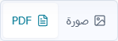
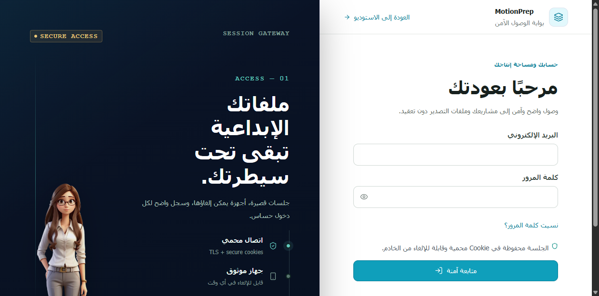
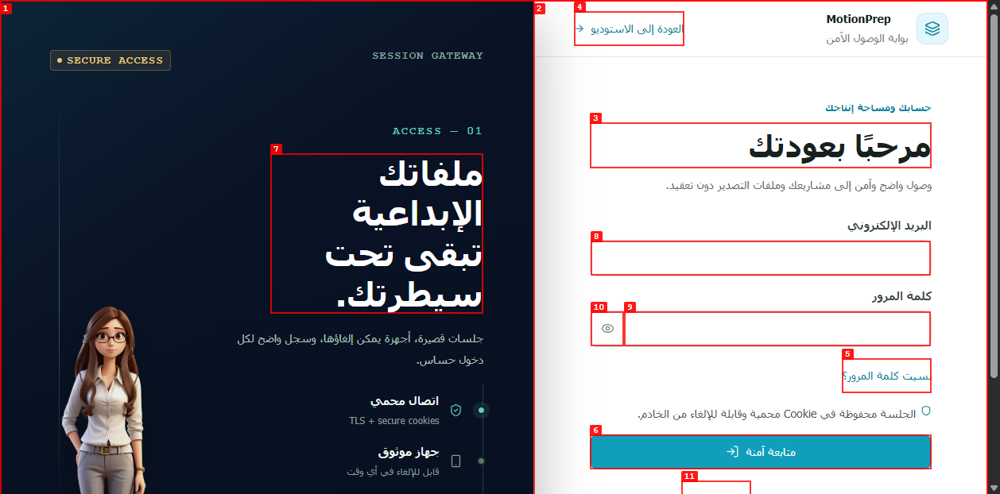

# Dogfood Report: MotionPrep

| Field | Value |
|---|---|
| Date | 2026-07-31 |
| App URL | `http://127.0.0.1:5173` |
| Session | `motionprep-local` |
| Scope | التسجيل، رفع صورة وPDF، المعالجة، استبدال المصدر، الطبقات، التصدير، لوحة المفاتيح، والهاتف |

## Summary

| Severity | Count |
|---|---:|
| Critical | 0 |
| High | 0 |
| Medium | 0 |
| Low | 0 |
| **Total** | **0** |

## Invalidated observations

### OBS-001: مفتاحا نوع المشروع بديا غير مرئيين في اللقطة المعلّمة

| Field | Value |
|---|---|
| Result | ليست مشكلة في التطبيق |
| URL | `http://127.0.0.1:5173`، مساحة تجهيز الصورة |
| Repro Video | N/A؛ المشكلة ظاهرة دون تفاعل |

**Description**

غطّت علامات الترقيم الحمراء النص الصغير في اللقطة الشاملة. فحص النمط المحسوب ولقطة العنصر وحده أثبتا أن الزرين مرئيان بلون وتباين صحيحين، وأن التبديل بينهما يعمل.

**Repro Steps**

1. سجّل الدخول وافتح مشروع صورة وارفع مصدراً صالحاً.
2. الدليل الحاسم هو لقطة العنصر المقصوصة التي تظهر الزرين بوضوح.
   

---

### OBS-002: نقرة آلية بمرجع قديم على زر إنشاء الحساب

| Field | Value |
|---|---|
| Result | ليست مشكلة في التطبيق |
| URL | `http://127.0.0.1:5173`، شاشة الدخول |
| Repro Video | غير متاح؛ أداة التسجيل المحلية تفتقد `ffmpeg` |

**Description**

ظهرت لقطة أولية توحي بأن الزر لم يعمل، لكن إعادة الاختبار من جلسة جديدة وتفعيله بلوحة المفاتيح أظهرت نموذج التسجيل كاملاً. السبب كان استخدام مرجع عنصر قديم في أداة الأتمتة بعد إعادة رسم الواجهة، وليس خللاً قابلاً للتكرار لدى المستخدم.

**Repro Steps**

1. افتح شاشة تسجيل الدخول ولاحظ وجود زر «إنشاء حساب».
   

2. انقر «إنشاء حساب» وانتظر اكتمال إعادة الرسم.

3. اللقطة التالية تخص المحاولة الآلية غير الصالحة، ولا تُعد دليلاً على عيب في المنتج.
   
