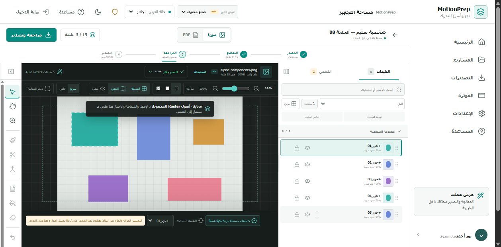
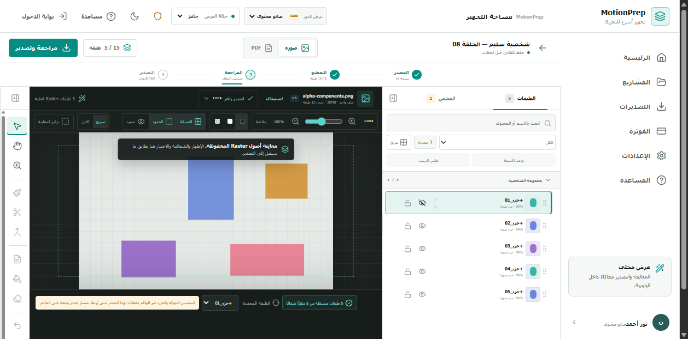
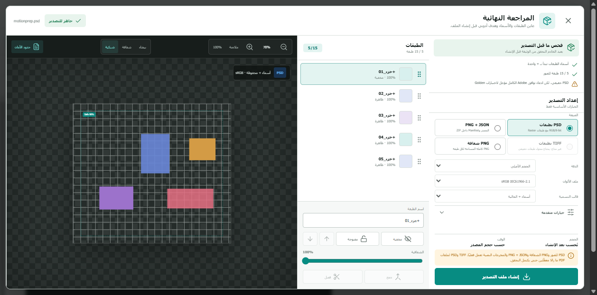
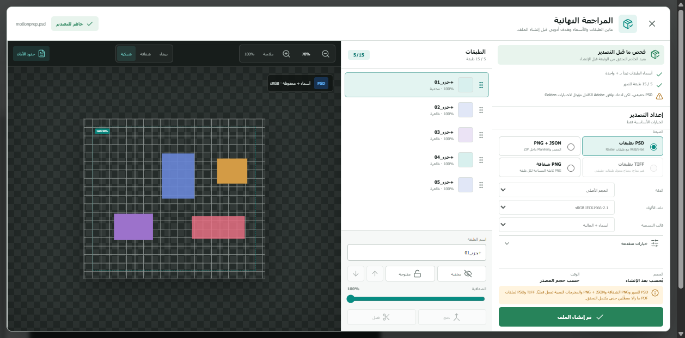

# Dogfood Report: MotionPrep Alpha Segmentation

| Field | Value |
|---|---|
| **Date** | 2026-07-28 |
| **App URL** | http://127.0.0.1:5173 |
| **Session** | motionprep-alpha-segmentation |
| **Scope** | Transparent image upload → five persisted raster layers → review → PSD export |

## Summary

| Severity | Count |
|---|---:|
| Critical | 0 |
| High | 0 |
| Medium | 0 |
| Low | 0 |
| **Total** | **0** |

## Verification log

1. Registered a fresh creator session and uploaded
   `artifacts/fixtures/alpha-components.png`.
2. The workspace reported five real Raster layers and rendered all five from
   authenticated layer-asset responses.
   
3. Hid `+جزء_01`; the canvas removed only that component while preserving the
   remaining four.
   
4. Opened export review. It showed the same five layers, the same hidden state,
   disabled unsupported structural controls, and a four-component composite.
   
5. Created the PSD. The browser observed PATCH 200, export POST 202, and
   download GET 200 with no console or page errors.
   
6. Read the downloaded PSD back structurally:
   - signature: `8BPS`
   - canvas: `720 × 480`
   - bytes: `47,272`
   - SHA-256:
     `0c495b9c907a6dc39ea6414c485f5fbf68ead031429848979be6ee1ca4d1682e`
   - five named layers with the expected cropped bounds
   - `+جزء_01` persisted as hidden

## Issues

No reproducible issues were found in this scoped run.
