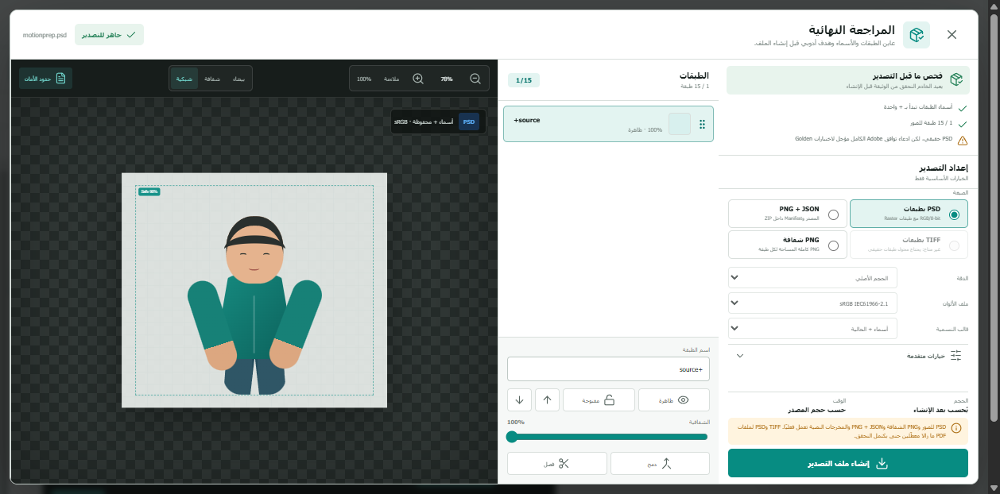
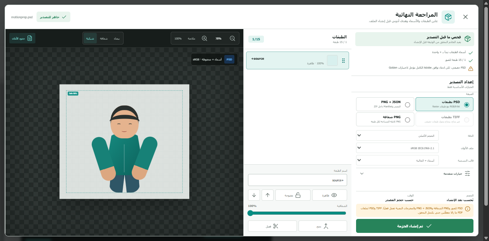
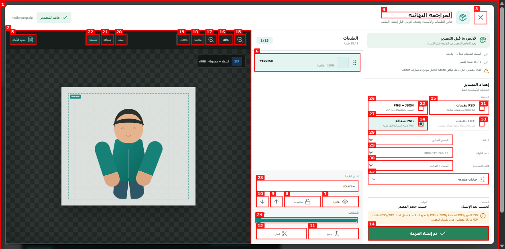
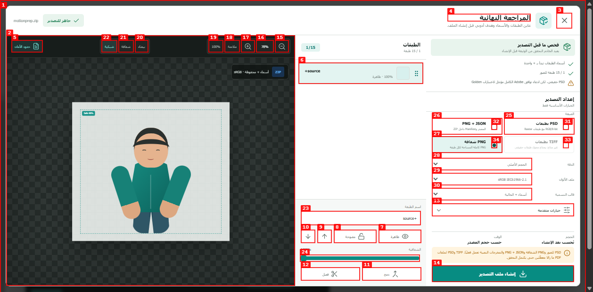
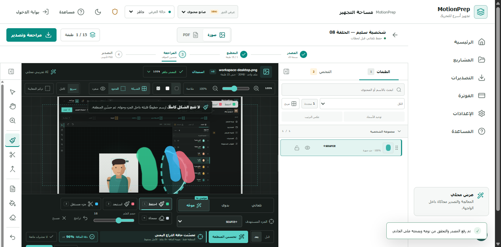
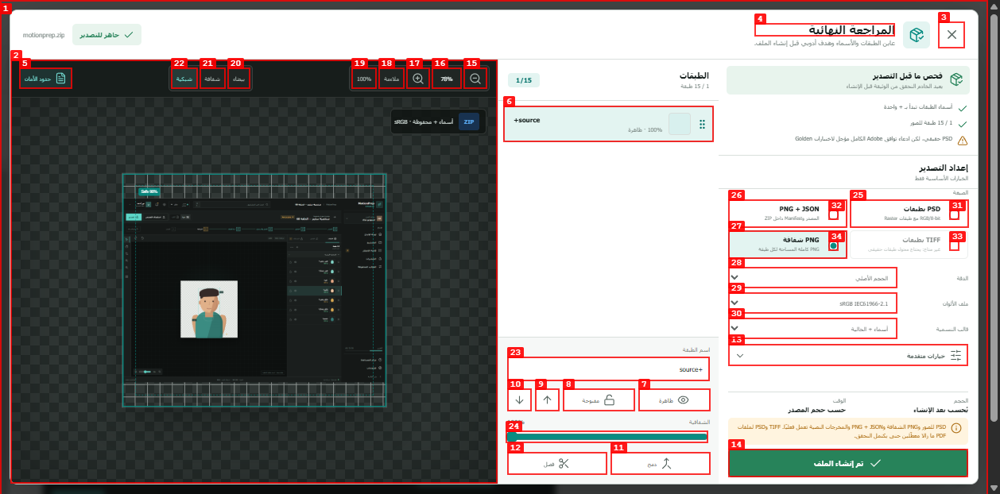
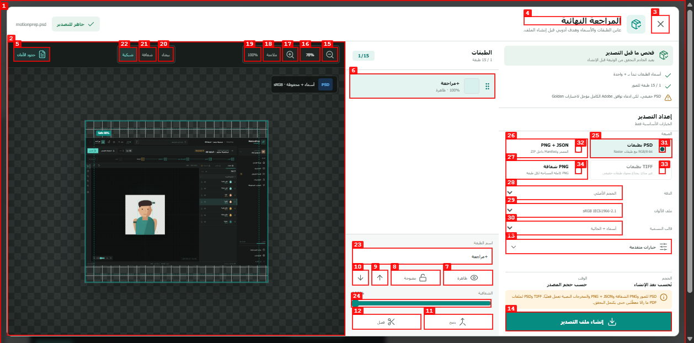
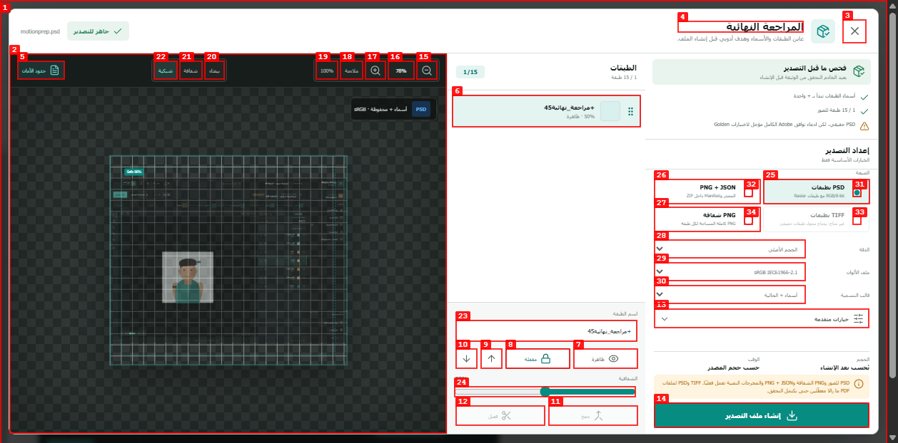
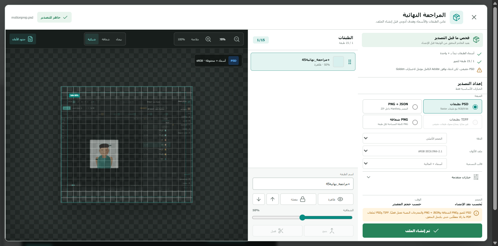

# Dogfood Report: MotionPrep image export

| Field | Value |
|---|---|
| **Date** | 2026-07-28 |
| **App URL** | http://localhost:5173 |
| **Session** | motionprep-image-export |
| **Scope** | Image upload → export review → PSD/transparent PNG availability and PSD download |

## Summary

| Severity | Count |
|---|---:|
| Critical | 0 |
| High | 1 |
| Medium | 1 |
| Low | 1 |
| **Total** | **3** |

## Verification

The real browser flow uploaded and processed a 1440×1000 PNG, exposed PSD
and transparent PNG exports, disabled layered TIFF, and downloaded a PSD.
One low-severity state-label issue was reproduced and fixed during the pass.

## Issues

### ISSUE-001: Success label survives a format change

| Field | Value |
|---|---|
| **Severity** | low |
| **Category** | ux |
| **URL** | http://127.0.0.1:5173 |
| **Repro Video** | N/A — local recorder could not start because ffmpeg is unavailable |

**Description**

After exporting PSD successfully, selecting “PNG شفافة” left the primary
button labeled “تم إنشاء الحزمة”. The newly selected PNG export had not been
created yet, so the retained success state could mislead the user.

**Repro Steps**

1. Open image export review with PSD selected.
   

2. Create the PSD and observe the success state.
   

3. Select “PNG شفافة”; the button still shows the previous success state.
   

**Resolution**

Reset generation state whenever the selected format changes and disable format
radios while generation is in progress. A pure-state regression test covers
the transition.

### ISSUE-002: Export review shows demo artwork instead of the uploaded source

| Field | Value |
|---|---|
| **Severity** | medium |
| **Category** | functional / ux |
| **URL** | http://127.0.0.1:5173 |
| **Repro Video** | N/A — visible in the review after upload |

**Description**

The workspace correctly previewed the uploaded `workspace-desktop.png`, but
opening export review replaced it with the hardcoded demo character. The
generated artifact used the real server source, so the review was not a
trustworthy preview of what would be exported.

**Evidence**

1. Workspace showing the real uploaded source.
   

2. Export review showing unrelated demo artwork.
   

**Resolution**

Pass the uploaded object URL into export review and render it with contain
scaling, visibility, and opacity from the current source layer. Keep the demo
artwork only as an explicit no-upload fallback.

### ISSUE-003: Review edits were not persisted before export

| Field | Value |
|---|---|
| **Severity** | high |
| **Category** | functional |
| **URL** | http://127.0.0.1:5173 |
| **Repro Video** | N/A — local recorder could not start because ffmpeg is unavailable |

**Description**

Renaming, hiding, locking, or changing opacity in export review updated only
React state. The export API loaded the original persisted `LayerDocument`, so
the resulting PSD/manifest could disagree with the approved review.

**Evidence**

1. Rename the real source layer to `+مراجعة` in export review.
   

**Resolution**

Added an authenticated, ownership-checked layer-document PATCH endpoint with
boundary validation and optimistic revision checks. The web client now sends
only changed editable fields before creating an export, advances the revision,
and updates its saved snapshot. Structural split/merge controls are disabled
for a production source until independently stored derived assets and
persisted ordering are supported.

Integration coverage verifies a reviewed name, lock, and opacity by reading
the generated PSD back, and verifies stale revisions return HTTP 409.

Browser verification then confirmed revision `2` with the reviewed layer name,
50% opacity, and lock state persisted. The resulting PSD download returned
HTTP 200, content type `image/vnd.adobe.photoshop`, and 1,419,560 bytes.

