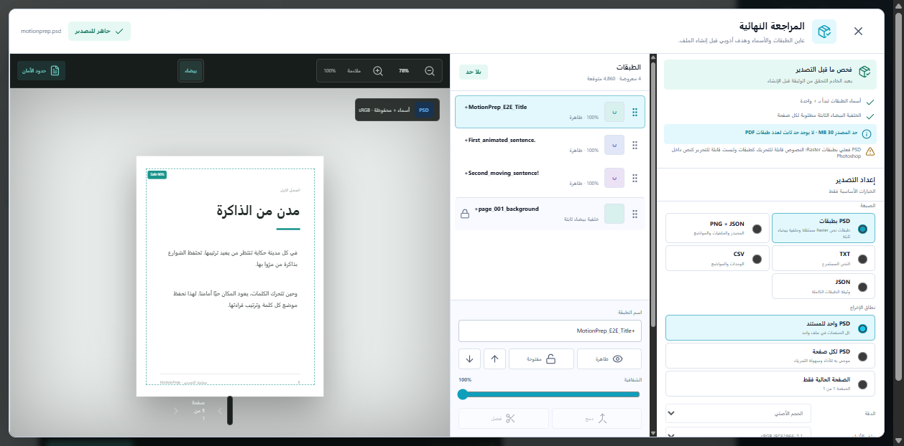
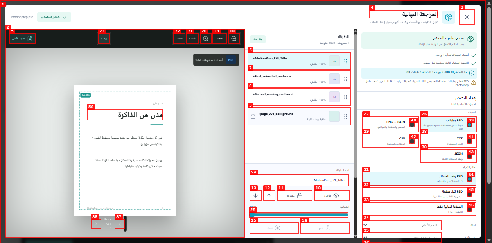
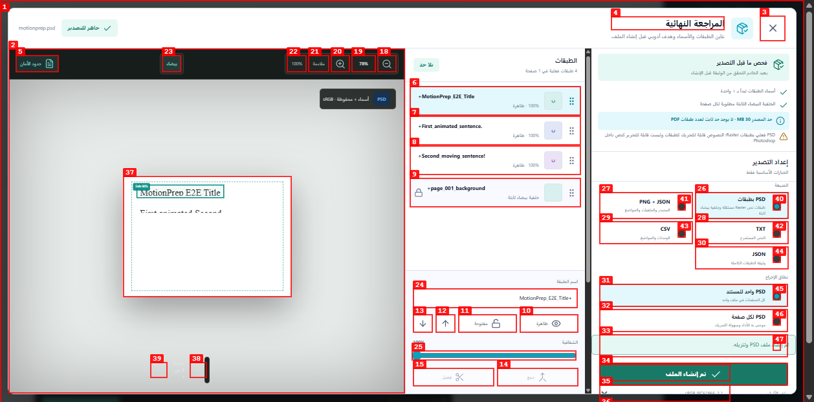
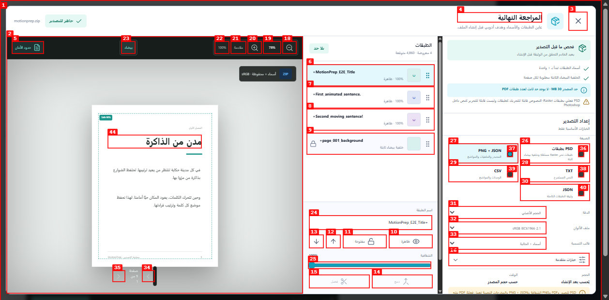
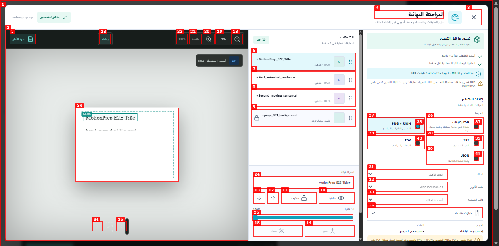
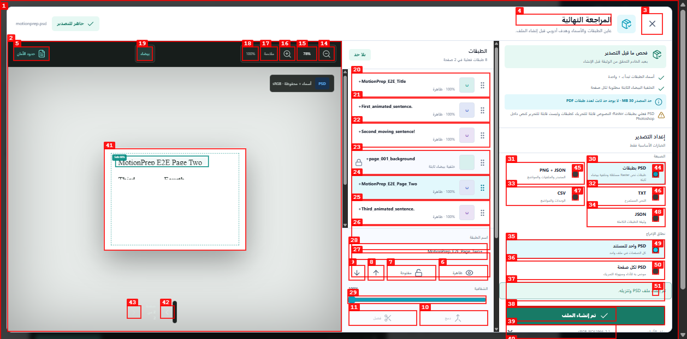
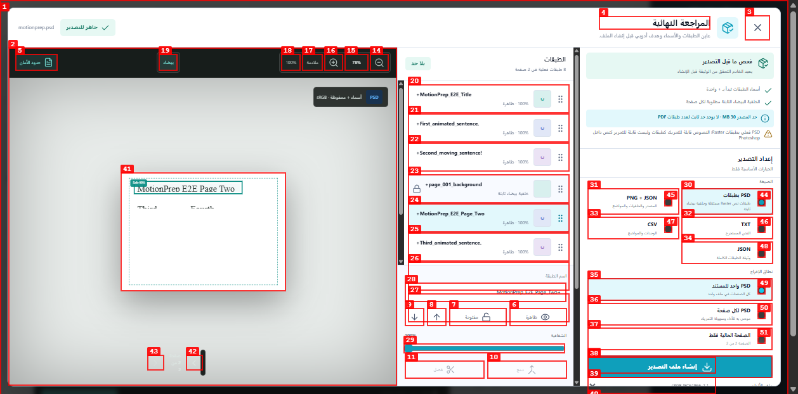
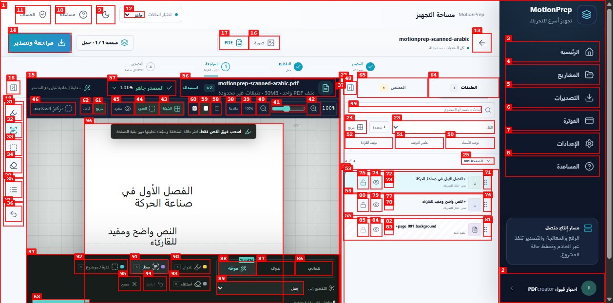
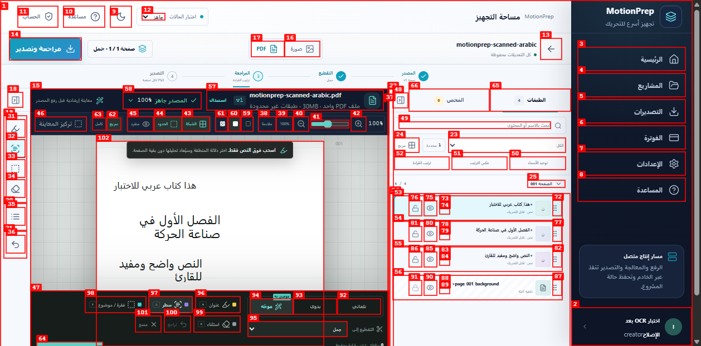
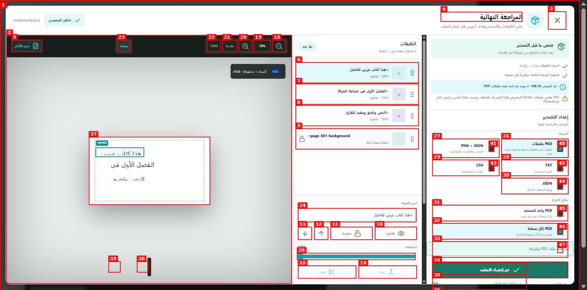

# تقرير Dogfood: MotionPrep Runtime Stack

| الحقل | القيمة |
|---|---|
| التاريخ | 2026-07-28 |
| الرابط | `http://127.0.0.1:5173` |
| الجلسة | `motionprep-runtime` |
| النطاق | التسجيل، الرفع، المعالجة، مراجعة الطبقات، التصدير، والتنقل الأساسي |

## الملخص

| الشدة | العدد |
|---|---:|
| حرجة | 0 |
| عالية | 1 |
| متوسطة | 2 |
| منخفضة | 1 |
| **الإجمالي** | **4** |

## نتائج الرحلة

- نجح إنشاء حساب وجلسة خادم حقيقية.
- نجح رفع صورة PNG وفصلها إلى خمس طبقات Raster.
- نجح ترتيب طبقة وإعادة تسميتها وحفظ التعديل.
- نجح إنشاء PSD للصورة وتنزيله وظهوره في سجل التصديرات.
- نجح رفع PDF واستخراج النص والخلفية.
- نجح إنشاء PSD كامل للـPDF بعد تثبيت زر الإجراء داخل اللوحة.
- نجح رفع PDF حقيقي من صفحتين والتنقل إلى الصفحة الثانية وعرض نصها الفعلي.
- نجح تصدير PDF متعدد الصفحات بصيغة PSD لكل صفحة بالنقر الفعلي.
- نجح OCR لملف PDF عربي ممسوح بلا نص مضمّن، واستعاد الأسطر الثلاثة في طبقات RTL مستقلة.
- نجح تصدير نتيجة OCR العربية بصيغة PSD لكل صفحة وتنزيلها.
- لا توجد أخطاء JavaScript مسجلة بعد إعادة الاختبار.

## المشكلات

### ISSUE-001: إجراء التصدير الأساسي يختفي أسفل اللوحة القابلة للتمرير

| الحقل | القيمة |
|---|---|
| الشدة | متوسطة |
| الفئة | تجربة مستخدم / وظيفية |
| الرابط | `http://127.0.0.1:5173` |
| فيديو الإعادة | غير متاح؛ أداة التسجيل المحلية تفتقد `ffmpeg` |
| الحالة | تم الإصلاح وإعادة الاختبار |

**الوصف**

في نافذة PDF وعلى ارتفاع 768px يقع زر «إنشاء ملف التصدير» أسفل مساحة
اللوحة اليمنى القابلة للتمرير، فلا يبقى مرئيًا بعد اختيار نطاق PSD. أظهر
التحقق أن الاختصار بلوحة المفاتيح يبدأ التصدير، بينما محاولة المؤشر قبل
تمرير اللوحة لا تصل إلى الإجراء. كان المتوقع بقاء الإجراء الأساسي ظاهرًا.

**خطوات الإعادة**

1. افتح مشروع `motionprep-e2e` وانتقل إلى «مراجعة وتصدير»، ثم اختر PSD
   و«كل الصفحات في ملف واحد».

   

2. حاول تشغيل «إنشاء ملف التصدير» من دون تمرير اللوحة اليمنى إلى نهايتها.

3. لاحظ أن الإجراء خارج الجزء المرئي ولا يبدأ الطلب بالمؤشر.

   

**الإصلاح والتحقق**

أصبح الزر sticky داخل لوحة الإعداد، وتبقى رسالة النجاح أو الفشل بجواره.
نجح بعد ذلك `POST /v1/exports` وتنزيل PSD عبر المؤشر.

---

### ISSUE-002: معاينة PDF تعرض نصًا وعدد طبقات تجريبيين

| الحقل | القيمة |
|---|---|
| الشدة | متوسطة |
| الفئة | وظيفية / محتوى |
| الرابط | `http://127.0.0.1:5173` |
| فيديو الإعادة | غير مطلوب؛ المشكلة ظاهرة عند فتح المراجعة |
| الحالة | تم الإصلاح وإعادة الاختبار |

**الوصف**

كانت المراجعة النهائية تعرض «مدن من الذاكرة» وفقرة عربية ثابتة بدل
`MotionPrep E2E Title` والنص المستخرج من الملف، كما تعرض «4,860 متوقعة»
بدل العدد الفعلي. هذا يجعل المعاينة غير صادقة رغم صحة قائمة الطبقات.

**الإصلاح والتحقق**

أصبحت المعاينة تبني كل طبقة من `fullContent` و`bounds` واتجاه النص وأبعاد
الصفحة الفعلية، ويعرض العداد «4 طبقات فعلية في 1 صفحة».

---

### ISSUE-003: نجاح التصدير يبقى ظاهرًا بعد تغيير نطاق PSD

| الحقل | القيمة |
|---|---|
| الشدة | منخفضة |
| الفئة | تجربة مستخدم / محتوى |
| الرابط | `http://127.0.0.1:5173` |
| فيديو الإعادة | غير مطلوب؛ الحالة ظاهرة مباشرة بعد تغيير الاختيار |
| الحالة | تم الإصلاح وإعادة الاختبار |

**الوصف**

بعد نجاح تصدير «PSD لكل صفحة»، يؤدي تغيير النطاق إلى «PSD واحد للمستند»
إلى إبقاء زر الإجراء بالنص «تم إنشاء الملف». يوحي ذلك بأن الاختيار الجديد
تم تصديره، مع أنه لم يُرسل بعد. المتوقع إعادة الزر ورسالة الحالة إلى الوضع
الافتراضي فور تغيير أي خيار يؤثر في ناتج التصدير.

**خطوات الإعادة**

1. صدّر PDF متعدد الصفحات مع اختيار «PSD لكل صفحة».
2. بعد ظهور نجاح التصدير، غيّر الاختيار إلى «PSD واحد للمستند».
3. لاحظ بقاء زر «تم إنشاء الملف» قبل إنشاء الملف ذي النطاق الجديد.

**الإصلاح والتحقق**

أصبحت حالة النجاح تُلغى فور تغيير نطاق PSD، كما تُعطّل خيارات النطاق
والتعديلات المؤثرة في الناتج أثناء إنشاء الملف لتجنب سباق حالة التصدير.

---

### ISSUE-004: مسار OCR لملف PDF ممسوح يسقط سطرًا عربيًا كاملًا

| الحقل | القيمة |
|---|---|
| الشدة | عالية |
| الفئة | وظيفية / سلامة بيانات |
| الرابط | `http://127.0.0.1:5173` |
| فيديو الإعادة | غير مطلوب؛ الناتج النهائي محفوظ في وثيقة الطبقات |
| الحالة | تم الإصلاح وإعادة الاختبار |

**الوصف**

عينة PDF الممسوحة لا تحتوي طبقة نص، وتعرض ثلاثة أسطر عربية واضحة. اكتمل
OCR وحُفظ المصدر كالإصدار v2، لكن وثيقة الطبقات والواجهة أعادتا السطرين
الثاني والثالث فقط، وأسقطتا «هذا كتاب عربي للاختبار» بالكامل. كذلك ظهر
الحرف الزائد في «للقارئء». يؤدي ذلك إلى فقد محتوى صامت في مسار أساسي،
رغم أن اختبار OCR المباشر على صورة العينة نفسها يقرأ النص كاملًا.

**خطوات الإعادة**

1. ارفع `motionprep-scanned-arabic.pdf` كمصدر بديل ووافق على حفظ الإصدار السابق.
2. انتظر وصول حالة المصدر إلى 100% وظهور المصدر v2.
3. لاحظ وجود طبقتي نص فقط، مع غياب السطر الأول من المعاينة وقائمة الطبقات.

**الإصلاح والتحقق**

أصبح مقياس رندر OCR تكيفيًا ويستهدف ضلعًا طويلًا قدره 1600px، مع حد
أقصى 2× للصفحات الصغيرة ومنع التكبير غير الضروري للصفحات الكبيرة. أضيف
اختبار كامل للحجمين 800×450 و1600×900. أعادت الواجهة بعد الإصلاح الأسطر
الثلاثة بالنص الصحيح، وأنشأت أربع طبقات تشمل الخلفية، ثم نجح تصدير PSD.

