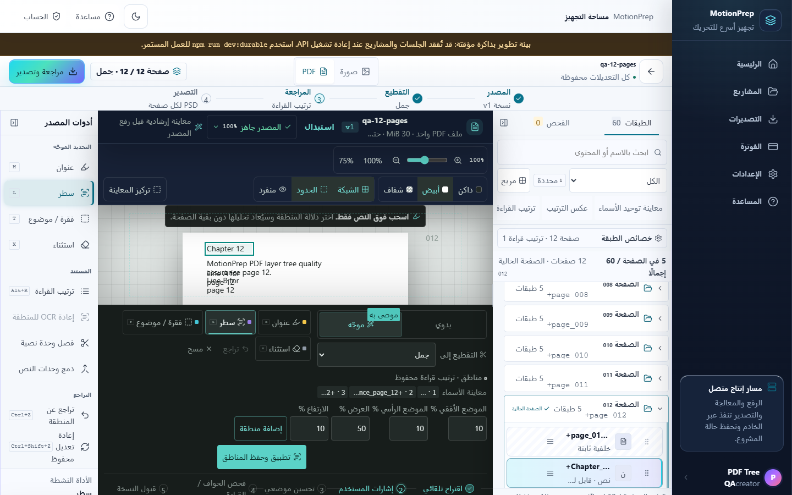
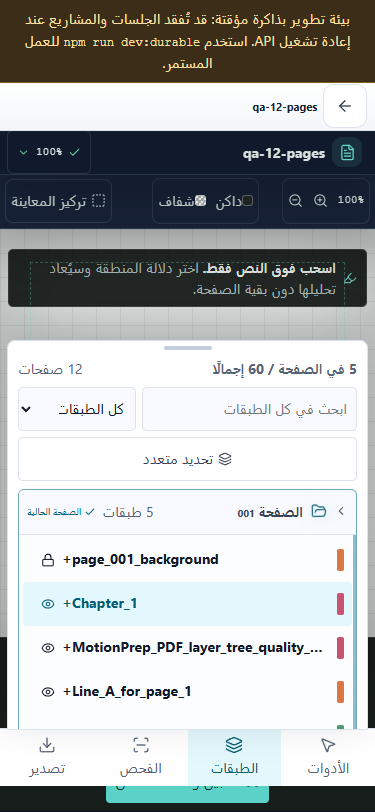
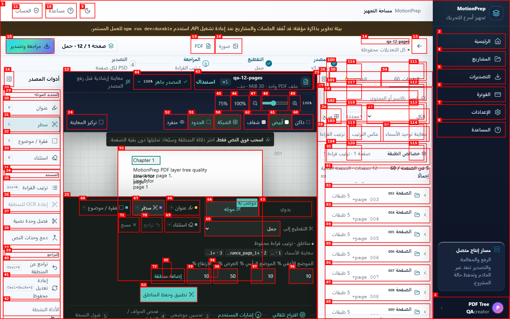
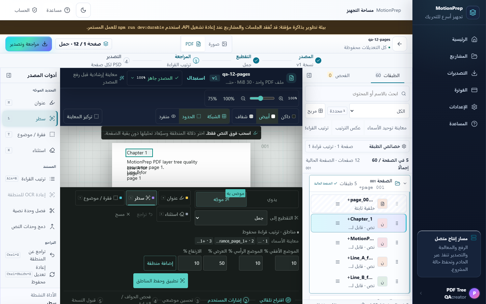

# Dogfood Report: MotionPrep PDF layer tree

| Field | Value |
|-------|-------|
| **Date** | 2026-08-14 |
| **App URL** | http://127.0.0.1:45201 |
| **Session** | pdf-tree-48e0db1a9fcd |
| **Scope** | PDF page folders, layer navigation, RTL, desktop/mobile responsiveness |

## Summary

| Severity | Count |
|----------|-------|
| Critical | 0 |
| High | 0 |
| Medium | 1 |
| Low | 0 |
| **Total** | **1** |

## Issues

### ISSUE-001: The desktop layer dock can hide the current PDF folder after a responsive transition

| Field | Value |
|-------|-------|
| **Severity** | medium |
| **Category** | ux / responsive navigation |
| **URL** | `http://127.0.0.1:45201/?view=workspace&mode=book` |
| **Repro Video** | Unavailable: the installed agent-browser runtime reported that `ffmpeg` is not installed; step screenshots are retained below. |
| **Status** | Fixed and verified in this branch |

**Description**

After moving to page 12 on desktop, selecting page 1 from the mobile layer
sheet, and returning to desktop, the document and count summary correctly show
page 1 but the desktop layer dock remains scrolled down to later page folders.
The current page folder is therefore outside the visible dock.

**Repro Steps**

1. Open the persisted 12-page PDF project on desktop.
   

2. Select page 12 in the desktop layer dock.
   

3. Resize to 375 × 812, open Layers, and select page 1.
   

4. Resize back to 1440 × 900. The content is on page 1, while the dock begins
   at later folders and does not expose the current page without scrolling.
   

**Fix Verification**

The shared page-folder window now scrolls the expanded/current page into view
for both ordinary and virtualized trees. After HMR replayed the same state,
the desktop tree reported `scrollTop=0`, page 1 at the top of the viewport, and
no browser errors. The focused PDF tree and page-scope suites pass 13/13.

## Performance Verification

- Benchmark shape: 5,000 PDF page folders with 20 content layers each
  (100,000 layers total).
- Before folder virtualization: 60,025 mounted DOM nodes and 4.149 seconds in
  the focused benchmark.
- Acceptance bounds after virtualization: fewer than 40 mounted page folders,
  fewer than 500 total mounted DOM nodes, no more than 160 mounted layer rows,
  and completion below 8 seconds.
- The active page is kept mounted and scrolled into view, including a direct
  transition to page 4,500.
- Production bundle gate: 181.9 KiB total JavaScript gzip; the Workspace chunk
  is 65,513 bytes against a 65,536-byte ceiling.
