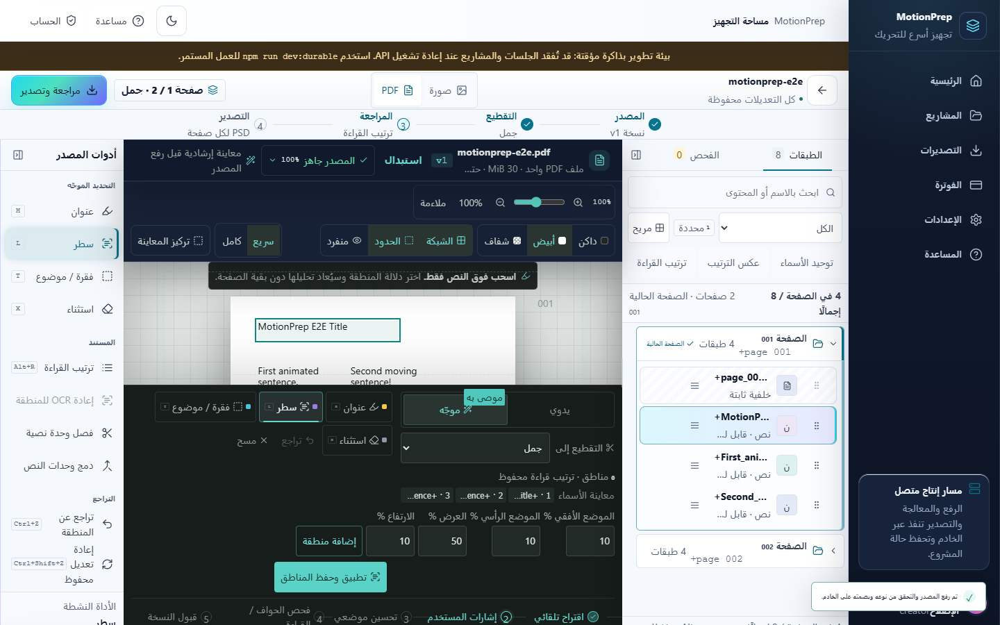
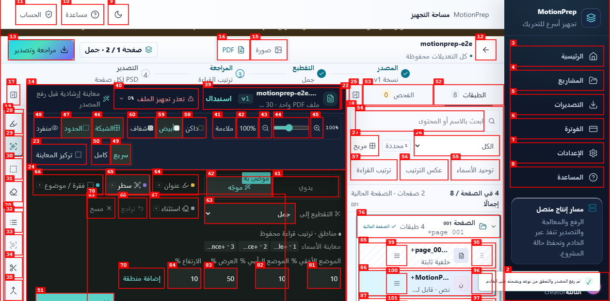
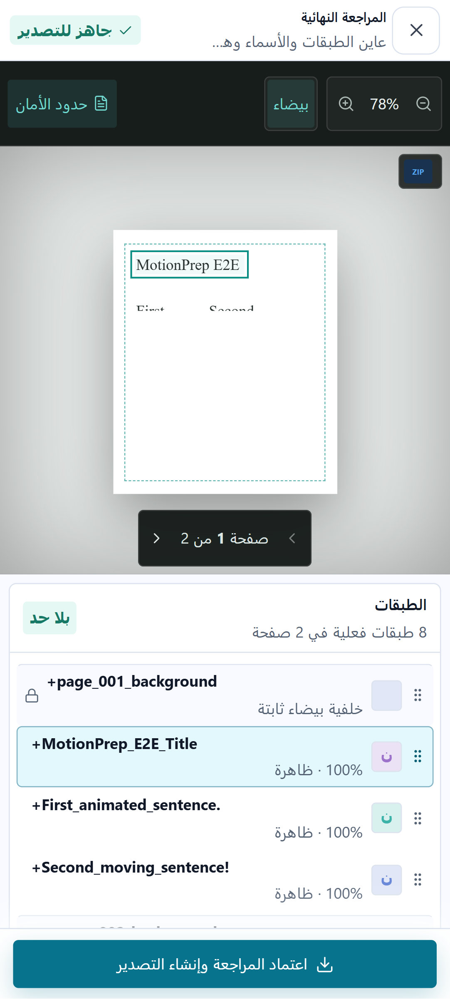
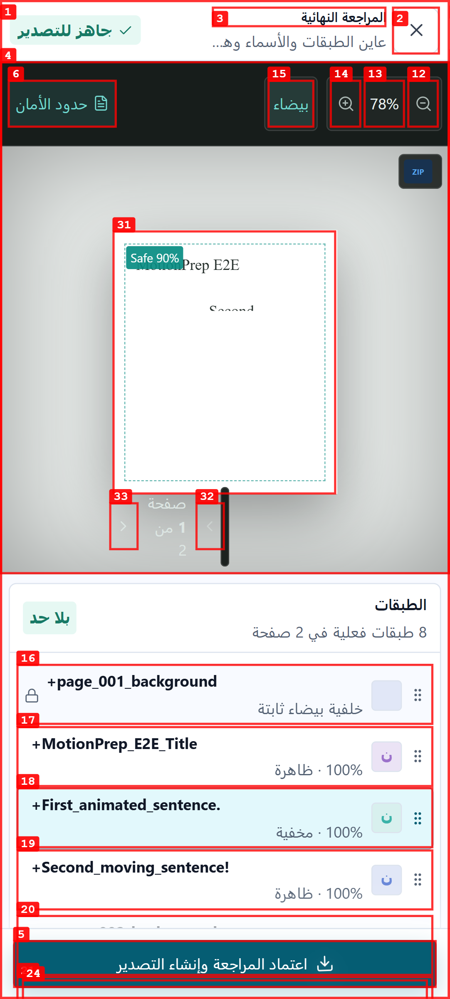

# تقرير QA بصري — المرحلة الثالثة

| الحقل | القيمة |
|---|---|
| التاريخ | 2026-08-13 |
| التطبيق | `http://127.0.0.1:45201` |
| الجلسة | `phase3-qa-48e0db1a9fcd` |
| النطاق | PDF workspace/export، سطح المكتب والهاتف، RTL |

## الملخص المرحلي

| الشدة | العدد |
|---|---:|
| حرجة | 0 |
| عالية | 0 |
| متوسطة | 2 |
| منخفضة | 0 |
| **الإجمالي** | **2** |

## المشكلات

### ISSUE-001: بطاقة تقدم الرفع تعرض فشلًا بعد نجاح تجهيز PDF

| الحقل | القيمة |
|---|---|
| الشدة | متوسطة |
| الفئة | وظيفية / محتوى |
| المسار | مساحة عمل PDF بعد الرفع |
| فيديو إعادة الإنتاج | غير مطلوب؛ الحالة ثابتة بعد اكتمال الرفع |

**الوصف**

بعد رفع `motionprep-e2e.pdf` تظهر الطبقات والنص والصفحتان، وتصبح المراجعة
والتصدير متاحين، لكن بطاقة حالة المصدر تعرض في الوقت نفسه «تعذر تجهيز الملف
0%». هذه حالة متناقضة قد تدفع المستخدم إلى إعادة الرفع رغم نجاح المعالجة.

**الحالة بعد الإصلاح:** محلولة ومُعادة الاختبار. أصبحت البطاقة تعرض «المصدر
جاهز 100%»، ولم يُنشأ Object URL غير مستخدم لملف PDF.

**خطوات إعادة الإنتاج**

1. إنشاء حساب اختبار، وفتح مشروع PDF جديد.
2. رفع `artifacts/fixtures/motionprep-e2e.pdf` وانتظار ظهور الطبقات.
3. ملاحظة أن مساحة العمل جاهزة بينما بطاقة الرفع تعرض الفشل.

### ISSUE-002: عناصر معاينة PDF تتداخل بصريًا على الهاتف

| الحقل | القيمة |
|---|---|
| الشدة | متوسطة |
| الفئة | مرئية / قابلية استخدام |
| المسار | مراجعة التصدير — Pixel 7، RTL |
| فيديو إعادة الإنتاج | غير مطلوب؛ الحالة ظاهرة عند فتح الحوار |

**الوصف**

في معاينة التصدير على الهاتف، شارة `Safe 90%` تغطي بداية عنوان PDF، ويظهر
مؤشر تمرير داكن فوق منطقة تنقل الصفحات، كما أن نص وأزرار التنقل البيضاء ذات
تباين ضعيف على خلفية المعاينة الفاتحة. الـRTL وعدم وجود overflow أفقي صحيحان،
لكن هذه التداخلات تجعل قراءة الصفحة والتنقل أقل وضوحًا.

**الحالة بعد الإصلاح:** محلولة ومُعادة الاختبار. أزيلت الشارة الداخلية، وأصبح
حاوي التنقل بعرض فعلي `158.906px` وخلفية داكنة بدل انكماشه إلى خط رأسي؛ بقي
الـoverflow الأفقي صفرًا.

**خطوات إعادة الإنتاج**

1. فتح مشروع PDF مجهز على محاكاة Pixel 7.
2. فتح «تصدير» مع تفعيل حدود الأمان.
3. ملاحظة تداخل شارة الأمان مع النص وضعف وضوح تنقل الصفحة.

## تحقق ناجح ضمن الجولة

- النقر داخل طبقة النص في معاينة PDF حدّث التحديد في الشجرة والتمييز المرئي.
- إخفاء طبقة أزالها فورًا من معاينة مساحة العمل ومعاينة التصدير.
- preflight عرض «جاهز للتصدير» فقط بعد graph صالح وحفظ مكتمل.
- الاسم المكرر لم يُحفظ، وظهر خطأ inline مع `aria-invalid=true`.
- عرض Pixel 7 ظل RTL ومن دون overflow أفقي، ولم تظهر أخطاء JavaScript أو
  طلبات شبكة فاشلة في console.
