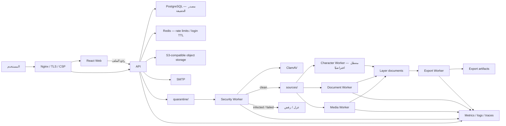

# التقرير الشامل لتدقيق الجاهزية الإنتاجية وخطة الإصلاح النهائية

**المشروع:** MotionPrep Studio / `riig-`
**تاريخ التدقيق:** 2026-08-20
**الفرع المدقَّق:** `codex/release-hardening-v0.1.9`
**الالتزام:** `06e530476ed99573f5693c2b32ee47dc75bfa32a`
**طلب الدمج:** [PR #49](https://github.com/ahmed1122-rpg/riig-/pull/49)
**آخر إصدار سابق:** `v0.1.8` عند `912e7edc4cdc5c7fe486af2a4071e1633fea5ebc`
**طبيعة SHA:** الالتزام أعلاه هو **target audited SHA**؛ ملف التقرير أُنشئ بعد التدقيق ولم يكن جزءًا من ذلك الالتزام وقت الكتابة.
**طبيعة الحالة الخارجية:** لقطة تحقق بتاريخ 2026-08-20 بتوقيت Africa/Cairo، وليست حقيقة دائمة؛ يجب إعادة الاستعلام عن GitHub والبيئات قبل قرار Go.
**حالة القرار:** **NO-GO — غير صالح للنشر العام أو إنشاء إصدار نهائي حاليًا**

---

## 1. الخلاصة التنفيذية

البنية العامة للمشروع قوية وقريبة من مستوى إنتاج محترم: التطبيق منظم كـ modular monolith، طبقة البيانات الدائمة تستخدم PostgreSQL، التخزين يستخدم S3، Redis مخصص للحدود الموزعة ومحاولات الدخول، العمال منفصلون، الحاويات مقيدة، ومسار CI الحالي ناجح. كما لم يكشف الجرد الثابت عن صفحات ميتة أو أدوات Workspace غير مربوطة أو مسارات عميل واضحة بلا نظير خادمي.

لكن نجاح CI الحالي **لا يكفي لإعلان الجاهزية**. توجد عوائق إنتاج مؤكدة لا تغطيها الفحوصات الحالية، أهمها:

1. ترحيل فحص البرمجيات الخبيثة يترك بيانات قديمة بحالة `ready` مع نتيجة `pending`، وبعض المسارات الدائمة والعمال تتحقق من `ready` فقط.
2. رابط تفعيل البريد المباشر لا يفتح بوابة التحقق، فيظهر للمستخدم موقع التسويق بدل إتمام التفعيل.
3. مسار rollback لا يشمل `worker-security` ولا يثبت تطابق نسخة جميع العمال؛ والعودة إلى `v0.1.8` بعد تفعيل الترحيل ليست rollback آمنًا.
4. توثيق staging يطلب تشغيله قبل الإصدار، بينما أدوات التحقق تشترط tag نهائيًا وصورًا موقعة بهوية ذلك tag؛ أي أن التسلسل الحالي متناقض عمليًا.
5. دورة الإصدار تنشر GitHub Release عاديًا قبل اكتمال أدلة staging والاستعادة والحمل والـ rollback.
6. مدقق dependency audit يمكن أن يمر عند بعض أخطاء الأداة أو الشبكة بدل أن يفشل مغلقًا.
7. Workflow الجاهزية يرفع recovery manifest الخام إلى GitHub Artifacts رغم أن سياسة الأمن تمنع ذلك.
8. سياسة Go تمنع أي استثناء High/Critical، بينما سجل Trivy الحالي يحتوي 12 استثناء مؤقتًا، منها 4 Critical و8 High.
9. اتصال ClamAV يستخدم TCP خامًا؛ يصبح ذلك مانعًا أمنيًا إذا كان العامل والماسح على مضيفين مختلفين دون قناة مشفرة وموثقة.
10. صفحتا الشروط والخصوصية معلّمتان صراحة كمسودتين تحتاجان اعتمادًا قانونيًا.

**الحكم المهني:** لا يُدمج هذا الفرع بقصد الإصدار، ولا يُنشأ `v0.1.9` نهائي، ولا تُستخدم أسرار إنتاج حقيقية، قبل إغلاق جميع عناصر P1 وإعادة تنفيذ بوابات الجاهزية على الالتزام نفسه والصور نفسها.

لا يوجد P0 مؤكد من التدقيق الساكن الحالي. يوجد ثمانية عوائق P1 مؤكدة داخل الشيفرة/خط الإصدار، وبوابتان خارجيتان مشروطتان للإطلاق (شبكة ClamAV والاعتماد القانوني)، بالإضافة إلى نتائج P2 وP3 يجب ترتيبها ضمن خطة الإغلاق أدناه.

---

## 2. ماذا يعني طلب «0 أخطاء»

لا يمكن لأي مراجعة برمجية أن تثبت رياضيًا عدم وجود أي خطأ غير مكتشف. التعريف المهني القابل للتحقق لهذا الهدف هو **Zero Known Release-Blocking Defects**:

- لا توجد نتائج معروفة من P0 أو P1 مفتوحة.
- كل نتيجة P2 وظيفية أو أمنية ذات مسار مستخدم أُغلقت أو قُبل خطرها رسميًا بمالك وموعد انتهاء.
- كل الاختبارات الساكنة والوحدية والتكاملية وE2E ناجحة على SHA المرشح نفسه.
- صور staging والإنتاج متطابقة بالـ digest، ولا يحدث rebuild أثناء الترقية.
- ترحيل قاعدة البيانات، الاستعادة، الحمل، الأعطال، التنبيهات والـ rollback مجرّبة وموثقة.
- لا توجد ثغرات High/Critical مخالفة للسياسة المعتمدة.
- صفحات السياسة والخصوصية واعتمادات المالك مكتملة.

أي ادعاء «0 أخطاء» خارج هذه الحدود سيكون ادعاءً غير قابل للإثبات.

---

## 3. النطاق والمنهج والقيود

### 3.1 ما تمت مراجعته

- جرد بنية المستودع والملفات والتطبيقات والحزم والـ workflows والترحيلات.
- تتبع مسارات الإنتاج عالية الخطورة: الرفع، quarantine، malware scan، المعالجة، إنشاء الطبقات، التصدير، الاستعادة، الحذف والاحتفاظ.
- تتبع المصادقة، تفعيل البريد، إعادة تعيين كلمة المرور، صلاحيات الإدارة والفوترة.
- مراجعة مسارات الواجهة والتنقل والصفحات وأدوات Workspace والـ polling والإلغاء وRTL.
- مراجعة PostgreSQL locks/leases/idempotency، Redis، التخزين، الكاش والتزامن.
- مراجعة Docker/Compose، CI، CodeQL، dependency audit، Trivy، SBOM، provenance، Cosign، staging، release والـ rollback.
- مراجعة المراقبة والتنبيهات والـ recovery والوثائق والملكية والسياسات القانونية.
- قياس الحجم، ملفات الاختبار، الملفات الكبيرة، التكرار الدقيق، الاعتمادات والـ artifacts.

### 3.2 طبيعة الأدلة

هذه مراجعة شاملة للجرد مع قراءة موجهة لكل الحدود والمسارات عالية المخاطر، مدعومة بنتائج CI على الالتزام الحالي. لا يعني ذلك ادعاء قراءة يدوية لكل سطر في 1,535 ملفًا؛ بل تم فهرسة المستودع بالكامل ثم فحص الملفات المؤثرة في الإنتاج والعقود والبوابات تفصيليًا.

لم تُعَد اختبارات البناء محليًا أثناء صياغة هذا التقرير حتى لا نخلط التدقيق القرائي بتغيير البيئة. الأدلة التنفيذية الحالية هي:

- [Quality CI — ناجح على الالتزام الحالي](https://github.com/ahmed1122-rpg/riig-/actions/runs/32391036375)
- [CodeQL — ناجح على الالتزام الحالي](https://github.com/ahmed1122-rpg/riig-/actions/runs/32391036381)
- حالة PR وقت التحقق: mergeable/clean، لكن ذلك لا يلغي النتائج الدلالية في هذا التقرير.

لم يُحفظ artifact مستقل يحمل timestamp لرد API الخاص بقوائم secrets/variables؛ لذلك تُعامل ملاحظات البيئة في القسم 14 كلقطة جلسة يجب إعادة إثباتها، بينما روابط تشغيل CI أعلاه هي مصدر دائم نسبيًا لحالة الفحوص على SHA المدقَّق.

### 3.3 القيود الخارجية

لا يستطيع المستودع وحده إثبات أن البنية الفعلية، IAM، DNS، TLS، النسخ الاحتياطية، ClamAV، SMTP، S3، Prometheus، Alertmanager أو tracing تعمل في بيئة حقيقية. لذلك فُصلت النتائج المؤكدة في الشيفرة عن أدلة التشغيل الخارجية المطلوب توفيرها.

---

## 4. خط الأساس والجرد الكمي

| العنصر | النتيجة |
|---|---:|
| الملفات المفهرسة في المستودع | 1,535 |
| ملفات المصدر/الأنماط المقاسة | 835 |
| الأسطر الفعلية التقريبية | 128,087 |
| الأسطر غير الفارغة التقريبية | 120,211 |
| ملفات الاختبار | 267 |
| تطبيقات API/Web/Workers | 7 |
| الحزم المشتركة | 7 |
| ترحيلات PostgreSQL | 44 |
| GitHub Actions workflows | 9 |
| صفحات الواجهة الرئيسية | 9 |
| مسارات API الحرفية تحت `/v1` | 78 تقريبًا |
| أنماط استدعاء API في العميل | 68 تقريبًا |
| ملفات `artifacts/` المتتبعة | 469، نحو 56.4 MB |
| مجموع `artifacts/` و`assets/` | نحو 73.4 MB |
| حجم تغييرات الفرع مقابل `v0.1.8` | 140 ملفًا، +4,106 / -248 |

الفرع الحالي أربعة commits بعد `v0.1.8` ولا يوجد tag على HEAD. حجم التغيير عابر للطبقات: migration وعامل أمني ومسارات رفع وإصدار وحاويات وواجهة؛ لذلك هو تغيير مرتفع المخاطر ولا يجب التعامل معه كتحديث صغير لمجرد أن النسخة `0.1.9`.

---

## 5. خريطة مسارات الإنتاج

الحلقة الأمنية الحرجة هي: `quarantine → scan clean → sources → processing`. النتيجة P1-01 أدناه تكسر هذا الضمان للبيانات القديمة وبعض المسارات الدائمة.

---

## 6. الضوابط القوية الموجودة بالفعل

هذه نقاط إيجابية يجب الحفاظ عليها وعدم كسرها أثناء الإصلاح:

- إعداد الإنتاج يرفض memory persistence، ويشترط PostgreSQL وS3 وRedis/TLS وSMTP/TLS وsecure cookies وkeyring قابلًا للدوران.
- رفع الملفات الجديدة يذهب إلى quarantine، والعامل الأمني يتحقق من الحجم وSHA-256 وClamAV قبل النشر الطبيعي.
- PostgreSQL يستخدم leases و`SKIP LOCKED` وadvisory locks وidempotency وrow locks وjob fencing في مسارات متعددة.
- التخزين الدائم محمي بـ durable write leases.
- بيانات المجال تظل في PostgreSQL؛ لم يُكتشف domain cache خادمي قديم أو ازدواج مصدر حقيقة.
- Redis مستخدم للحدود الموزعة ومحاولات الدخول مع TTL، وليس كنسخة ثانية من بيانات المشاريع.
- Nginx يطبق CSP/HSTS وتنقية proxy headers، ويخزن الأصول ذات البصمة كـ immutable، بينما `index` لا يُخزن.
- استجابات API الافتراضية `no-store`، والأصول غير القابلة للتغيير تستخدم ETag وسياسة cache محددة.
- الواجهة توقف polling عند offline أو إخفاء الصفحة وتستخدم exponential backoff وتمنع الطلبات المتطابقة المتزامنة.
- صلاحيات admin/finance/support مفصولة خادميًا، وتوجد سجلات تدقيق للأفعال الحساسة.
- الفوترة تتحقق من توقيع webhook وتستخدم idempotency وترفض الأحداث القديمة.
- حذف الحساب يجمع مفاتيح `sources` و`quarantine` ووظائف الفحص ضمن graph الحذف.
- الحاويات تعمل كمستخدم غير root مع read-only filesystem و`cap_drop: ALL` و`no-new-privileges` وحدود موارد وhealthchecks.
- توجد CodeQL وgitleaks وdependency audit وTrivy وSBOM وprovenance وCosign.
- توجد CODEOWNERS وDependabot وSECURITY.md وLICENSE وrunbooks وADRs.
- فحوص العقود وOpenAPI ومسارات المستودع والتكرار الدقيق والملفات الكبيرة نجحت في CI الحالي.

---

## 7. نتائج P1 — موانع الإصدار

| المعرّف | المجال | النتيجة | الحالة |
|---|---|---|---|
| P1-01 | البيانات/الأمن | البيانات القديمة قد تبقى `ready/pending` وتتجاوز بوابة malware في مسارات دائمة | مؤكد |
| P1-02 | المصادقة/الواجهة | رابط `verificationToken` المباشر لا يفتح بوابة التحقق | مؤكد |
| P1-03 | الاسترجاع | rollback يستبعد `worker-security` ولا يثبت نسخة العمال | مؤكد |
| P1-04 | staging | تسلسل ما قبل الإصدار يتعارض مع اشتراط tag وتوقيع tag | مؤكد |
| P1-05 | الإصدار | Release مستقر وصور branch يمكن نشرها قبل الأدلة الخارجية | مؤكد |
| P1-06 | supply chain | dependency audit قد يفشل fail-open | مؤكد |
| P1-07 | الأسرار/التعافي | رفع recovery manifest الخام كـ artifact | مؤكد |
| P1-08 | الثغرات | سياسة صفر High/Critical تتناقض مع 12 استثناء قائمًا | مؤكد |
| P1-09 | شبكة الفحص | ClamAV عبر TCP خام دون حماية يفرضها التطبيق | بوابة P1 خارجية/مشروطة بالبنية |
| P1-10 | قانوني | الشروط والخصوصية منشورتان كمسودتين غير معتمدتين | بوابة P1 خارجية للإطلاق العام |

### P1-01 — كسر invariant فحص البرمجيات الخبيثة للبيانات القديمة

**الدليل**

- `apps/api/migrations/044_malware_scanning.sql:21-29` يضيف verdict افتراضيًا `pending`.
- `apps/api/migrations/044_malware_scanning.sql:99-114` ينشئ scan jobs للرفوعات القديمة ذات `status='ready'`، لكنه لا يسحب حالة الرفع/المصدر من `ready`.
- الإنشاء الطبيعي الجديد محمي عبر `apps/api/src/infrastructure/postgres/postgres-upload-repository.ts:48-61` عند تفعيل `requireMalwareScan` في الإنتاج؛ لذلك لا يصح وصف كل الإنشاءات الجديدة بأنها متجاوزة.
- لكن enqueue/retry الدائم للمعالجة يتحقق من `ready` فقط في `postgres-processing-repository.ts:117-123,176-182`.
- العامل يختار رفعًا `ready` فقط في `apps/api/src/processing/processing-job-executor.ts:68-82`.
- export repository يتحقق من `ready` فقط في `postgres-export-repository.ts:95-101`. طبقة الخدمة الخارجية تحمي الإنشاء العادي، لكن المسار الدائم ليس دفاعًا مكتملًا أمام jobs قديمة أو retry مباشر.
- restore يتحقق من `ready` فقط في `postgres-source-version-restore.ts:115-135`.
- finalization ينشر `ready` دون شرط verdict في `postgres-upload-finalization.ts:54-70`، والـ reconciler يعيد معالجة `verifying/ready` في `:115-140`.
- لا يوجد قيد DB يفرض `ready ⇒ malware_scan_verdict='clean'`.
- هذا يخالف الوعد في `docs/DEPLOYMENT.md:286-290` بأن المعالجة محجوزة حتى verdict نظيف.

**الأثر**

بعد تطبيق migration على قاعدة بيانات v0.1.8، يمكن لوظيفة قديمة queued، أو retry إداري، أو restore، أو نافذة سباق، أن تعالج ملفًا قديمًا قبل اكتمال الفحص. هذا خلل أمني وتكامل بيانات، وليس مجرد نقص تغطية اختبار.

**الإصلاح المطلوب**

1. تُعامل migration 044 على أنها immutable ما دامت قد تكون وُزعت أو طُبقت، ويُضاف migration 045 forward-only للإصلاح. لا يعاد تحرير 044 إلا إذا ثبت توثيقيًا أنها لم تخرج من بيئة المطور ولم تدخل أي migration checksum/baseline؛ والتوصية الآمنة هنا هي 045.
2. تُنقل كل سجلات `ready/pending` القديمة إلى حالة `scanning` أو حالة صريحة غير قابلة للمعالجة، ثم تُملأ queue.
3. يضاف invariant في قاعدة البيانات يمنع `ready` ما لم يكن verdict `clean`. لأن PostgreSQL لا يعرف بيئة التطبيق، يجب تمثيل وضع التطوير صراحة في schema — مثل verdict `not_required` لا تسمح به إعدادات/أدوار الإنتاج — أو جعل no-op scanner يكتب `clean`; ولا يُستخدم شرط يعتمد ضمنيًا على اسم البيئة.
4. يضاف شرط `clean` إلى processing enqueue/retry، worker execution، export enqueue/retry، restore، finalization وreconciler. مسار admin HTTP الحالي يمر عبر gate الخدمة في production wiring؛ المطلوب اختباره كـ regression وعدم فتح أي direct retry يتجاوزه.
5. يكون تسلسل النشر: maintenance fence يوقف uploads/processing → نشر consumers التي تفرض gate → backfill/queue على دفعات → تشغيل عامل الأمن حتى صفر pending مطلوب → إضافة/تفعيل القيد والتحقق منه → إعادة الحركة. لا يُفعّل القيد قبل معالجة السجلات المخالفة.

**معيار القبول**

- fixture قاعدة بيانات v0.1.8 يحتوي رفعًا `ready` ووظائف queued وrestore candidate.
- بعد migration لا يستطيع أي processing/export/restore البدء قبل verdict `clean`.
- ملف EICAR لا يصل إلى `sources/` مطلقًا.
- clean file لا يصبح قابلًا للمعالجة قبل verdict نظيف؛ نشر حالة DB ذري، وأي فشل بين S3 وPostgreSQL يترك cleanup obligation دائمة قابلة للاستئناف بدل ادعاء معاملة ذرية عبر النظامين.
- قيد DB يرفض `ready/pending` عندما يكون الفحص مطلوبًا، ولا يقبل `ready` إلا مع `clean` أو حالة schema صريحة مثل `not_required` تحظرها أدوار/إعدادات الإنتاج.

### P1-02 — رابط تفعيل البريد المباشر مكسور

**الدليل**

- `apps/web/src/features/auth/AuthGateway.tsx:37-42,68-85` يدعم `verificationToken` وينفذ التحقق عند تركيب المكوّن.
- `apps/web/src/features/marketing/entryState.ts:33-38,58-62` يتعرف على password reset عند وجود `token` فقط.
- `apps/web/src/app/App.tsx:82-93` يفتح auth اعتمادًا على `entryIntent.passwordReset` فقط.

**الأثر**

المستخدم الذي يضغط رابط تفعيل البريد يصل إلى صفحة التسويق ولا تُركب بوابة التحقق. هذا يكسر onboarding ويزيد طلبات الدعم وقد يحبس الحساب في حالة غير مفعلة.

**الإصلاح ومعيار القبول**

- إضافة intent باسم `verificationToken` أو `authCallback` عام.
- فتح AuthGateway تلقائيًا، والمحافظة على المعامل حتى الاستهلاك ثم تنظيف URL دون حذف معاملات أخرى.
- اختبارات component وPlaywright لرابط صحيح، منتهي، مستخدم سابقًا، مستخدم مسجل الدخول وغير مسجل، مع اختبار `popstate`/history داخل جلسة SPA لا الرابط المباشر فقط.

### P1-03 — rollback غير آمن بعد إدخال عامل الأمن

**الدليل**

- `compose.production.yaml:116-136` يشغّل `worker-security`.
- `docs/runbooks/production-release-and-rollback.md:50-60` لا يسحب العامل ولا يعيد إنشاءه.
- `scripts/run-release-rollback-drill.mjs:78-100` يختبر api-a/api-b/media/document/export/web فقط.
- `apps/api/src/observability/worker-readiness.ts:7-23` يتحقق من النوع وقدم heartbeat، لا من release SHA.

**الأثر**

يمكن أن تبقى fleet مختلطة الإصدارات. كما أن الرجوع إلى `v0.1.8` بعد migration 044 قد يعيد API لا يفرض بوابة malware على schema/بيانات جديدة. لذلك `v0.1.8` ليس hot rollback baseline آمنًا بعد الترحيل.

**الإصلاح ومعيار القبول**

- إضافة العامل الأمني إلى pull/recreate/readiness/drill والوثائق.
- إصدار heartbeat/metric يحمل commit SHA وimage digest لجميع العمال، مع فشل readiness عند الاختلاف.
- اختيار rollback baseline يحتوي أصلًا بوابة malware، أو اعتماد forward-fix. عند اضطرار العودة لما قبلها: تعطيل uploads/processing عند الحافة أولًا.
- تنفيذ clean/EICAR journey بعد candidate وبعد rollback، مع إثبات عدم وصول الملف الخبيث إلى sources.

### P1-04 — تناقض pre-release staging مع tag النهائي

**الدليل**

- `docs/DEPLOYMENT.md:41-48` يطلب staging قبل release.
- `.github/workflows/staging-readiness.yml:44-62` يتطلب SHA/tag وصورًا موقعة ويستدعي المدقق.
- `scripts/verify-release-checkout.mjs:14-24,44-58` يشترط semantic tag مساويًا لنسخة الحزمة، tag يشير للـ SHA نفسه، checkout نظيفًا، وتوقيع Cosign بهوية `refs/tags/<tag>`.

**الأثر**

لا يمكن تنفيذ اختبار staging الحقيقي للمرشح قبل إصدار tag نهائي بالطريقة الموثقة. إنشاء tag أولًا يحوّل staging من بوابة قبل الإصدار إلى تحقق بعد إعلان الإصدار.

**الإصلاح**

فصل المسار إلى بوابتين:

1. `provider-connectivity-preflight`: يعمل على SHA المرشح، اتصالات غير تدميرية، بلا اشتراط tag أو صورة release.
2. `staging-release-readiness`: يعمل على candidate images ثابتة وموقعة بالـ digest بهوية workflow مرشح محمية ومعلومة، ويثبت هوية deployment والتدفقات الكاملة.

الترتيب الأفضل: merge إلى main → بناء/توقيع candidate مرة واحدة بالـ SHA وهوية candidate workflow → نشر staging والتحقق من تلك الهوية → الاختبارات والاستعادة والحمل → promotion محمي ينشئ `v0.1.9` ويضيف توقيعًا tag-bound إلى **الـ digests نفسها** → stable release دون rebuild.

### P1-05 — دورة الإصدار تعلن الاستقرار قبل اكتمال الأدلة

**الدليل**

- `scripts/create-release-evidence.mjs:41-63` يسجل staging/rollback/recovery/load كـ `pending`، لكنه يسجل بوابة Trivy مكتملة دون تلخيص الاستثناءات.
- `.github/workflows/release-images.yml:311-324` ينشئ GitHub Release عاديًا بعد بوابات المصدر/الصور، قبل الأدلة الخارجية.
- workflow يدعم `workflow_dispatch`، ووظيفة publish ليست tag-only؛ يمكن نشر/توقيع صور branch بهوية يرفضها staging لاحقًا.

**الإصلاح ومعيار القبول**

- منع publish المستقر من branch، وتعريف candidate ref/identity صريح لا يختلط بالـ stable tag.
- حفظ candidate evidence كـ artifact محمي أو Draft غير معلن. إذا استُخدم RC tag/Prerelease فيجب أن يكون له عقد version وهوية منفصلان بوضوح؛ لا تُستخدم كلمة Prerelease كحل غامض لمشكلة tag الحالية.
- protected promotion وحده ينشئ tag النهائي والتوقيع المرتبط به وGitHub Release المستقر بعد جميع الأدلة الخارجية، دون إعادة بناء الصور.
- جعل إعادة التشغيل idempotent؛ لا يعاد بناء digest منشور ولا يفشل `gh release create` لمجرد وجود draft سابق.
- توقيع evidence bundle نفسه وربطه بالـ SHA وimage digests وSBOM/provenance/Trivy.
- تضييق صلاحيات GitHub Actions على مستوى كل job.

### P1-06 — dependency audit قد يفشل مفتوحًا

**الدليل**

`scripts/verify-dependency-audit.mjs:94-123` يرفض خطأ spawn أو JSON غير قابل للتحليل، لكنه لا يرفض صراحة `report.error`، signal، status غير المتوقع أو schema ناقصًا. بعض أخطاء registry/network قد تنتج JSON صالحًا بلا بنية vulnerabilities المتوقعة.

**الإصلاح ومعيار القبول**

- الفشل عند exit code/signal غير متوقع، `report.error`، غياب الحقول الإلزامية أو تناقض totals.
- fixtures لاختبار network error، registry auth error، JSON ناقص، JSON تالف، signal، نجاح نظيف وثغرة فعلية.
- الأداة تفشل مغلقًا ويظهر السبب بوضوح دون طباعة أسرار.

### P1-07 — نشر recovery manifest خام

**الدليل**

- `SECURITY.md:37-42` يمنع وضع recovery manifests الخام في التقارير أو السجلات.
- `.github/workflows/provider-readiness.yml:96-127` يكتب `RECOVERY_MANIFEST_JSON` إلى `recovery-manifest.json` ثم يرفعه artifact لمدة 90 يومًا.

**الإصلاح ومعيار القبول**

- التحقق في ملف مؤقت وحذفه في `finally` دائمًا حتى عند الفشل.
- حساب SHA-256 للـ manifest الخام وتسجيل نتيجة التحقق من توقيعه، دون رفع الخام نفسه.
- إنشاء disclosure summary منفصل منقح: digest، نتيجة التحقق، زمن الإنشاء، RPO/RTO والموارد المجهّلة، ثم توقيع/attest هذا الملخص مستقلًا؛ فتوقيع الخام لا يصبح توقيعًا للملخص بعد التنقيح.
- مراجعة artifacts السابقة؛ إذا رُفع manifest حقيقي، إزالته وتدوير/إلغاء أي مفاتيح أو URLs حساسة داخله.

### P1-08 — تناقض سياسة الثغرات مع سجل الاستثناءات

**الدليل**

- `docs/EXTERNAL_GATE_INPUTS.md:59-64` يشترط عدم وجود waived High/Critical لاتخاذ Go.
- `security/trivy-unfixed-exceptions.json` يحتوي 12 استثناء مؤقتًا: 4 Critical و8 High، تنتهي في 2026-09-18.
- `scripts/verify-trivy-exceptions.mjs` يسمح بهذه الاستثناءات، بينما release evidence لا يعرض ملخص المخاطر.

**الحكم**

بموجب السياسة الحالية، المرشح No-Go حتى لو نجح الفحص تقنيًا.

**الإصلاح**

- الخيار الأفضل: تقليل runtime وإزالة الحزم غير اللازمة أو تحديث base حتى تصبح القائمة صفرًا.
- إذا قبلت الإدارة الخطر، يجب تعديل معيار Go رسميًا، لا تجاوزه ضمنيًا، وربط كل استثناء بـ CVE والحزمة وinstalled version وbase/image digest ومالك وتذكرة وتخفيف وموعد انتهاء.

### P1-09 — نقل ملفات إلى ClamAV عبر TCP خام

**الدليل**

- `apps/api/src/security/clamav-malware-scanner.ts:133-140` يستخدم `node:net`.
- `.env.production.worker-security.example:15-16` يقترح مضيفًا شبكيًا مثل `clamav.internal.example.com:3310`.

**الأثر**

إذا كان ClamAV بعيدًا، تمر بايتات ملفات المستخدم دون تشفير أو مصادقة يوفرهما التطبيق. إن كان sidecar/loopback داخل مضيف موثوق فالمخاطر أقل، لكن ذلك غير مفروض ولا مثبت.

**الإصلاح**

- تفضيل Unix socket أو loopback sidecar.
- عند العبور الشبكي: mTLS proxy/gateway وسياسة شبكة تمنع أي exposure للمنفذ 3310.
- رفض عنوان raw TCP غير loopback في production إلا باستثناء موثق ومحدود.

### P1-10 — الوثائق القانونية غير جاهزة

- `apps/web/public/legal/terms.html:1` يصرح بأنها مسودة تحتاج موافقة قانونية.
- `apps/web/public/legal/privacy.html:1` يطلب اعتماد المالك/القانوني وتحديد controller/contact والاحتفاظ والمناطق/subprocessors.

لا يُسمح بإطلاق عام أو جمع بيانات مستخدمين حقيقيين قبل إكمال هذه المعلومات واعتماد النسخ المنشورة. هذا مانع إطلاق تجاري وقانوني، لا خلل TypeScript.

---

## 8. نتائج P2 — أخطاء ومخاطر مهمة

### P2-01 — orphan لنسخة quarantine عند فشل finalization نهائيًا

العامل ينسخ الملف النظيف إلى `sources/` ثم يحدّث `object_key` ويحاول finalization في `malware-scan-worker-runtime.ts:214-223`. عند فشل نهائي قد تفقد عملية retention مرجع `quarantine_object_key` القديم؛ `postgres-retention-store.ts:23-40` يرى مفتاح الرفع المنشور فقط. لا يمكن جعل S3 وPostgreSQL معاملة ذرية واحدة؛ المطلوب durable cleanup obligation/outbox أو reconciler مستقل يحفظ `quarantine_object_key` حتى الحذف، مع اختبار فشل بعد النسخ وقبل النشر.

### P2-02 — ترتيب أقفال متعاكس قد يسبب deadlock

الإلغاء يقفل upload ثم source ثم project ثم يحدث scan job في `postgres-upload-cancellation.ts:47-59,87-95`. العامل يقفل scan job أولًا ثم يحدث upload/source/project في `postgres-malware-scan-repository.ts:195-210,126-151`. المطلوب ترتيب أقفال موحد واختبار PostgreSQL متزامن للإلغاء أثناء settlement.

### P2-03 — replay غير سليم لوظائف الفحص

`postgres-upload-scan-queue.ts:83-94` لا يصفر `attempt` أو lease/completion/error عند conflict. job فاشل عند max attempts قد يصبح `queued` لكنه غير قابل للـ claim، وjob نظيف قد يظل clean بينما الرفع يعود scanning/pending. يجب تعريف replay contract صريح: إما منع replay بعد terminal state أو إعادة تهيئة ذرية كاملة.

### P2-04 — جاهزية العامل لا تثبت استمرار جاهزية ClamAV

`malware-scan-worker-runtime.ts:53-104` يفحص scanner عند البداية، ثم يستمر heartbeat أثناء أخطاء الحلقة. أضف live readiness وdefinition age وqueue age وconsecutive failures، وتنبيهًا عند تراكم الطابور أو قدم التعريفات.

### P2-05 — سباق طلبات لوحة الإدارة

في `AdminPanel.tsx:101-159` تُنفذ setters للبيانات قبل فحص `cancelled`، و`admin-client.ts:12-75` لا يدعم `AbortSignal`. يجب إلغاء الطلبات في cleanup وحماية كل setters، واختبار تبديل التبويبات بسرعة.

### P2-06 — طلبات مشاريع وفوترة بلا إلغاء

- `ProjectsView.tsx:117-142` يجلب source versions بلا signal.
- `BillingPortal.tsx:90-118` ينفذ `Promise.all` بلا signal.
- billing/projects clients لا يمرران signal في هذه العمليات.

النتيجة الممكنة هي كتابة استجابة قديمة بعد تغيير المشروع/الصفحة. أضف AbortController أو request generation guard.

### P2-07 — لا توجد سياسة retention لـ `malware_scan_jobs`

`prune-retention-database.ts:140-228` يعالج processing/export jobs ولا يعالج scan jobs. قد يكون الاحتفاظ مطلوبًا للتدقيق، لكن يجب تحديد مدة رسمية ثم archive/partition/prune مع الحفاظ على الأدلة القانونية المطلوبة.

### P2-08 — سجلات Compose قد تملأ القرص

لا يحدد `compose.production.yaml` `max-size/max-file` أو logging driver، ولا توجد قاعدة disk-space في `deploy/prometheus-alerts.yml`. يمكن أن يكون الضبط على المضيف، لكنه غير مثبت. إما إضافته في Compose أو توثيق managed logging واختبار تنبيه امتلاء القرص.

### P2-09 — release evidence غير موقّع

الصور موقعة، لكن `release.env` و`release-evidence.json` يرفعان دون توقيع blob/attestation يربطهما نهائيًا بالـ digests. يجب توقيع manifest النهائي والتحقق منه في staging وpromotion.

### P2-10 — Docker build غير حتمي بالكامل

`Dockerfile` يستخدم `apt-get update && apt-get upgrade` أثناء البناء. رغم تثبيت base digest، قد ينتج rebuild لاحقًا طبقات مختلفة. الأفضل تحديث base digest مسبق البناء، أو استخدام snapshot repository، وعدم ترقية النظام عشوائيًا داخل build المرشح.

### P2-11 — workflow الإصدار غير idempotent

`gh release create` يفشل إذا وُجد الإصدار، وقد يُعاد بناء tag SHA قابل للكتابة. يجب أن يكون artifact immutable، وأن تتعرف إعادة التشغيل إلى الأصول الموجودة وتتحقق من digest بدل استبدالها.

### P2-12 — المراقبة المجدولة تتوقف عند required reviewer

workflows المجدولة تستخدم environment محمية بمراجع بشري. هذا مناسب للنشر، لا للمراقبة الآلية. افصل environment اتصال غير تدميري قليلة الصلاحية عن بيئة promotion التي تتطلب موافقة.

### P2-13 — قناة تنبيه dependency audit عامة

`dependency-audit.yml` يفتح Issue عاديًا عند الفشل، بينما SECURITY.md يوجه الإبلاغ الأمني الخاص. نص الـ Issue الحالي يضع رابط تشغيل workflow ولا يدرج CVE أو تفاصيل الثغرة، لذلك لا يوجد تسريب CVE مؤكد من النص نفسه؛ لكن القناة غير متسقة وقد تكشف توقيت حادثة أمنية أو تقود إلى سجل عام. استخدم private security channel أو security advisory، وحدّث incident قائمًا وأغلقه عند التعافي بدل تكرار issues، وراجع كذلك مستوى ظهور logs.

### P2-14 — استثناءات Trivy واسعة

المطابقة الحالية تعتمد target+CVE+package فقط؛ لا تربط installed version أو base/image digest، و`approvedBy` نص حر. يجب تضييق schema والتحقق من هوية المراجع والتذكرة ومدة الخطر.

### P2-15 — Dependabot لا يغطي صور Docker

`.github/dependabot.yml` يغطي npm وGitHub Actions فقط. أضف آلية مراقبة وتحديث digests لصور Docker، مع إعادة جميع فحوص الصورة عند التحديث.

### P2-16 — الحقيقة التشغيلية موزعة ومختلطة تاريخيًا

`docs/PRODUCTION_READINESS.md` يبدأ بلقطة 2026-08-16 ثم يحتوي مطالب لإصدار أصبح قديمًا وسجل إصدارات متعددًا. افصل `CURRENT_RELEASE_READINESS.md` قصيرًا عن archive غير قابل للتعديل، واجعل كل ادعاء يحمل SHA/digests/run URL/date/owner.

---

## 9. نتائج P3 — قابلية الصيانة والحوكمة

1. **ملفات كبيرة تقترب من حد الصيانة:** خمسة ملفات بين نحو 454 و470 سطرًا غير فارغ، أهمها `postgres-account-deletion-state.ts` و`verify-deployment.mjs` و`app.ts` و`config.ts` و`projects-client.ts`. لا يوجد تجاوز حالي لحد 550، لكن يجب تقسيمها قبل أن تصبح مراكز تعقيد.
2. **CSS ضخم بلا ratchet للحجم:** `atelier.css` و`workspace.css` و`export-review.css` و`account-admin.css` و`guided-editors.css` كبيرة. فحص الاستخدام ناجح ولا توجد classes ميتة ظاهرة، لكن يلزم budget حسب feature.
3. **تكرار اتجاه أسماء الطبقات:** heuristic مكرر في `LayerDockPanels.tsx:186` و`ExportReviewLayerList.tsx:25`.
4. **تكرار toast JSX:** موجود في فرعين داخل `App.tsx`. لا يعرض toast مرتين الآن بسبب early return، لكنه عبء صيانة.
5. **نطاقات نسخ غير موحدة في package manifests:** ست حزم تظهر بصيغة exact في موضع وcaret في آخر: `@napi-rs/canvas` وبيانات Tesseract و`pdf-lib` و`pg` و`stripe` و`tesseract.js`. lockfile واحد يقلل اختلاف النسخة المثبتة حاليًا، لكن يجب توحيد السياسة.
6. **حدود تغطية عامة متواضعة:** Web نحو 58% lines، وAPI نحو 70%. النجاح الحالي يعني اجتياز threshold لا إثبات تغطية المسارات الحرجة. ارفع التغطية لكل module حساس تدريجيًا بدل رفع رقم عالمي اعتباطي.
7. **تضخم artifacts:** 469 ملفًا ونحو 56.4 MB تحت `artifacts/`. انقل screenshots والتقارير التاريخية إلى release/evidence storage، وأبق fixtures/manifests الحتمية فقط.
8. **لا يوجد `CONTRIBUTING.md`:** ليس مانع نشر، لكنه مطلوب لتعريف إعداد البيئة، فروع الإصلاح، migrations، الاختبارات، security disclosure ومعيار Definition of Done.
9. **CODEOWNERS لا يحدد الحدود الأمنية الجديدة:** يوجد مالك عام، لكن أضف قواعد صريحة لـ `/security/` و`/apps/worker-security/` وmigration 044 وما يتبعها.
10. **ملكية فردية:** توثيق الملكية يشير إلى مالك مسؤول واحد. قبل الإنتاج المفوض يلزم مراجع ثانٍ ومسار on-call/escalation واضح.
11. **لا Router/i18n مخصصين:** التنقل العميق الحالي يعمل ولا يبرر migration عاجلًا. لكن النصوص العربية inline ستجعل الترجمة مكلفة؛ أضف i18n عندما يصبح تعدد اللغة مطلبًا فعليًا.
12. **polling بلا حالة توقف نهائية:** `useResourcePolling.ts:102-128` يعيد المحاولة بلا نهاية عند network/5xx، لكن مع backoff وoffline/visibility handling؛ لذلك هو P3 ما لم تثبت قياسات حمل أو أثر مستخدم يجعله أعلى. عرّف سياسة terminal/manual retry للعرض الخلفي واحتفظ بالاستمرار للمهام النشطة فقط.
13. **اتجاه RTL/LTR غير موحد:** `PdfTextOperationDialog.tsx` يستخدم fallback `rtl`، بينما `PdfExtractedTextPage.tsx` يستخدم `auto`. استخرج helper واحدًا واختبر العربي واللاتيني والمختلط. لم يثبت أثر وصول يمنع النشر، لذا التصنيف P3.
14. **تقسيم Workspace chunk يحتاج قياسًا:** الصفحات lazy-loaded جيدًا، لكن Workspace يجمع محررات وdialogs ثقيلة. لا يوجد تجاوز budget مثبت؛ قِس أولًا ثم افصل حسب `mode`/فتح dialog إذا أثبت القياس الحاجة.

فحص maintainability الحالي لم يجد exact clone blocks، ولم يوجد `TODO/FIXME/HACK/NotImplemented` تنفيذي واضح. لذلك لا يصح الادعاء بوجود تكرار واسع أو أجزاء وهمية غير منفذة؛ النتائج أعلاه محددة وموضعية.

---

## 10. الصفحات والمسارات والأدوات

### 10.1 الصفحات

تم التحقق من ربط الصفحات التالية داخل دورة التطبيق:

| الصفحة | الربط | الملاحظة |
|---|---|---|
| Dashboard | سليم ظاهريًا | lazy-loaded |
| Projects | سليم ظاهريًا | يلزم إلغاء source-version requests |
| Workspace | سليم ظاهريًا | أكبر مساحة أداء/تزامن |
| Exports | سليم ظاهريًا | يعتمد على سلامة gate الخادمية |
| Billing | سليم ظاهريًا | يلزم AbortSignal للتحميل المتوازي |
| Security | سليم ظاهريًا | لا يغني UI عن enforcement الخادمي |
| Admin | سليم ظاهريًا | سباق طلبات P2-05 |
| Help | سليم ظاهريًا | لا نتيجة مانعة |
| Settings | سليم ظاهريًا | لا نتيجة مانعة |

لم يظهر مسار عميل مستخدم بلا مقابل خادمي واضح في المقارنة الثابتة، كما اجتازت اختبارات العقود والمسارات الحالية. الاستثناء الوظيفي المؤكد هو deep link الخاص بتفعيل البريد P1-02.

### 10.2 أدوات Workspace

الأدوات المعرفة في `workspaceToolRegistry.ts` مرتبطة بمسارات dispatch؛ لم تظهر أداة ميتة أو صفحة غير قابلة للوصول. حالات الرفع تعرض upload/scan/processing/verifying، ومسار الإلغاء يعيد الاسم والحالة السابقة، ورسائل malware/timeout/failure منفصلة.

لا ينبغي إضافة Router أو state library أو cache library جديدة لمجرد «الاكتمال». الأولوية لإصلاح invariants والطلبات القابلة للإلغاء، ثم القياس قبل إدخال مكتبات.

### 10.3 E2E

المصفوفة الحالية تغطي ثماني رحلات حرجة عبر خمسة مشاريع متصفح: Chromium وFirefox على desktop/mobile وWebKit desktop. لكن preview E2E يستخدم API inline/memory، لذلك لا يثبت وحده durable production topology. يجب الحفاظ عليه للسرعة، وإضافة رحلات release منفصلة على PostgreSQL/Redis/S3/ClamAV الفعلية.

---

## 11. البيانات والتزامن والكاش والمزامنة

### 11.1 مصدر الحقيقة

PostgreSQL هو مصدر الحقيقة للمشاريع والرفوعات والوظائف. هذا اختيار صحيح. لا يوجد دليل على domain cache مزدوج يحتاج invalidation معقدًا.

### 11.2 Redis

Redis مستخدم للـ distributed rate limiting ومحاولات الدخول مع TTL. لم يُكتشف استخدامه كنسخة authoritative من حالة المشروع. لا أوصي بإضافة كاش مجال قبل وجود قياسات تبين حاجة؛ سيضيف خطر stale state بلا فائدة مثبتة.

### 11.3 HTTP/Nginx cache

- hashed assets: cache immutable.
- index/application shell: no-cache أو إعادة تحقق.
- API: no-store افتراضيًا.
- layer assets غير المتغيرة: ETag وسياسة private immutable محددة.

هذه السياسة متماسكة. يجب إضافة اختبار deployment يمنع تخزين responses تحمل بيانات حساسة عند أي endpoint جديد.

### 11.4 المزامنة في المتصفح

يوجد request coalescing وpause عند offline/hidden وbackoff. المخاطر المتبقية ليست «الكاش» بل:

- طلبات بلا AbortSignal تكتب نتيجة قديمة.
- polling بلا حد نهائي.
- تفاوت RTL helper.

### 11.5 التزامن في قاعدة البيانات

الـ leases وSKIP LOCKED وfencing قوية. المخاطر المركزة هي lock order في مسار scan/cancel، replay semantics، وغياب invariant `ready ⇒ clean`. يجب إصلاحها داخل DB/application معًا؛ ففحص الخدمة وحده لا يكفي لمواجهة jobs قديمة أو أوامر إدارية مباشرة.

---

## 12. الاعتمادات وسلسلة التوريد

### الوضع الحالي

- lockfile واحد ونسخ أدوات مثبتة نسبيًا.
- CodeQL security-extended وgitleaks وTrivy وSBOM/provenance/Cosign موجودة.
- base images مثبتة بالـ digest.
- توجد allowlist للـ install scripts.

### المطلوب

1. إغلاق fail-open في dependency audit.
2. حل تناقض High/Critical أو اعتماد سياسة خطر جديدة رسميًا.
3. جعل استثناءات Trivy مرتبطة بالنسخة والـ digest والتذكرة.
4. تحديث Docker digests آليًا.
5. إزالة `apt-get upgrade` غير الحتمي من build المرشح.
6. توقيع evidence bundle والتحقق منه عند promotion.
7. حظر public issues لتفاصيل الثغرات.

---

## 13. التشغيل والمراقبة والاستعادة

توجد أمثلة Prometheus/Alertmanager وGrafana ومقاييس وheartbeats، لكنها **قوالب وليست دليل نشر فعلي**. لا بد من إثبات:

- scrape حقيقي لكل API/worker.
- alert delivery إلى قناة يملكها شخص محدد، مع اختبار firing ثم resolved.
- queue depth/age، worker release mismatch، scanner unavailable/definition age، storage errors، DB pool saturation، Redis failures، p95/error rate، disk usage.
- logs مركزية مع redaction وrotation ومدة احتفاظ.
- tracing من HTTP request إلى job ثم worker، مع correlation IDs وعدم تسريب بيانات حساسة.
- نسخ PostgreSQL PITR، وobject versioning/lifecycle، وrecovery manifest موقع ومنقح.
- تجربة استعادة منسقة تحقق RPO ≤ 15 دقيقة وRTO ≤ 4 ساعات، إن بقيت هذه الحدود المعتمدة.
- rollback محدث للعامل الأمني، لا مجرد إعادة تشغيل خدمات الويب.

عدم وجود Kubernetes أو Terraform/Helm ليس عيبًا بحد ذاته. Compose مع modular monolith مناسب للحجم الحالي، بشرط وجود مواصفات مضيف وشبكة وأسرار ونسخ احتياطي ومراقبة قابلة لإعادة التنفيذ. لا يُنصح بإضافة تعقيد orchestrator قبل وجود حاجة مثبتة.

---

## 14. فجوات البيئة الخارجية المؤكدة

وقت التحقق لم تكن هناك repository secrets أو variables عامة، وكانت بيئات GitHub غير مكتملة:

- `production-readiness`: لا secrets، وبعض متغيرات release/rollback القديمة فقط.
- `production-release`: لا secrets أو variables.

### المدخلات المطلوبة قبل تشغيل staging

- `DATABASE_URL` لخدمة PostgreSQL مُدارة مع TLS وPITR.
- `REDIS_URL` مشفر وسياسة auth/ACL.
- SMTP host/port/secure/requireTLS/from وبيانات الاعتماد.
- S3 region/bucket/encryption/path-style عند الحاجة، ويفضل OIDC role بدل مفاتيح طويلة العمر.
- ClamAV endpoint آمن وتعريفات حديثة.
- `STAGING_ORIGIN` وhost وmetrics URL وbearer محدود.
- representative PDF URL/hash/size وحدود أداء صريحة.
- recovery public key وملخص manifest؛ لا ترفع raw manifest.
- image refs بالـ digest وrelease SHA، لا tags قابلة للتغيير.

### أدلة الصلاحيات المطلوبة

- DB roles منفصلة وأقل صلاحية، خصوصًا security worker.
- IAM يسمح للعامل الأمني بقراءة/حذف quarantine والكتابة المقيدة إلى sources فقط.
- bucket versioning وSSE وlifecycle مثبتة.
- الشبكة تمنع الوصول العام إلى PostgreSQL وRedis وClamAV وmetrics.
- branch/tag/environment protection ومراجع ثانٍ للإنتاج.

أسرار الإنتاج لا تُحقن في PR غير موثوق أو fork. استخدم staging credentials منفصلة وأقل صلاحية، ثم بيئة promotion محمية.

---

## 15. خطة الإصلاح النهائية المرتبة

### المرحلة 0 — تجميد الإصدار وتثبيت الحقيقة

**المدة المستهدفة:** يوم عمل
**المالك:** Release owner + Security owner

- عدم إنشاء tag أو GitHub Release مستقر وعدم الدمج بقصد النشر.
- توثيق أن `v0.1.8` ليس rollback baseline آمنًا بعد migration 044.
- تحديد أين طُبقت migration 044 وحجم البيانات المتأثرة؛ واعتماد migration 045 forward-only كمسار الإصلاح الآمن إذا كانت 044 قد وُزعت أو طُبقت.
- إنشاء readiness snapshot جديد للـ SHA الحالي، وفصل السجل التاريخي.

**بوابة الخروج:** قرار migration موثق، baseline rollback آمن محدد، ولا توجد جهة تعمل على إصدار موازٍ غير معروف.

### المرحلة 1 — إغلاق مسار malware والتزامن

**المدة المستهدفة:** 2–4 أيام
**المالك:** Backend/Data + Security، بمراجع ثانٍ

1. إصلاح `ready/clean` invariant في migration وقاعدة البيانات.
2. تطبيق gate على processing/export/restore/worker/finalization/reconciler، مع regression test لمسار admin الحالي.
3. إصلاح quarantine settlement والتنظيف عبر durable obligation/outbox أو reconciler، لا بافتراض ذرية بين S3 وPostgreSQL.
4. توحيد lock order.
5. إصلاح scan replay semantics.
6. تعريف retention للـ scan jobs.
7. إضافة scanner liveness/definition/queue metrics.

**اختبارات القبول:** migration fixture من v0.1.8، clean/EICAR، retry/replay، cancel-vs-scan concurrency، finalization failure، reconciler، restore/export/processing direct paths.

### المرحلة 2 — إغلاق بقية عوائق P1 الأمنية والتجارية

**المدة المستهدفة:** 1–3 أيام
**المالك:** Security/Platform + Frontend/Auth + Legal/Product

1. إصلاح verification deep link وتنظيف URL الآمن واختبار الرابط المباشر و`popstate`/history.
2. جعل dependency audit fail-closed مع fixtures.
3. حذف رفع raw recovery manifest، إنشاء ملخص منفصل موقع/attested، ومراجعة artifacts القديمة.
4. حسم استثناءات High/Critical وفق السياسة وتضييق Trivy ledger.
5. فرض ClamAV local/Unix socket أو mTLS وفق البنية الفعلية.
6. نقل إشعارات الثغرات إلى قناة خاصة.
7. اعتماد terms/privacy نهائيًا وتحديد controller/contact/retention/regions/subprocessors.

**اختبارات/بوابة الخروج:** Playwright لكل حالات التفعيل المباشرة وعبر history، failure tooling يفشل CI، لا أسرار في artifacts، كل High/Critical متوافق صراحة مع السياسة، شبكة ClamAV مثبتة، والوثائق القانونية بلا draft markers ومعتمدة.

### المرحلة 3 — إعادة تصميم دورة الإصدار والـ rollback

**المدة المستهدفة:** 2–3 أيام
**المالك:** Platform/Release

1. فصل provider preflight عن staging release readiness.
2. بناء candidate مرة واحدة بالـ SHA وتوقيعه بهوية candidate workflow محمية ونشره بالـ digest.
3. جعل staging يتحقق من هوية المرشح المحددة، لا من tag نهائي غير موجود.
4. حفظ الأدلة كـ artifact محمي أو Draft غير معلن؛ وإذا استُخدم RC tag فله عقد version منفصل وصريح.
5. إضافة protected promotion ينشئ tag النهائي ويضيف توقيعًا tag-bound إلى digests نفسها ثم ينشئ stable release دون rebuild.
6. توقيع/attest release evidence وربطه بالـ SHA وdigests.
7. جعل workflow idempotent وstable publish مقيدًا بالـ promotion/tag النهائي.
8. إضافة `worker-security` وversion/digest matching إلى rollback/drill.
9. فصل المراقبة المجدولة عن بيئة الموافقة البشرية. مدخلات حمل schedule لديها fallback داخل `load-pdf-config.mjs`، ويجب الحفاظ على اختبار هذا العقد بدل افتراض أنها فارغة فعليًا.

**اختبارات القبول:** rerun آمن، branch cannot publish stable، كل العمال على SHA واحد، candidate/rollback EICAR clean journey، release لا يصبح stable مع evidence pending.

### المرحلة 4 — إنشاء staging حقيقي وإنتاج الأدلة الخارجية

**المدة المستهدفة:** 2–5 أيام بعد توفر الحسابات
**المالك:** Platform + Operations + Product owner

- إنشاء PostgreSQL/Redis/S3/SMTP/ClamAV منفصلة عن الإنتاج وبأقل صلاحية.
- نشر الصور نفسها بالـ digest.
- تشغيل durable topology وmigration على نسخة ممثلة من البيانات.
- تشغيل E2E، representative load، fault injection، backup/restore، rollback، alert delivery، tracing، log/disk checks.
- حفظ evidence موقع يحمل SHA/digests/run URLs/timestamps/owners.

**بوابة الخروج:** كل الأدلة ناجحة لنفس SHA والصور، ولا يوجد اختبار «ناجح» على build مختلف.

### المرحلة 5 — إغلاق بقية نتائج P2

**المدة المستهدفة:** 1–3 أيام، ويمكن تنفيذها بالتوازي بعد استقرار إصلاح P1
**المالك:** Backend/Frontend/Platform بحسب النتيجة

- إضافة AbortSignal وgeneration guards لطلبات Admin/Billing/Project versions واختبار stale-response races.
- تثبيت سياسة retention/archive لـ `malware_scan_jobs`.
- إضافة log rotation أو إثبات managed logging وتنبيه disk-space.
- جعل Docker build حتميًا وإغلاق سلوك إعادة تشغيل release.
- إضافة Docker digest update automation وقواعد CODEOWNERS الأمنية.
- تنظيف snapshot الجاهزية الحالي وفصل الأرشيف.

**بوابة الخروج:** كل P2 له اختبار أو دليل تشغيل أو risk acceptance صريح بمالك وموعد، ولا توجد نتيجة أمنية/وظيفية معروفة بلا مسار إغلاق.

### المرحلة 6 — الصيانة وجودة P3

**المدة المستهدفة:** 2–4 أيام، بالتوازي بعد P1

- تقسيم الملفات/CSS الكبيرة وفق القياس.
- إزالة التكرار الموضعي.
- توحيد dependency range policy.
- رفع تغطية وحدات auth/upload/malware/admin/billing/recovery بدل رفع عالمي شكلي.
- تنظيف artifacts وإضافة CONTRIBUTING وsecurity CODEOWNERS وon-call ownership.
- قياس workspace bundle ثم lazy split عند الحاجة.
- تعريف terminal polling/manual retry policy وتوحيد RTL helper.

### المرحلة 7 — الترقية المحمية

1. موافقة مراجعين اثنين على كل P1 وإثباتاتها.
2. إنشاء stable tag عبر promotion المحمي فقط.
3. إن كانت منصة الاستضافة تدعم blue-green/canary دعمًا مثبتًا، يُنشر تدريجيًا بالـ digests المجربة؛ وإلا تُستخدم maintenance window محمية مع readiness وforward-fix فوري بدل ادعاء canary غير موجود في Compose.
4. تشغيل post-deploy smoke وsynthetic scanner health وversion/readiness checks. لا يُستخدم EICAR في الإنتاج الحقيقي إلا داخل tenant اصطناعي معزول، بموافقة الأمن وتنظيف مؤكد؛ يبقى اختبار EICAR الكامل إلزاميًا في staging/rollback drill.
5. مراقبة error rate/p95/queue/scanner/storage/DB لمدة متفق عليها.
6. توسيع الحركة تدريجيًا.
7. توثيق قرار Go ونافذة الرجوع ومالك المناوبة.

---

## 16. مصفوفة التحقق المطلوبة

| البوابة | أداة/مسار التحقق | شرط النجاح |
|---|---|---|
| جودة المصدر | `npm run quality` | نجاح كامل على candidate SHA |
| dependency audit | `npm run verify:dependency-audit` | fail-closed، صفر نتيجة مخالفة للسياسة |
| CodeQL/Gitleaks | GitHub Actions | نجاح على SHA نفسه |
| migration | PostgreSQL integration | v0.1.8 fixture لا يتجاوز scan |
| malware | clean + EICAR + failure tests في staging المعزول | لا وصول لـ sources قبل clean |
| Auth deep link | component + Playwright | كل حالات token واضحة وآمنة |
| E2E | browser matrix | نجاح الرحلات الثماني |
| Durable topology | production-like compose | PostgreSQL/Redis/S3/ClamAV فعليًا |
| Image security | Trivy/SBOM/provenance/Cosign | نفس digests، سياسة CVE متحققة |
| Staging | signed candidate deployment | هوية SHA/digest متطابقة |
| Load | representative PDF | p95/RSS/queue ضمن حدود مكتوبة |
| Recovery | coordinated DB+objects restore | RPO/RTO محققان |
| Faults | DB/Redis/S3/worker/scanner outages | fail closed وتعافٍ مراقب |
| Rollback | all-service drill | كل العمال على baseline آمن |
| Alerts | fire → receive → resolve | دليل استلام فعلي |
| Legal | owner/legal approval | لا draft markers ومعلومات كاملة |

---

## 17. قائمة Go/No-Go النهائية

لا يصدر قرار **Go** إلا عند تحقق جميع البنود:

- [ ] إغلاق P1-01 إلى P1-10 مع مراجعة مستقلة.
- [ ] لا سجل إنتاج مطلوب فحصه بحالة `ready` دون `clean`؛ schema يسمح فقط بـ `clean` أو حالة صريحة مثل `not_required`، وإعداد/دور الإنتاج يرفض `not_required`.
- [ ] رابط تفعيل البريد يعمل مباشرة في المتصفحات المدعومة.
- [ ] `worker-security` ضمن الإصدار والـ rollback وتطابق النسخ.
- [ ] dependency audit وTrivy يفشلان مغلقًا عند تعطل الأدوات.
- [ ] لا raw secrets/manifests في logs أو artifacts.
- [ ] لا تعارض بين سياسة High/Critical والنتيجة الفعلية.
- [ ] ClamAV محلي أو عبر قناة مشفرة وموثقة، والمنفذ غير عام.
- [ ] CI/CodeQL/E2E/integration ناجحة على SHA النهائي.
- [ ] صور staging والإنتاج هي digests نفسها وموقعة.
- [ ] staging/load/recovery/fault/rollback/alerts/tracing ناجحة وموثقة.
- [ ] managed DB/Redis/S3/SMTP وIAM/network controls مثبتة.
- [ ] terms/privacy معتمدتان.
- [ ] مالك نشر ومراجع ثانٍ وon-call وrollback window محددون.
- [ ] GitHub Release لا يصبح stable قبل اكتمال evidence.

إذا بقي أي بند من هذه القائمة بلا دليل، فالقرار يظل **No-Go** حتى لو كانت checks خضراء.

---

## 18. النتيجة النهائية

المشروع ليس في حالة انهيار، ولا يحتاج إعادة كتابة أو تحويلًا إلى microservices/Kubernetes. الاتجاه المعماري الأساسي سليم، والمسارات والصفحات والأدوات موجودة ومترابطة بدرجة جيدة، وضوابط الإنتاج الحالية أفضل من المعتاد لمشروع بهذا الحجم.

المشكلة أن التغيير الأمني الأكبر — malware scanning — لم يُغلق بعد كـ invariant شامل عبر migration وكل المسارات والـ rollback، وأن سلسلة الإصدار تخلط بين المرشح والإصدار المستقر. هذان المحوران، مع رابط تفعيل البريد وسرية recovery evidence وسياسة الثغرات والوثائق القانونية، يمنعان النشر الآن.

الخطوة المهنية الصحيحة ليست دمجًا نهائيًا سريعًا، بل تنفيذ المراحل 0–5، إعادة جميع البوابات على SHA/digests واحدة، ثم promotion محمي. بعد ذلك يمكن معالجة عناصر P3 كدين صيانة مراقب دون توسيع البنية بلا حاجة.
